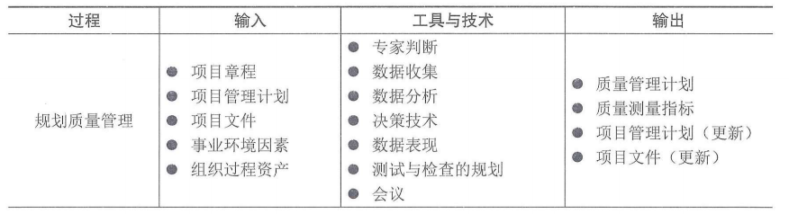
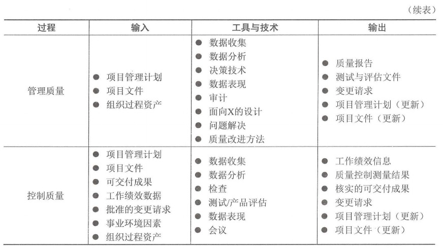
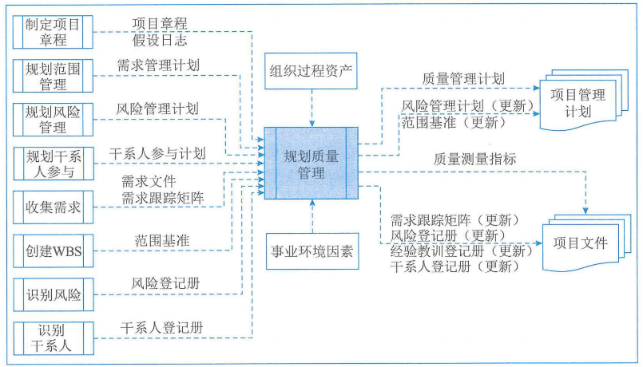
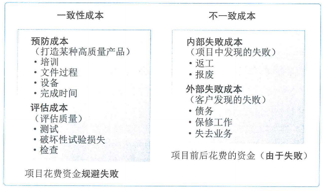
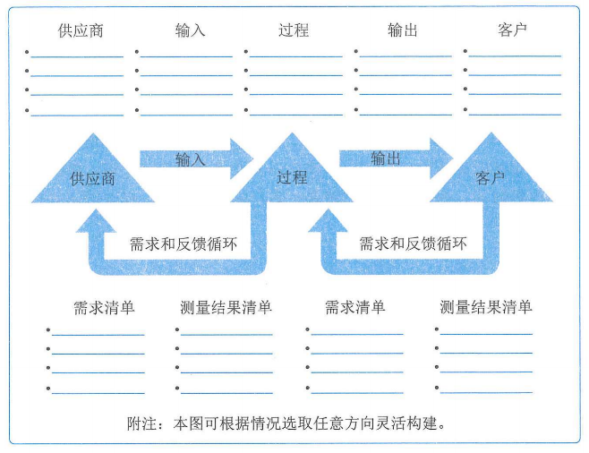
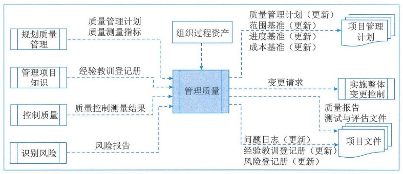
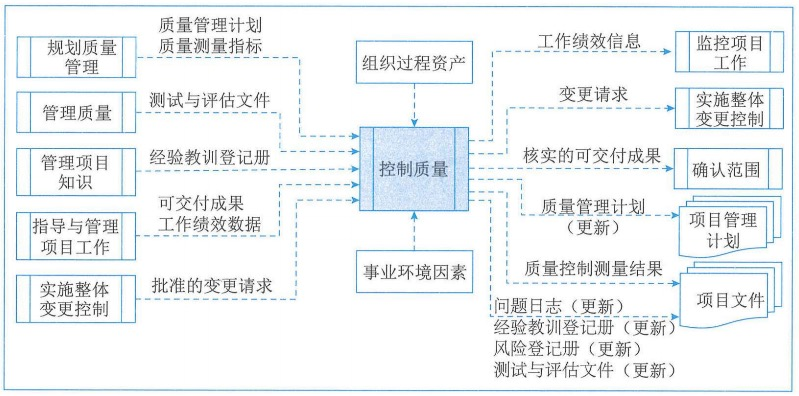
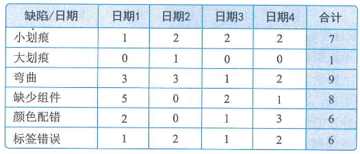

# 项目质量管理

## 1.质量管理基础

### 1.1质量与项目质量

#### 1、质量

1.国际标准化组织（ISO）对质量的定义是："反映实体满足主体明确和隐含需求的能力的特性总和"。

2.国家标准对质量的定义为："一组固有特性满足要求的程度"。

3.质量通常是指产品的质量，广义上的质量还包括工作质量。**产品质量**是指产品的使用价值及其属性：而**工作质量**则是产品质量的保证，它反映了与产品质量直接有关的工作对产品质量的保证程度。

4.质量与等级的区别。**质量与等级是两个不同的概念**。

- 一个低等级（功能有限）、**高质量**（无明显缺陷，用户手册易读）的软件产品，适合一般情况下使用，也**可以被认可**。
- 一个高等级（功能繁多）、**低质量**（有许多缺陷，用户手册杂乱无章）的软件产品，该产品的功能会因质量低劣而无效和或低效，**不会被使用者接受**。

5.预防胜于检查。最好啊将质量设计到可交付成果中，而不是在检查时发现质量问题。**预防错误的成本通常远低于在检查或使用中发现并纠正错误的成本。**

6."公差"：结果的可接受范围。

7."控制界限"：在统计意义上稳定的过程或过程绩效的普通偏差的边界。

#### 2、项目质量

项目的质量是顺应顾客的要求进行的，不同的顾客有着不同的质量要求，其意图已反映在项目合同中。因此，**项目合同通常是进行项目质量管理的主要依据。**

### 1.2质量管理

#### 1、质量管理

质量管理是指确定质量方针、目标和职责，并通过质量体系中的质量规划、质量保证、质量控制以及质量改进来使其实现所有管理智能的全部活动。

#### 2、质量方针与质量目标

质量方针是指"由组织的最高管理者正式发布的该组织总的质量宗旨和方向"。

质量目标是指"在质量方面所追求的目的"，它是落实质量方针的具体要求。

#### 3、按有效性递增排列的五种质量管理水平

### 1.3质量管理标准体系

#### 1、GB/T 19000系列标准

#### 2、全面质量管理

全面质量管理有4个核心的特征包括：**全员参加的质量管理、全过程的质量管理、全面方法的质量管理和全面结果的质量管理。**

### 1.4管理新实践

## 2.项目质量管理过程

### 2.1过程概述

项目质量管理过程包括：

1. **规划质量管理**：识别项目及其可交付成果的质量要求、标准，并书面描述项目符合质量要求、标准的证明。
2. **管理质量**：把组织的质量政策用于项目，并将质量管理计划转化为可执行的质量活动。
3. **控制质量**：为了评估绩效，监督和记录质量管理活动的执行结果，确保项目输出完整、正确，且满足客户期望。

**规划质量管理**过程关注工作需要达到的质量，**管理质量**则关注管理整个项目期间的质量。在管理质量过程期间，在规划质量管理过程中识别的质量要求成为测试与评估工具，将用于控制质量过程，以确认项目是否达到这些质量要求。**控制质量**关注工作成果与质量要求的比较，确保结果可接受。

### 2.2裁剪考虑因素

### 2.3敏捷与适应方法

为了引导变更，敏捷或适应型方法要求多个质量与审核步骤贯穿整个项目，而不是在面临项目结束时才执行。

首先，循环回顾、定期检查质量过程的效果；其次，寻找问题的根本原因；然后，建议实施新的质量改进方法；最后，回顾会议评估实验过程，确定是否可行，是否应继续，做出调整或者直接弃用。为了促进频繁的增量交付，敏捷或适应型方法关注于小批量工作，纳入尽可能多的项目可交付成果的要素，小批量系统的目的是在项目生命周期早期（整体变更成本较低）就能发现不一致和质量问题。

## 3.规划质量管理

规划质量管理是识别项目及其可交付成果的质量要求、标准，并书面描述项目将如何证明符合质量要求、标准的过程。本过程的主要作用是为了在整个项目期间如何管理和核实质量提供指南和方向。规划质量管理过程的数据流向如图：

### 3.1输入

#### 1、项目章程

#### 2、项目管理计划

用于规划质量管理过程的项目管理计划组件主要包括：

1. 需求管理计划：提供了识别、分析和管理需求的方法，以供质量管理计划和质量测量指标借鉴。
2. **风险管理计划**：提供了识别、分析和监督风险的方法。将风险管理计划和质量管理计划的信息相结合，有助于成果交付产品和项目。
3. **干系人参与计划**：提供了记录干系人需求和期望的方法，为质量管理奠定了基础。
4. **范围基准**：在确定适用于项目的质量标准和目标时，以及在确定要求质量审查的项目可交付成果和过程时，需要考虑WBS和项目范围说明书中记录的可交付成果。

#### 3、项目文件

可作为规划质量管理过程输入的项目文件主要包括：

1. 假设日志：记录与质量要求和标准合规相关的全部假设条件和制约因素。
2. **需求文件**：记录项目和产品为满足干系人的期望应达到的要求，它包括针对项目和产品的质量要要求，这些需求有助于项目团队规划如何实施项目质量控制。
3. **需求跟踪矩阵**：将产品需求连接到可交付成果，有助于确保需求文件中的各项需求都得到测试。
4. **风险登记册**：包含可能影响质量要求的各种威胁和机会的信息。
5. **干系人登记册**：有助于识别对质量有特别兴趣或影响的干系人，尤其注重客户和项目发起人的需求和期望。

#### 4、事业环境因素

#### 5、组织过程资产

### 3.2工具与技术

#### 1、专家判断

#### 2、数据收集

适用于规划质量管理过程的数据收集技术包括：

1. **标杆对照**：将实际或计划的项目实践或项目的质量标准与可比项目的实践进行比较，以便识别最佳实践，形成改进意见，并为绩效考核提供依据。
2. **头脑风暴**：通过头脑风暴可以向团队成员或主题专家收集数据，以制定最合适新项目的质量管理计划。
3. **访谈**：有经验的项目参与者、干系人和主题专家有助于了解他们对项目和产品质量的隐形和显性、正式和非正式的需求和期望。

#### 3、数据分析

适用于规划质量管理过程的数据分析技术包括：

**（1）成本效益分析**：成本效益分析是用来估算备选方案优势和劣势的财务分析工具，以确定可以创造最佳效益的备选方案。成本效益分析可以帮助项目经理确定规划的质量活动是否有效利用了成本。

**（2）质量成本**：

1. 预防成本：预防特定项目的产品、可交付成果或服务质量低劣所带来的成本。
2. 评估成本：评估、测量、审计和测试特定项目的产品、可交付成果或服务所带来的成本。
3. 失败成本（内部/外部）：因产品、可交付成果或服务与干系人需求或预期不一致而导致的成本。

#### 4、决策技术

**多标准决策分析**是适用于规划质量管理过程的一种决策技术，多标准决策分析工具（如优先矩阵）可用于识别关键事项和合适的备选方案，并通过一系列决策排列出备选方案的优先顺序。**先对标准排序和加权，再应用于所有备选方案，计算出各个备选方案的数学得分，然后根据得分对备选方案排序。在本过程中，它有助于排定质量测量指标的优选顺序。**

#### 5、数据表现

使用与规划质量管理过程的数据表现技术包括：

**（1）流程图**：流程图也称过程图，用来显示一个或多个输入转化成一个多多个输出的过程中，所需步骤顺序和可能分支。下图展示了其中一个版本的价值链，即SIPOC（供应商、输入、过程、输出和客户）模型。流程图有助于了解和估算一个过程的质量成本，通过工作流的逻辑分支及其相对频率来估算质量成本，这些逻辑分支细分为完成服务要求的输出而需要开展的一致性工作和非一致性工作。**用于展示过程步骤时，流程图有时又被称为"过程流图"或"过程流向图"，可帮助改进过程并识别可能出现质量缺陷或可以纳入质量检查的地方。**

**（2）逻辑数学模型**：逻辑数学模型是把组织数据可视化，用业务语言加以描述，不依赖任何特定技术。逻辑数学模型可用于识别会出现数据完整性或其他问题的地方。

**（3）矩阵图**：矩阵图在行列交叉的位置展示因素、原因和目标之间的强弱关系。根据可用来比较因素的数量，项目经理可使用不同形状的矩阵图，如L型、T型、Y型、X型、C型和屋顶型矩阵。**在规划质量管理过程中，矩阵图有助于识别对项目成功至关重要的质量测量指标。**

**（4）思维导图**：是一种用于可视化组织信息的绘图法。质量思维导图通常是基于单个质量概念创建的，是绘制在空白页面中央的图像，之后再增加以图像、词汇或词条形式表现的想法。思维导图技术可以有助于快速收集项目质量要求、制约因素、依赖关系和联系。

#### 6、测试与检查的规划

在规划阶段，项目经理和项目团队决定如何测试或检查产品、可交付成果或服务，以满足干系人的需求和期望，以及如何满足产品的绩效和可靠性目标。

#### 7、会议

项目团队可召开规划会议来制定质量管理计划。

### 3.3输出

#### 1、质量管理计划

质量管理计划是项目管理计划的组成部分，描述如何实施适用的政策、程序和指南以实现质量目标。它描述了项目管理团队为实现一系列项目质量目标所需的活动和资源。**质量管理计划内容一般包括**：

1. 项目采用的质量标准
2. 项目的质量目标
3. 质量角色与职责
4. 需要质量审查的项目可交付成果和过程
5. 为项目规划的质量控制和质量管理活动
6. 项目使用的质量工具
7. 与项目有关的主要程序，例如不符合要求的情况、纠正措施程序以及持续改进程序等

#### 2、质量测量指标

质量测量指标专用于描述项目或产品属性，以及控制质量过程将如何验证符合程度。**质量测量指标的例子包括按时完成的任务的百分比、以CPI测量的成本绩效、故障率、识别的日缺陷数量、每月总停机时间、每个代码行的错误、客户满意度分数，以及测试计划所涵盖的需求百分比（及测试覆盖度）。**

#### 3、项目管理计划（更新）

可能需要变更的部分包括：

1. 风险管理计划：在确定质量管理方法时可能需要更改已商定的项目风险管理方法。
2. 范围基准：如果需要增加特定的质量管理活动，范围基准可能因本过程而变更。WBS词典记录的质量要求可能需要更新。

#### 4、项目文件（更新）

可在规划质量管理过程更新的项目文件主要包括：

1. 经验教训登记册：在质量规划过程中遇到的挑战需要更新在经验教训登记册中。
2. 需求跟踪矩阵：本过程指定的质量要求，记录在需求跟踪矩阵中。
3. 风险登记册：在本过程中识别的新风险记录在风险登记册中，并通过风险管理过程进行管理。
4. 干系人登记册：如果在规划质量过程中收集到有关现有或新干系人的其他信息，则记录到干系人登记册中。

## 4.管理质量

管理质量是把组织的质量政策用于项目，并将质量管理计划转化为可执行的质量活动的过程。本过程的主要作用：

1. 提供实现质量目标的可能性；
2. 识别无效过程和导致质量低劣的原因；
3. 使用控制质量过程的数据和结果向干系人展示项目的总体质量状态；

管理质量过程需要在整个项目期间开展。管理质量过程的数据流向如图：

管理质量有时被称为"质量保证"，但"管理质量"的定义比"质量保证"更广，因其可用于非项目工作。在项目管理中，质量保证着眼于项目使用的过程，旨在高效地执行项目过程，包括遵守和满足要求，向干系人保证最终产品可以满足他们的需求、期望和要求。管理质量包括所有质量保证活动，还与产品设计和过程改进有关。

管理质量过程执行在项目质量管理计划中所定义的一系列有计划、有系统的行动和过程，有助于：

1. **通过执行有关产品特定方面的设计准则，设计出最优的成熟产品；**
2. **建立信心，相信通过质量保证工具和技术（如质量审计和故障分析）可以使未来输出在完工时满足特定的需求和期望；**
3. **确保使用质量过程并确保其使用能够满足项目的质量目标；**
4. **提高过程和活动的效率与效果，获得更好的成果和绩效并提高干系人的满意度。**

项目经理和项目团队可以通过组织的**质量保证部门或其他组织职能**执行某些管理质量活动，例如故障分析、实验设计和质量改进。质量保证部门在质量工具和技术的使用方面通常拥有跨组织经验，是良好的项目资源。

质量管理是所有人的共同职责，包括项目经理、项目团队、项目发起人、执行组织的管理层，甚至是客户。所有人在管理项目质量方面都扮演一定的角色，尽管这些角色的人数和工作量不同，参与质量管理工作的程度取决于所在行业和项目管理风格。**在敏捷型项目中，整个项目期间的质量管理由所有团队成员执行；但在传统项目中，质量管理通常是特定团队成员的职责。**

### 4.1输入

#### 1、项目管理计划

项目管理计划组件包括但不限于质量管理计划

#### 2、项目文件

可作为管理质量过程输入的项目文件主要包括：

1. 经验教训登记册
2. **质量控制测量结果**：用于分析和评估项目过程和可交付成果的质量是否符合执行组织的标准或特定要求，质量控制测量结果也有助于分析这些测量结果的产生过程，以确定实际测量结果的正确程度。
3. 质量测量指标：核实质量测量指标是控制质量过程的一个环节。管理质量过程依据这些质量测量指标设定项目的测试场景和可交付成果，用作改进举措的依据。
4. 风险报告：管理质量过程使用风险报告识别整体项目风险的来源以及整体风险敞口的最重要的驱动因素，这些因素能够影响项目的质量目标。

#### 3、组织过程资产

### 4.2工具与技术

#### 1、数据收集

适用于管理质量过程的数据收集技术是**核对单**。核对单是一种结构化工具，通常列出特定组成部分，用来核实所要求的一系列步骤是否得到执行或检查需求列表是否已经得到满足。用来规范地执行经常性任务。

#### 2、数据分析

适用于管理质量过程的数据分析技术主要包括：

1. **备选方案分析**：该技术用于评估已识别的可选方案，以选择那些最合适的质量方案或方法。
2. **文件分析**：分析项目控制过程所输出的不同文件。
3. **过程分析**：该分析可以识别过程改进机会，同时检查在过程期间遇到的问题、制约因素以及非增值活动。
4. **根本原因分析（RCA）**：该分析是确定引起偏差、缺陷或风险的根本原因的一种分析技术。一项根本原因可能引起多项偏差、缺陷或风险。根本原因分析还可以作为一项技术，用于识别问题的根本原因并解决问题。消除所有根本原因可以杜绝问题再次发生。

#### 3、决策技术

适用于本过程的决策技术包括但不限于多标准决策分析。在讨论影响项目或产品质量的备选方案时，可以使用多标准决策评估多个标准。"项目"决策可以包括在不同执行情况或供应商加以选择，"产品"决策可以包括评估生命周期成本、进度、干系人的满意程度，以及与解决产品缺陷有关的风险。

#### 4、数据表现

适用于管理质量过程的数据表现技术主要包括：

1. **亲和图**：亲和图可以对潜在缺陷成因进行分类，展示最应该关注的领域
2. **因果图**：因果图又称"鱼骨图"、"why-why分析图"和"石川图"，将问题陈述的原因分解为离散的分支，有助于识别问题的主要原因或根本原因。
3. **流程图**：流程图展示了引发缺陷的一系列依赖。
4. **直方图**：直方图是一种展示数字数据的条形图，可展示每个可交付成果的缺陷数量、缺陷成因排列、各个过程的不合规次数，或项目或产品缺陷的其他表现形式。
5. **矩阵图**：矩阵图在行列交叉的位置展示因素、原因和目标直接的关系强弱。
6. **散点图**：散点图是一种展示两个变量之间关系的图形，它能够展示两支轴的关系，一支轴表示过程、环境或活动的任何要素，另一支轴表示质量缺陷。

#### 5、审计

审计是用于确定项目活动是否遵循了组织和项目的政策、过程与程序的一种结构化且独立的过程。

**质量审计目标一般包括：**

1. **识别全部正在实施的良好及最佳实践；**
2. **识别所有违规做法、差距及不足；**
3. **分享所在组织和/或行业中类似项目的良好实践；**
4. **积极主动地提供协助，以改进过程的执行，从而帮助团队提高生产效率；**
5. **强调每次审计都应对组织经验教训知识库的积累做出贡献等。**

采取后续措施纠正问题可以降低质量成本，并提高发起人或客户对项目产品的接受度。**质量审计可事先安排，也可随机进行；可由内部或外部审计师进行。**

质量审计还可确认已批准的变更请求（包括更新、纠正措施、缺陷补救和预防措施）的实施情况。

#### 6、面向X的设计

面向X的设计（DfX）是产品设计期间可采用的一系列技术指南，旨在优化设计的特定方面，可以控制或提高产品最终特性。DfX中的X可以是产品开发的不同方面，例如可靠性、调配、装配、制造、成本、服务、可用性、安全性和质量。**使用DfX可以降低成本、改进质量、提高绩效和客户满意度。**

#### 7、问题解决

问题解决发现解决问题或应对挑战的解决方案。它包括收集其他信息、具有批判性思想的、创造性的、量化的和/或逻辑性的解决方法。有效和系统化地解决问题是质量保证和质量改进的基本要素。问题可能在控制质量过程或质量审计中发现，也可能与过程或可交付成果有关。

使用结构化的问题解决方法有助于消除问题和制定长久有效的解决方案。问题解决方法通常包括以下要素：定义问题，识别根本原因，生成可能的解决方案，选择最佳解决方案，执行解决方案，验证解决方案的有效性等。

#### 8、质量改进方法

质量改进的开展，可基于质量控制过程的发现和建议、质量审计的发现或管理质量过程的问题解决。计划-实施-检查-行动和六西格玛是最常用于分析和评估改进机会的两种质量改进工具。

### 4.3输出

#### 1、质量报告

质量报告可能是图形、数据或定性文件，其中包含的信息可帮助其他过程和部门采取纠正措施，以实现项目质量期望。质量报告的信息可以包含团队上报的质量管理问题，针对过程、项目和产品的改善建议，纠正措施建议（包括返工、缺陷/漏洞补救、100%检查等），以及在控制质量过程中发现的情况的概述。

#### 2、测试与评估文件

可基于行业需求和组织模板创建测试与评估文件。它们是控制质量过程的输入，用于评估质量目标的实现情况。这些文件可能包括专门的核对单和详尽的需求跟踪矩阵。

#### 3、变更请求

如果管理质量过程期间出现了可能影响项目管理计划任何组成部分、项目文件或项目/产品管理过程的变更，项目经理应提交变更请求并遵循实施整体变更控制过程。

#### 4、项目管理计划（变更）

此处可能需要变更的包括：

1. 质量管理计划：可能需要根据实际结果修改已商定的质量管理方法。
2. 范围基准：可能因特定的质量管理活动而变更。
3. 进度基准：可能因特定的质量管理活动而变更。
4. 成本基准：可能因特定的质量管理活动而变更。

#### 5、项目文件（更新）

可在管理质量过程更新的项目文件主要包括：

1. 问题日志：在本过程中提出的新问题记录到问题日志中。
2. 经验教训登记册：项目中遇到的挑战、本应可以规避这些挑战的方法以及良好的质量管理方式，需要记录在经验教训登记册中。
3. 风险登记册：在本过程中识别的新风险记录在风险登记册中，并通过风险管理过程进行管理。

## 5.控制质量

控制质量是为了评估绩效，确保项目输出完整、正确且满足客户期望，而监督和记录质量管理活动执行结果的过程。本过程的主要作用：

1. 核实项目可交付成果和工作已经达到主要干系人的质量要求，可供最终验收；
2. 确定项目输出是否达到预期目的，这些输出需要满足所有适用标准、要求、法规和规范。

控制质量过程需要在整个项目期间开展，控制质量过程的数据流向如图：

控制质量过程的目的是在用户验收和最终交付之前测量产品或服务的完整性、合规性和适用性。

**在敏捷或适应型项目中，控制质量活动可能由所有团队成员在整个项目生命周期中执行；而在瀑布或预测型项目中，控制质量活动由特定团队成员在特定时间点或者项目或阶段快结束时执行。**

### 5.1输入

#### 1、项目管理计划

可用于控制质量的项目管理计划组件是质量管理计划

#### 2、项目文件

可作为控制质量过程输入的项目文件主要包括：

1. **测试与评估文件**：用于评估质量目标的实现程度。
2. **质量测量指标**：专用于描述项目或产品属性，以及控制质量过程将如何验证符合程度。
3. 经验教训登记册：在项目早期的经验教训可以运用到后期阶段，已改进质量控制。

#### 3、可交付成果

作为指导与管理项目工作过程输出的可交付成果将得到检查，并与项目范围说明书定义的验收标准作比较。

#### 4、工作绩效数据

工作绩效数据包括产品状态数据，例如观察结果、质量测量指标、技术绩效测量数据，以及关于改进进度绩效和成本绩效的项目质量信息。

#### 5、批准的变更请求

批准的变更请求的实施须合适，并需要确认完整性、正确性以及是否重新测试。

#### 6、事业环境因素

#### 7、组织过程资产

### 5.2工具与技术

#### 1、数据收集

适用于控制质量过程的数据收集技术包括：

**（1）核对单**：有助于以结构化的方式管理控制质量活动。

**（2）核查表**：又称计数表，用于合理排列各种事项，以便有效地收集关于潜在质量问题的有用数据。在开展检查以识别缺陷时，用核查表收集属性数据就特别方便。

**（3）统计抽样**：是指从目标总体中选取部分样本用于检查（如从75张工程图纸中随机抽取10张）。样本用于测量控制和确认质量。

**（4）问卷调查**：可用于在部署产品或服务之后收集关于客户满意度的数据。

#### 2、数据分析

适用于控制质量过程的数据分析技术包括：

1. **绩效审查**：针对实际结果测量、比较和分析规划质量管理过程中定义的质量测量指标。
2. **根本原因分析（RAC）**：根本原因分析用于识别缺陷成因。

#### 3、检查

检查是指检查工作产品，以确定是否符合书面标准。检查的结果通常包括相关的测量数据，可在任何层面上进行。可以检查单个活动的成果，也可以检查项目的最终产品。检查也称为审查、同行审查、审计或巡查等，而在某些应用领域，这些术语的含义比较狭窄和具体。检查也可用于确认缺陷补救。

#### 4、测试/产品评估

测试是一种有组织的、结构化的调查，旨在根据项目需求提供有关被测产品或服务质量的客观信息。测试的目的是找出产品或服务中存在的错误、缺陷、漏洞或其他不合规问题。

#### 5、数据表现

适用于控制质量过程的数据表现技术包括：

1. **因果图**：用于识别质量缺陷和错误可能造成的结果。
2. **控制图**：用于确定一个过程是否稳定，或者是否具有可预测的绩效。规格上限和下限是根据要求制定的，反映了可允许的最大值和最小值。上下控制界限不同于规格界限。控制界限根据标准的统计原则，通过标准的统计计算确定，代表一个稳定过程的自然波动范围。
3. **直方图**：可按来源组成部分展示缺陷数量。
4. **散点图**：可在一支轴上展示计划的绩效，在另一支轴上展示实际绩效。

#### 6、会议

### 5.3输出

#### 1、工作绩效信息

工作绩效信息包含有关项目需求实现情况的信息、拒绝的原因、要求的返工、纠正措施建议、核实的可交付成果列表、质量测量指标的状态以及过程调整需求。

#### 2、质量控制测量结果

控制质量的测量结果是对质量控制活动结果的书面记录，应以质量管理计划所确定的格式加以记录。

#### 3、核实的可交付成果

控制质量过程的一个目的就是确定可交付成果的正确性。开展控制质量过程的结果是核实的可交付成果，后者又是确认范围过程的一项输入，以便正式验收。

#### 4、变更请求

#### 5、项目管理计划（更新）

包括但不限于质量管理计划。

#### 6、项目文件（更新）

可在控制质量过程更新的项目文件主要包括：

1. 问题日志：多次不符合质量要求的可交付成果通常被记录为问题。
2. 经验教训登记册：质量缺陷的来源、可以规避它们的方法以及有效的处理方式，都应该记录到经验教训登记册中。
3. 风险登记册：在本过程中识别的新风险记录在风险登记册中。
4. 测试与评估文件：本过程可能导致测试与评估文件修改，使未来的测试更加有效。

## 6.论文

项目质量管理是项目管理的重要组成部分，包括确定质量政策、目标与职责的各个过程和活动，从而使项目满足预定的需求。请以论信息系统项目的质量管理为题进行论述。

1、概要叙述参与管理与管理过的信息系统项目（项目的背景、项目规模、发起单位、目的、项目内容、组织机构、项目周期、交付的成果等），并说明你在其中承担的工作（项目背景要求本人真实经历，不得抄袭及杜撰）。

2、请结合你所叙述的信息系统项目，围绕以下要点论述你对信息系统项目质量管理的认识。

（1）该项目质量管理的过程（包含工作内容、目的、涉及角色和主要工作成果）

（2）请根据你所描述的项目，详细阐述你是如何进行质量保证的。

（3）请根据你所描述的项目，帮助QA制定一份质量核对单。