# 项目资源管理

项目资源管理包括识别、获取和管理所需资源以成功完成项目的各个过程，这些过程有助于确保项目经理和项目团队在正确的时间和地点使用正确的资源。

**项目资源包括实物资源和团队资源**。项目资源管理是为了降低项目成本，而对项目所需的人力、材料、机械、技术、资金等资源所进行的计划、组织、指挥、协调和控制等的活动。

实物资源包括设备、材料、设施和基础设施；团队资源指的是人力资源。

## 1.管理基础

### 1.1相关术语和定义

#### 1、项目团队

项目团队是执行项目工作，以实现项目目标的一组 人员，由为了完成项目而承担不同角色与职责的人员组成。

#### 2、项目管理团队

项目管理团队是直接参与项目管理活动的项目团队成员，负责项目管理和领导活动。

#### 3、项目经理

项目经理是由执行组织委派，领导项目团队实现项目目标的个人。

#### 4、领导和管理

领导者的主要工作主要涉及3个方面：

1. **确定方向**：为团队设定目标，描绘愿景，制定战略；
2. **统一思想**：协调人员，团结尽可能多的力量来实现愿景和项目目标；
3. **激励和鼓舞**：在向项目目标努力的过程中不可避免地要遇到艰难险阻，领导者要激励和鼓舞大家克服困难奋勇前进。

管理者被组织赋予职位和权利，负责某件事情的管理或实现某个目标。管理者主要管理持续不断地为干系人创造他们所期望的成果。

通俗地说，**领导者设定目标，管理者率众实现目标**。

领导力是让一个群体为了一个共同的目标而努力的能力。**尊重和信任，而非畏惧和顺从，是有效领导力的关键因素**。

项目经理具有领导者和管理者的双重身份。对项目经理而言，管理能力和领导能力二者均不可或缺。对于大型复杂项目，领导力尤为重要。

#### 5、权利

项目经理的权利有5种来源：

1. **职位权利**。来源于管理者在组织中的职位和职权。在高级管理层对项目经理正式授权的基础上，项目经理让员工进行工作的权利。
2. **惩罚权利**。使用降薪、扣薪、惩罚、批评、威胁等负面手段的能力。惩罚权利很有力，但会对团队气氛造成破坏。滥用惩罚权力会导致项目失败，应谨慎使用。
3. **奖励权利**。给予下属奖励的能力。奖励包括加薪、升职、福利、休假、礼物、口头表扬、认可度、特殊的任务以及其他的奖励员工满意行为的手段。优秀的管理者擅长使用权利激励员工高水平完成工作。
4. **专家权利**。来源于个人的专业技能。如果项目经理让员工感到他是某些领域的专业权威，那么员工就会在这些领域内遵从项目经理的意见。**来自一线的中层管理者经常具有很大的专家权利**。
5. 参照权利。由于成为别人学习和参照榜样所拥有的力量。参照权利是由他人对榜样者的认可和敬佩从而愿意模仿和服从榜样者以及希望自己成为榜样者那样的人而产生的力量，这是一种个人魅力。

**职位权利、惩罚权利、奖励权利来自于组织的授权，专家权利和参照权利来自于管理者自身。**

项目经理更注重运用奖励权利、专家权利和参照权利，尽量避免使用惩罚权利。

#### 6、冲突竞争

冲突是指两个或两个以上的社会单元在目标上互不相容或互相排斥，从而产生心理上的或行为上的矛盾。

**冲突并不一定是有害的，"一团和气"的集体不一定是一个高效率的集体。**

**项目经理对于有害的冲突要设法加以解决或减少；对有益的冲突要加以利用，要鼓励团队成员良性竞争。**

#### 7、团队发展

优秀团队的建设不是一蹴而就的，一般要依次经历以下5个阶段。

1. **形成阶段**。一个个的个体转变为团队成员，逐渐相互认识并了解项目情况及他们在项目中的角色与职责，开始形成共同目标。团队成员倾向于相互独立，不怎么开诚布公。在本阶段，团队往往对未来有美好的期待。
2. **震荡阶段**。团队成员开始执行分配的任务，一般会遇到超出预想的困难，希望被现实打破。个体之间开始争执，相互指责，并且怀疑项目经理的能力。
3. **规范阶段**。经过一定时间磨合，团队成员开始协同工作，并调整各自的工作习惯和行为来支持团队，团队成员开始相互信任，项目经理能得到团队的认可。
4. **发挥阶段**。随着相互之间的配合默契和对项目经理的信任加强，团队就像一个组织有序的单位那样工作。团队成员之间相互依靠，平稳有效地解决问题。这时团队成员的集体荣誉感会非常强，常以第一称谓称呼团队，如"我们组"、"我们部门"等，并会努力捍卫团队声誉。
5. **解散团队**。所有工作完成后，项目结束，团队解散。

上述这些阶段通常按顺序进行，然而，**团队停滞在某个阶段或退回到较早阶段的情况也非罕见。如果团队成员曾经共事过，项目团队建设也可以跳过某些阶段。**

某个阶段持续时间的长短，取决于团队活力、团队规模和项目管理团队的领导力。

#### 8、激励理论

马斯洛需求层次理论。马斯洛需求层次理论是一个5层的金字塔结构，如图所示，表示人们的行为收到一系列需求的引导和刺激，在不同的层次满足不同的需求，才能达到激励的作用。

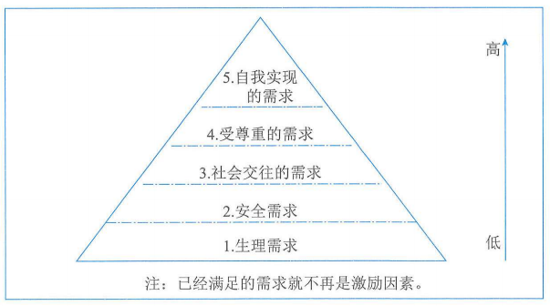

1. **生理需求**：对衣食住行等需求都是生理需求，这类需求的级别最低，人们在转向较高层次的需求之前，总是尽力满足这类需求。**常见的激励措施：员工宿舍、工作餐、工作服、班车、工资、补贴、奖金等。**
2. **安全需求**：包括对人身安全、生活稳定、不致失业以及免遭痛苦、威胁或疾病等的需求。和生理需求一样，在安全需求没有得到满足之前，人们一般不会最求更高层次的需求。**常见的激励措施：养老保险、医疗保障、长期劳动合同、意外保险、失业保险等。**
3. **社会交往需求**：包括对友谊、爱情以及隶属关系的需求。当生理需求和安全需求得到满足后，社会需求就会凸显，进而产生激励作用。这些需求如果得不到满足，就会影响员工的精神，导致高缺勤率、低生产率、对工作不满及情绪低落。**常见的激励措施：定期员工活动、聚会、比赛、俱乐部。**
4. **受尊重需求**：包括自尊心和荣誉感。荣誉来自别人，自尊来自自己。**常见的激励措施：荣誉性的奖励，形象、地位提升，颁发奖章，作为导师培训别人。**
5. **自我实现需求**：实现自己的潜力，发挥个人能力到最大程度。使自己越来越成为自己所期望的人物。达到自我实现境界的人，必须干与其能力相称的工作，这样才会使他们感到最大的快乐。**常见的激励措施：给他更多的空间让他负责、让他成为智囊团、参与决策、参与组织的管理会议等。**

赫茨伯格双因素理论。双因素理论认为有2种完全不同的因素影响着人们的工作行为。

1. **保健因素**：与工作环境或条件有关的，能防止人们产生不满意感的一类因素，包括工作环境、工资薪水、组织政策、个人生活、管理监督、人际关系等。**当保健因素不健全时，人们就会对工作产生不满意感。但即使保健因素很好时，也仅仅可以消除工作中的不满意，却无法增加人们对工作的满意感，所以这些因素是无法起到激励作用的。**
2. **激励因素**：与员工的工作本身或工作内容有关的。能促使人产生工作满意感的一类因素，是高层次的需要，包括成就、承认、工作本身、责任、发展机会等。**当激励因素缺乏时，人们就会缺乏进取心，对工作无所谓，但一旦具备了激励因素，员工则会感觉到强大的激励力量从而产生对工作的满意感，所以只有这类因素才能真正激励员工。**

麦格雷戈X理论和Y理论。**X理论对人性有如下假设：**

- 人天生好逸恶劳，只要有可能就会逃避工作；
- 人生来就以自我为中心，漠视组织的要求；
- 人缺乏进取心，逃避责任，甘愿听从指挥，安于现状，没有创造性；
- 人们通常容易受骗，易受人煽动；
- 人们天生反对改革；
- 人的工作动机就是为了获取经济报酬。

X理论注重满足员工的生理需求和安全需求，激励仅在生理和安全层次起作用，同时很注重惩罚，认为惩罚是有效的管理工具。

**崇尚X理论的领导者任务，在领导工作中必须对员工采取强制、惩罚和解雇等手段，强迫员工努力工作，对员工应当严格监督、控制和管理；在领导行为上应当实施高度控制和集中管理。**

Y理论对人性的假设与X理论完全相反，其主要观点如下：

- 人天生并不是好逸恶劳，他们热爱工作，从工作得到满足感和成就感；
- 外来的控制和处罚对人们实现组织的目标不是一个有效的办法，下属能够自我确定目标、自我指挥和自我控制；
- 在适当的条件下，人们愿意主动承担责任；
- 大多数人具有一定的想象力和创造力；
- 在现代社会中，人们的智慧和潜能只能部分地得到了发挥，如果给予机会，人们喜欢工作，并渴望发挥其才能。

Y理论认为激励在需求的各个层次上都起作用。

**崇尚Y理论的管理者对员工采取一人为中心的、宽容的及放权的领导方式，使下属目标和组织目标很好地结合起来，为员工的智慧和能力的发挥创造有利的条件。**

**X理论和Y理论的选择决定管理者处理员工关系的方式。这两个理论各有自己的长处和不足。用X理论可以加强管理，但项目团队成员通常是比较被动地工作。用Y理论可以激发员工主动性，但对于员工把握工作而言可能又放任过度。**

我们在应用的时候应该因人、因项目团队发展的阶段而异。例如，**在项目团队的开始阶段**，大家互相还不是很熟悉，对项目不是很了解或者还有某种抵触等，这时候需要项目经理**运用X理论**去指导和管理；**当项目团队进入执行阶段**，成员对项目的目标已经了解，都原因努力工作完成项目，这时候可以**运用Y理论**授权团队完成所负责的工作，并提供支持和相应的环境。

期望理论。期望理论是一种通过考察人们的努力行为与其所获得的最终报酬之间的因果关系，来说明激励过程，并以选择合适的行为达到最终的奖酬目标的理论。

期望理论认为，一个目标对人多激励程度受2个因素影响。

1. **目标效价**：指实现该目标对个人有多大价值的主观判断。如果实现该目标对个人来说很有价值，个人的积极性就高；反之，积极性就低。
2. **期望值**：指个人对实现该目标可能性大小的主观估计。只有个人认为实现该目标的可能性很大，才会去努力争取实现，从而在较高程度上发挥目标的激励作用；如果个人认为实现该目标的可能性很小，甚至完全没有可能，目标激励作用则小，以至完全没有。

期望理论认为，激励水平等于目标效价和期望值的乘积：

**激发力量=目标效价x期望值**

### 1.2管理新实践

项目资源管理的趋势和新实践包括：

1. 资源管理方法。精益管理、准时制（JIT）生产，Kaizen（持续改善）、全员生产维护（TPM）、约束理论等。
2. 情商（EI）。项目经理应提升内在（如自我管理和自我意识）和外在（如关系管理）能力，从而提高个人情商。
3. **自组织团队**。随着敏捷或适应型方法在IT项目中的应用越来越普遍，自组织团队（无需集中管控运作）越来越大。对于用印自组织团队的项目，"项目经理"（可能实际上不称为"项目经理"）这一角色主要是为团队创造环境，支持并信任团队可以完成工作。成果的自组织团队通常由通用的专业人才而不是主题专家组成，他们能够不断适应变化的环境并采纳建设性反馈。
4. **虚拟团队/分布式团队。**项目全球化推动了虚拟团队需求的增长。这些团队成员致力于同一个项目，却分布在不同的地方。沟通技术（如电子邮件、电话会议、社交媒体、网络会议和视频会议等）的使用，使虚拟团队变得可行。虚拟团队管理有独特的优势，例如能够利用不在同一地理区域的专家的专业技术；将在家办公的员工纳入团队；以及将行动不便者或残疾人纳入团队。虚拟团队管理面临的挑战主要在于沟通，包括团队成员可能产生孤立感、团队成员之间难以分享知识和经验、难以跟进进度和生产率，以及可能存在时区和文化差异等问题。

## 2.项目资源管理过程

### 2.1过程概述

项目资源管理过程包括：

1. 规划资源管理：定义如何估算、获取、管理和利用实物以及团队项目资源。
2. 估算活动资源：估算执行项目所需的团队资源，材料、设备和用品的类型和数量。
3. 获取资源：获取项目所需的团队成员、设施、设备、材料、用品和其他资源。
4. 建设团队：提高工作能力，促进团队成员互动，改善团队整体氛围，提高绩效。
5. 管理团队：管跟踪团队成员工作表现，提供反馈，解决问题并管理团队变更，以优化项目绩效。
6. 控制资源：确保按计划为项目分配实物资源，以及根据资源使用计划监督资源实际使用情况，并采取必要纠正措施。

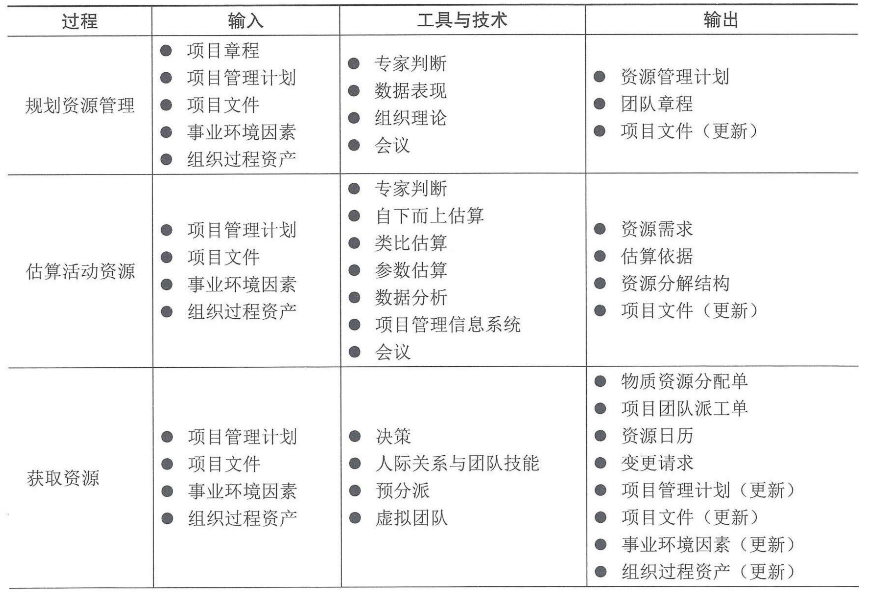

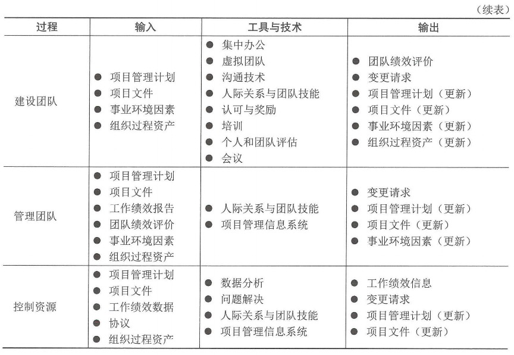

### 2.2裁剪考虑因素

### 2.3敏捷与适应方法

对于易变性高的项目，更适合采用能够最大限度地集中和协作的团队结构形式。协作旨在提高生产效率和促进创新问题的解决，协作型团队可以促进不同工作活动的快速整合、改善沟通、增加知识分享，同时可以灵活的分配工作。

虽然协作型团队也适用于其他项目环境，但更适合于易变性高且快速变化的项目，因为在这种环境下可用更少的时间实现任务分配和决策。对于易变性高的项目，对实物和人力资源规划具有较高的不可预测性。在这些环境中，快速供应协议和精益方法对控制成本和实现进度非常重要。

## 3.规划资源管理

规划资源管理是定义如何估算、获取、管理和利用团队以及实物资源的过程。本过程的主要作用是，根据项目类型和复杂程度确实适用于项目资源的管理方法和管理程度。本过程仅开展一次或仅在项目的预定义点开展。规划资源管理过程的数据流向如图：

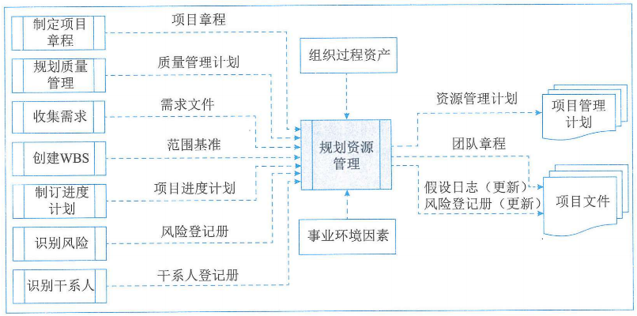

### 3.1输入

#### 1、项目章程

项目章程提供项目的高层级描述和要求，此外还包括可能影响项目资源管理的关键干系人名单、里程碑概况以及预算批准的财务资源。

#### 2、项目管理计划

可作为规划资源管理过程输入的项目管理计划组件主要包括：

1. **质量管理计划**：有助于定义项目所需的资源水平，以实现和维护已定义的质量水平并达到项目测量指标。
2. **范围基准**：识别了可交付成果，决定了需要管理的资源的类型和数量。

#### 3、项目文件

可作为规划资源管理过程输入的项目文件组件主要包括：

1. 需求文件：指出了项目所需的资源的类型和数量，并可能影响管理资源的方式。
2. 项目进度计划：提供了所需资源的时间轴。
3. 风险登记册：包含可能影响资源规划的各种威胁和机会的信息。
4. 干系人登记册：有助于识别对项目所需资源有特别兴趣或影响的那些干系人，以及会影响资源使用偏好的干系人。

#### 4、事业环境因素

#### 5、组织过程资产

### 3.2工具与技术

#### 1、专家判断

#### 2、数据表现

图表适用于规划资源管理过程的数据表现。数据表现有多种格式来记录和阐明团队成员的角色与职责，**大多数格式属于层级型、矩阵型或文本型**。无论使用什么方法来记录团队成员的角色，目的都是要确保每个工作包都明确的责任人，确保全体团队成员都清楚地理解其角色和职责。**一般来说，层级型可用于表示高层级角色，而文本型则更适用于记录详细职责**。

（1）层级型：可采用传统的组织结构图，自上而下地显示各种职位及其相互关系。

- **工作分解结构（WBS）**：用来显示如何把项目可交付成果分解为工作包，有助于明确高层的职责。
- **组织分解结构（OBS）**：按照组织现有的部门、单元或团队排列，并在每个部门下列出项目活动或工作包。例如，运营部门只需找到其所在的OBS位置，就能看到自己的全部项目职责。
- **资源分解结构**：按资源类别和类型，对团队和实物资源的层级列表，用于规划、管理和控制项目工作，每向下一个层级代表对资源的更详细描述，直到信息细到可以与工作分解结构（WBS）相结合。

（2）矩阵型：展示项目资源在各个工作包中的任务分配。矩阵型图表的一个例子是**责任分配矩阵（RAM）**，它显示了分配给每个工作包的项目资源，用于说明工作包或活动与项目成员之间的关系。在大型项目中，可以制定多个层次的RAM。矩阵型图表能反映与每个人相关的所有活动，以及与每项活动相关的所有人员，它也可以确保任何一项任务都只有一个人负责，从而避免职权不清。RAM的一个例子是**RACI（执行、负责、咨询和知情）矩阵**，如图：

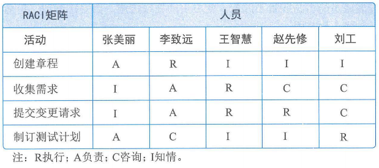

（3）文本型：如果需要描述团队成员的职责，就可以采用文本型。

#### 3、组织理论

组织理论阐述个人、团队和组织部门的行为方式。

#### 4、会议

### 3.3输出

#### 1、资源管理计划

资源管理计划提供了关于如何分类、分配、管理和释放项目资源的指南。资源管理计划可以根据项目的具体情况为**团队管理计划和实物资源管理计划**。资源管理计划的内容主要包括：

（1）识别资源：用于识别和量化项目所需的团队和实物资源的方法。

（2）获取资源：关于如何获取项目所需的团队和实物资源的指南。

（3）角色与职责：

- **角色**是指在项目中某人承担的职务或分配给某人的职务
- **职权**是指使用项目资源、做出决策、签字批准、验收可交付成果并影响他人开展项目工作的权利
- **职责**是指为完成项目活动，项目团队成员必须履行的职责和工作
- **能力**是指为完成项目活动，项目团队成员须具备的技能和才干

（4）项目组织图：以图形方式展示项目团队成员及其报告关系。基于项目需要，项目组织图可以是正式的或非正式的，非常详细或高度概括的。

（5）项目团队资源管理：关于如何定义、配备、管理和最终遣散项目团队资源的指南。

（6）培训：针对项目成员的培训策略。

（7）团队建设：建设项目团队的方法。

（8）资源控制：依据需要确保实物资源充足可用，并为项目需求优化实物资源采购而采用的方法。包括有关整个项目生命周期期间的库存、设备和用品管理的信息。

（9）认可计划：将给予团队成员哪些认可和奖励，以及何时给予。

#### 2、团队章程

**团队章程是为团队创建团队价值观、共识和工作指南的文件。团队章程包括：团队价值观、沟通指南、决策标准和过程、冲突处理过程、会议指南和团队共识。**

团队章程对项目团队成员的可接受行为确定了明确的期望，尽早认可并遵守明确的规则，有助于减少误解，提高生产力；借助诸如行为规范、沟通、决策、会议礼仪等方面的讨论，团队成员可以了解彼此重要的价值观。由团队制定或参与制定的团队章程可发挥最佳效果，所有项目团队成员都分担责任，确保遵守团队章程中规定的规则：可定期审查和更新团队章程，确保团队成员始终了解团队基本规则，并知道新成员融入团队。

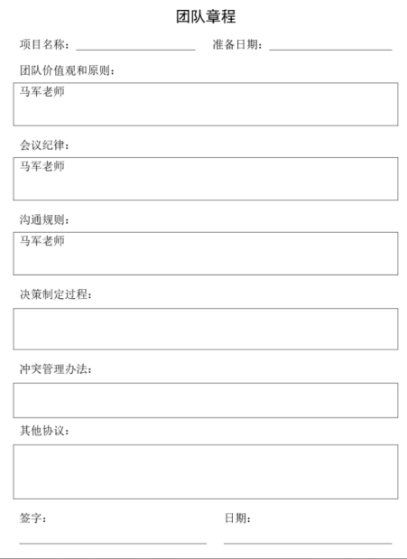

#### 3、项目文件（更新）

可在规划资源管理过程更新的项目文件主要包括：

1. 假设日志：更新假设日志时可增加关于实物资源的可用性、物流要求和位置信息以及团队资源的技能集和可用性的假设条件。
2. 风险登记册：更新关于团队和实物资源可用性的风险，以及其他已知资源的相关风险。

## 4.估算活动资源

估算活动资源是估算执行项目所需的团队资源，以及材料、设备和用品的类型和数量的过程。本过程的主要作用是明确完成项目所需的资源种类、数量和特性。本过程应根据需要在整个项目期间定期开展。估算活动资源过程的数据流向如图：

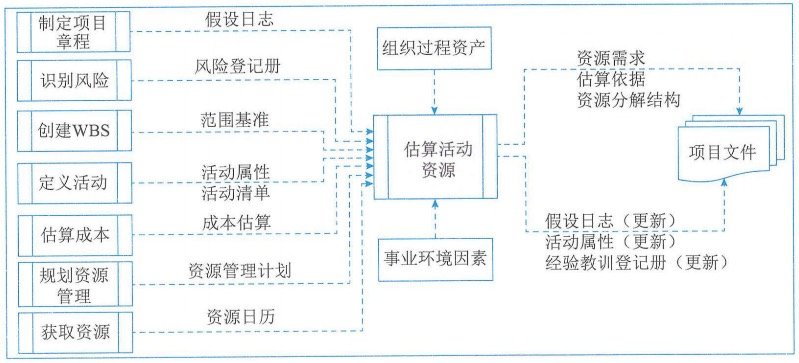

### 4.1输入

#### 1、项目管理计划

可作为估算活动资源过程输入的项目管理计划组件主要包括：

1. **范围基准**：识别了实现项目目标所需的项目和产品范围，而范围决定了对团队和实物资源的需求。
2. 资源管理计划：定义了识别项目所需不同资源的方法，还定义了各个活动所需的资源并整合这些信息的方法。

#### 2、项目文件

可作为估算活动资源过程输入的项目文件主要包括：

1. 假设日志：可能包含了有关生产力因素、可用性、成本估算以及工作方法的信息，这些因素会影响团队和实物资源的性质和数量。
2. **风险登记册**：描述了可能影响资源选择和可用性的各个风险。
3. 活动属性：为估算活动清单中每项活动所需的团队和实物资源提供了数据来源。
4. **活动清单**：识别了需要资源的活动。
5. **成本估算**：资源成本从数量和技能水平方面会影响资源选择。
6. **资源日历**：识别了每种具体资源可用时的工作日、班次、正常营业的上下班时间、周末和公共假期。

#### 3、事业环境因素

#### 4、组织过程资产

### 4.2工具与技术

#### 1、专家判断

#### 2、自下而上估算

自下而上估算是首选对团队和实物资源在活动级别上进行估算，然后汇总成工作包、控制账户和总体项目层级上的估算。

#### 3、类比估算

类比估算将以往类似项目的资源相关信息作为估算未来项目的基础。这是一种快速估算方法。

#### 4、参数估算

参数估算基于历史数据和项目参数，使用某种算法或历史数据与其他变量之间的统计关系，来计算活动所需的资源数量。参数估算的准确性取决于参数模型的成熟度和基础数据的可靠性。

#### 5、数据分析

适用于估算活动资源过程的数据分析技术是备选方案分析。备选方案分析是一种对已识别的可选方案进行评估的技术，用来决定选择哪种方案或使用何种方法来执行项目工作。很多活动有多个备选的实施方案，例如使用能力或技能水平不同的资源、不同的规模或类型的机器、不同的工具（手动或自动），以及关于资源自制、租赁或购买的决策。备选方案分析有助于提供在定义的制约因素范围内执行项目活动的最佳方案。

#### 6、项目管理信息系统

#### 7、会议

### 4.3输出

#### 1、资源需求

资源需求识别了各个工作包或工作包中每项活动所需的资源类型和数量，可以汇总这些需求，以估算每个工作包、每个WBS分支以及整个项目所需的资源。资源需求描述的细节数量与具体程度因应用领域而异，而资源需求文件也可包含为确定所用资源的类型、可用性和所需数量所做的假设。

#### 2、估算依据

资源估算所需的支持信息的数量和种类，支持性文件都应该清晰完整地说明资源估算是如何得出的。

#### 3、资源分解结构

资源分解结构是资源依类别和类型的层级展现，如图。在规划资源管理过程中，资源分解结构用于指导项目的分类活动。在这一过程中，资源分解结构是一份完成的文件，用于获取和监督资源。

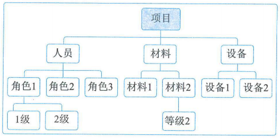

#### 4、项目文件（更新）

可在估算活动资源过程更新的项目文件主要包括：

1. 假设日志：关于项目所需资源的类型和数量的假设条件更新在假设日志中。此外，任何资源制约因素，包括集体劳资协议、连续工作时间、计划休假等，也应当相应更新。
2. 活动属性：活动属性依据资源需求更新。
3. 经验教训登记册：在经验教训登记册中更新能够有效和高效地估算资源的技术，以及那些无效或低效的技术信息。

## 5.获取资源

获取资源是获取项目所需的团队成员、设施、设备、材料、用品和其他资源的过程。本过程的主要作用是：

1. 概述和指导资源的选择；
2. 将选择的资源分配给相应的活动

本过程应根据需要在整个项目期间定期开展。获取资源过程的数据流向如图：

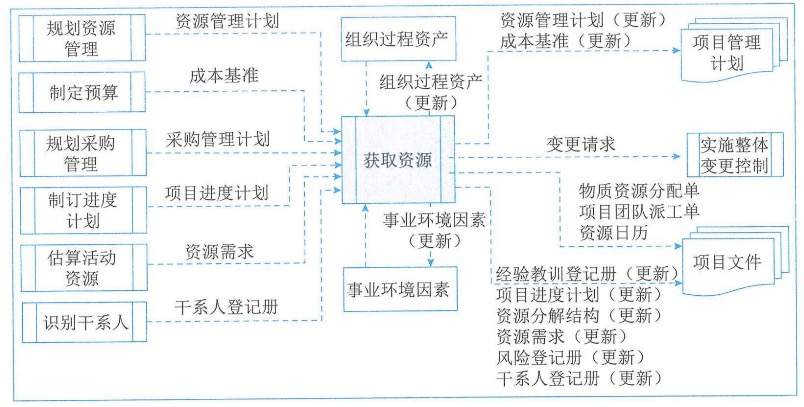

项目所需资源可能来自项目执行组织的内部或外部。内部资源由职能经理或资源经理负责获取（分配），外部资源则通过采购过程获取。

**因为集体劳资协议、分包商人员使用、矩阵型项目环境、内外部报告关系或其他原因，项目管理团队有可能没有对资源选择的直接控制权。**

### 5.1输入

#### 1、项目管理计划

可作为获取资源过程输入的项目管理计划组件主要包括：

1. 资源管理计划：为如何获取项目资源提供指南。
2. **成本基准**：提供了项目活动的总体预算。
3. **采购管理计划**：提供了关于将从项目外部获取的资源的信息，包括如何将采购与其他项目工作整合起来以及涉及资源采购工作的干系人。

#### 2、项目文件

可作为获取资源过程输入的项目文件主要包括：

1. **项目进度计划**：展示了各项活动及其开始和结束日期，有助于确定需要提供和获取资源的时间。
2. **资源需求**：识别了需要获取的资源。
3. **干系人登记册**：可能会从中发现干系人对项目特定资源的需求或期望，在获取资源过程中应加以考虑。

#### 3、事业环境因素

#### 4、组织过程资产

### 5.2工具与技术

#### 1、决策

适用于获取资源过程的决策技术是**多标准决策分析**。选择标准常用于选择项目的实物资源或项目团队。使用多标准决策分析工具制定出标准，用于对潜在资源进行评级或打分（例如，在内部和外部团队资源之间进行选择）。根据标准的相对重要性对标准进行加权，加权值可能因资源类型的不同而发生变化。**可使用的选择标准包括：**

- **可用性：确认资源能够在项目所需时段内为项目所用**
- **成本：确认增加资源的成本是否在规定的预算内**
- **能力：确认团队成员是否提供了项目所需的能力**

**有些选择标准对团队资源来说是独特的，包括：**

- **经验：确认团队成员具备项目成功所需的相关经验**
- **知识：团队成员是否掌握关于客户、执行过类似项目和项目环境细节的相关知识**
- **技能：确认团队成员拥有使用项目工具的相关技能**
- **态度：团队成员能否与他人协同工作，以形成有凝聚力的团队**
- **国际因素：团队成员的位置、时区和沟通能力**

#### 2、人际关系与团队技能

适用于获取资源过程的人际关系与团队技能是**谈判**。

#### 3、预分派

预分派指事先确定项目的实物或团队资源，在如下情况时可采用预分派：

- 在竞标过程中承诺分派特定人员进行项目工作；
- 项目取决于特定人员的专有技能；
- 在完成资源管理计划的前期工作之前，制定项目章程过程或其他过程已经制定了某些团队成员的工作。

#### 4、虚拟团队

虚拟团队模式使人们有可能个：

- 在组织内部地处不同地理位置的员工之间组件团队；
- 为项目团队增加特殊技能，即使相应的专家不在同一地理区域；
- 将在家办公的员工纳入团队；
- 在工作班次、工作小时或工作日不同的员工之间组建团队；
- 将行动不变者或残疾人纳入团队；
- 执行那些原本会因差旅费用过高而被搁置或取消的项目；
- 节省员工所需的办公室和所有实物设备的开支等。

**在虚拟团队的环境中，沟通规划变得日益重要。**

### 5.3输出

#### 1、物质资源分配单

物资资源分配单记录了项目将使用的材料、设备、用品、地点和其他实物资源。

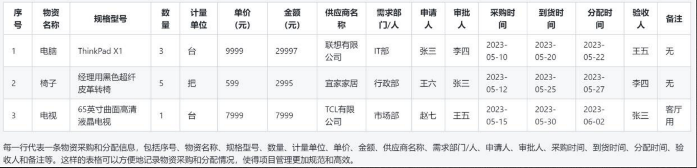

#### 2、项目团队派工单

项目团队派工单记录了团队成员及其在项目中的角色和职责，可包括项目团队名录，还需要把人员姓名插入项目管理计划的其他部分，如项目组织图和进度计划。

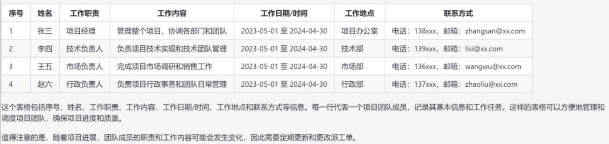

#### 3、资源日历

资源日历识别了每种具体资源可用时的工作日、班次、正常营业的上下班时间、周末和公共假期。资源日历规定了在项目期间确定的团队和实物资源何时可用和可用多久。

#### 4、变更请求

#### 5、项目管理计划（更新）

开展获取资源过程可能导致项目管理计划更新的内容包括：

1. 资源管理计划：更新资源管理计划，以反映获取项目资源的实际经验，包括在项目早期获取资源的经验教训，这些经验教训会影响项目后期的资源获取过程。
2. 成本基准：在项目资源采购期间，成本基准可能发生变更。

#### 6、项目文件

可在获取资源过程更新的项目文件主要包括：

1. 经验教训登记册
2. 项目进度计划：所需资源的可用性可能会导致项目进度的变更
3. 资源分解结果：在本过程中获取的资源应记录到资源分解结构中
4. 资源需求：可更新资源需求文件，以反映获取的项目资源
5. 风险登记册：将本过程中识别的新风险记录在风险登记册中
6. 干系人登记册：任何增加的新干系人，以及在本过程中获得的有关现有相关方的新信息更新在干系人登记册中

#### 7、事业环境因素（更新）

#### 8、组织过程资产（更新）

## 6.建设团队

建设团队是提高工作能力，促进团队成员互动，改善团队整体氛围，以提高项目绩效的过程。本过程的主要作用是，改进团队协作、增强人际关系技能、激励员工、减少摩擦以及提升整体项目绩效。本过程需要在整个项目期间开展。建设团队过程的数据流向如图：

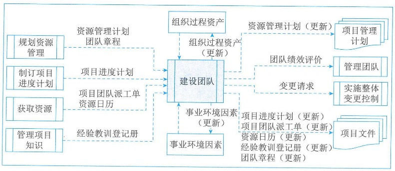

**建设项目团队的目标包括：**

1. **提高团队成员的知识和技能**：以提高他们完成项目可交付成果的能力，并降低成本、缩短工期和提高质量；
2. **提高团队成员之间的信任和认同感**：以提高士气、减少冲突和增进团队协作；
3. **创建富有生气、凝聚力和协作性的团队文化**：一是可帮助提高个人和团队生产率，振奋团队精神，促进团队合作；二是促进团队成员之间的交叉培训和辅导，以分享知识和经验；
4. **提高团队参与与决策的能力**：使他们承担起对解决方案的责任，从而提高团队的生产效率，获得更有效和高效的成果等。

### 6.1输入

#### 1、项目管理计划

建设团队过程使用到的项目管理计划组件是资源管理计划。

#### 2、项目文件

可作为建设团队过程输入的项目文件主要包括：

1. **团队章程**：包含团队工作指南。团队价值观和工作指南为描述团队的合作方式提供了架构。
2. **项目进度计划**：定义了如何以及合十为项目团队提供培训，以培养不同阶段所需的能力，并根据项目执行期间的任何差异（如有）识别需要的团队建设策略。
3. **项目团队派工单**：识别了团队成员的角色与职责。
4. **资源日历**：定义了项目团队成员何时能够参与团队建设活动，有助于说明团队在整个项目期间的可用性
5. 经验教训登记册：项目早期与团队建设有关的经验教训可以运用到项目后期阶段，以提高团队绩效

#### 3、事业环境因素

#### 4、组织过程资产

### 6.2工具与技术

#### 1、集中办公

集中帮是指把许多或全部最活跃的项目团队成员安排在同一个地点工作，以增强团队工作能力。

#### 2、虚拟团队

#### 3、沟通技术

可采用的沟通技术包括：

1. 共享门户：共享信息库（如网站、协作软件或内部网）对虚拟项目团队很有帮助
2. 视频会议：一种可有效的与虚拟团队进行沟通的重要技术
3. 音频会议：有助于与虚拟团队建立融洽的相互信任的关系
4. 电子邮件/聊天软件：使用电子邮件和聊天软件定期沟通也是一种有效的方式

#### 4、人际关系与团队技能

适用于建设团队过程的人际关系与团队技能主要包括：

1. 冲突管理：项目经理应及时的以建设性方式解决冲突，从而创建高绩效团队
2. 影响力：本过程的影响力技能是指收集相关的关键信息，在维护相互信任的关系时，用来解决重要问题并达成一致意见
3. 激励：为采取行动提供了理由。提高团队参与决策的能力并鼓励独立工作
4. 谈判：团队成员之间的谈判旨在就项目需求达成共识。谈判有助于在团队成员之间建立融洽的相互信任的关系
5. 团队建设：通过举办各种活动，强化团队的社交关系，打造积极合作的工作环境

#### 5、认可与奖励

在建设项目团队过程中，需要对成员的优良行为给予认可和奖励。

#### 6、培训

培训包括旨在提高项目团队成员能力的全部活动

#### 7、个人和团队评估

个人和团队评估工具能让项目经理和项目团队洞察成员的优势和劣势。这些工具可帮助项目经理评估团队成员的偏好和愿望、团队成员如何处理和整理信息、如何制定决策，以及团队如何与他人打交道。有各种可用的工具，如态度调查、专项评估、结构化访谈、能力测试及焦点小组。这些工具有利于增进项目团队成员间的理解、信任、承诺和沟通，在整个项目期间不断提高团队成效。

#### 8、会议

### 6.3输出

#### 1、团队绩效评价

随着项目团队建设工作（如培训、团队建设和集中办公等）的开展，项目管理团队应该对项目团队的有效性进行正式或非正式的评价。有效的团队建设策略和活动可以提高团队绩效，从而提高实现项目目标的可能性。**评价团队有效性的指标可包括**：

1. **个人技能的改进，使成员更有效的完成工作任务**
2. **团队能力的改进，从而使团队成员更好的开展工作**
3. **团队成员离职率的降低**
4. **团队凝聚力的加强，从而使团队成员公开分享信息和经验，并互相帮助来提高项目绩效**

#### 2、变更请求

#### 3、项目管理计划（更新）

可能需要变更的项目管理计划组成部分包括但不限于资源管理计划。

#### 4、项目文件（更新）

可在建设团队过程更新的项目文件主要包括：

1. 项目进度计划：团队建设活动可能会导致项目进度的变更
2. 项目团队派工单：如果团队建设导致已商定的派工单出现变更，应对项目团队派工单做出相应的更新
3. 资源日历：更新资源日历，以反映项目资源的可用性
4. 经验教训登记册
5. 团队章程：更新团队章程，以反映团队建设对团队工作指南做出的变更

#### 5、事业环境因素

#### 6、组织过程资产

## 7.管理团队

管理团队是跟踪团队成员工作表现、提供反馈、解决问题并管理团队变更以优化项目绩效的过程。本过程的主要作用是，影响团队行为、管理冲突以及解决问题。本过程需要在整个项目期间开展。管理团队过程的数据流向如图：

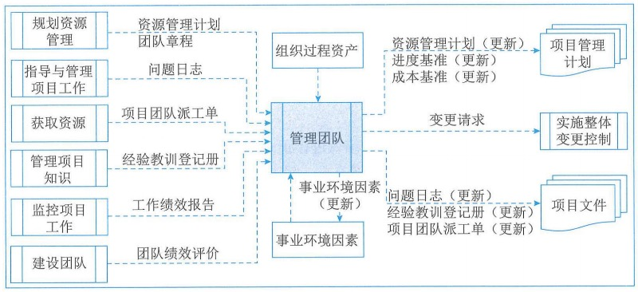

### 7.1输入

#### 1、项目管理计划

可用于管理团队的项目管理计划组件是资源管理计划。

#### 2、项目文件

可作为管理团队过程输入的项目文件主要包括：

1. **团队章程**：为团队如何决策、举行会议和解决冲突提供指南。
2. **问题日志**：在管理项目团队过程中，总会出现各种问题，此时可用问题日志记录由谁负责在目标日期内解决特定问题，并监督解决情况。
3. **项目团队派工单**：识别了团队成员的角色与职责。
4. 经验教训登记册

#### 3、工作绩效报告

工作绩效报告是为制定决策、采取行动或引起关注所形成的实物或电子工作信息，它包括从进度控制、成本控制、质量控制和范围确认中得到的结果，有助于项目团队管理。绩效报告和相关预测报告中的信息，有助于确定未来的团队资源需求、认可与奖励，以及更新资源管理计划。

#### 4、团队绩效评价

项目管理团队应该持续的对项目团队绩效进行正式或非正式的评价。不断的评价项目团队绩效，有助于采取措施解决问题、调整沟通方式、解决冲突和改进团队互动。

#### 5、事业环境因素

#### 6、组织过程资产

### 7.2工具与技术

#### 1、人际关系与团队技能

适用于管理团队过程的人际关系与团队技能包括：冲突管理、制定决策、情商、影响和领导力。

（1）冲突管理。**在项目环境中，冲突不可避免。冲突的来源包括：资源稀缺、进度优先级排序和个人工作风格差异等**。采用团队基本规则、团队规范及成熟的项目管理实践（如沟通规划和角色定义），可以减少冲突的数量。

有5中常用的冲突解决办法，每种技巧都有各自的作用和用途。

1. **撤退/回避：**从实际或潜在冲突中退出，将问题推迟到准备充分的时候，或者将问题推给其他人员解决。
2. **缓和/包容：**强调一致而非差异；为维持和谐与关系而退让一步，考虑其他地方的需要。
3. **妥协/调解：**为了暂时或部分解决冲突，寻找能让各方都在一定程度上满意的方案，但这种方法有时会导致"双输"局面。
4. **强迫/命令：**以牺牲其他方为代价，推行某一方的观点；只提供赢-输方案。通常是利用权利来强行解决紧急问题，这种方法通常会导致"赢-输"局面。
5. **合作/解决问题：**综合考虑不同的观点和意见，采用合作的态度和开放式对话引导各方达成共识和承诺，这种方法可以带来双赢局面。

（2）制定决策。此处决策是指谈判能力以及影响组织与项目管理团队的能力，而不是决策工作集所描述的一系列工具。

（3）情商。是指识别、评估和管理个人情绪、他人情绪及团体情绪的能力。

（4）影响。在矩阵环境中，项目经理对团队成员通常没有或仅有很小的命令职权，所以他们适时影响干系人的能力，对保证项目成功非常关键。影响力主要体现在如下方面：说服他人；清晰表达观点和立场；积极且有效的倾听；了解并综合考虑各种观点；收集相关信息，在维护相互信任的关系下，解决问题并达成一致意见等。

（5）领导力。

#### 2、项目管理信息系统

### 7.3输出

#### 1、变更请求

#### 2、 项目管理计划（更新）

可能需要变更的项目管理计划组成部分包括：

1. 资源管理计划：根据实际的项目团队管理经验更新。
2. 进度基准：可能需要更改项目进度，以反映团队的执行方式。
3. 成本基准：可能需要更改项目成本基准，以反映团队的执行方式。

#### 3、项目文件（更新）

可在管理团队过程更新的项目文件包括：

1. 问题日志：在本过程提出的新问题可以记录到问题日志中。
2. 经验教训登记册
3. 项目团队派工单：如果需要对团队做出变更，在项目团队派工单记录这些变更。

#### 4、事业环境因素（更新）

## 8.控制资源

控制资源是确保按计划为项目分配实物资源，以及根据资源使用计划监督资源实际使用情况，并采取必要纠正措施的过程。本过程的主要作用：

1. 确保所分配的资源适时、适地可用于项目；
2. 资源在不再需要时释放。

本过程需要在整个项目期间开展。控制资源过程的数据流向如图：

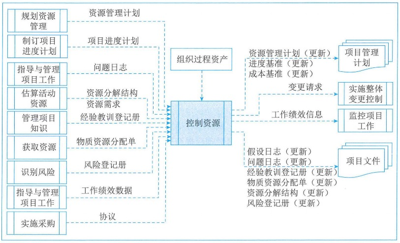

控制资源过程关注：

1. 监督资源支出；
2. 及时识别和处理资源缺乏/剩余情况；
3. 确保根据计划和项目需求使用并释放资源；
4. 出现资源相关问题时通知相应干系人；
5. 影响可以导致资源使用变更的因素；
6. 在变更实际发生时对其进行管理等。

### 8.1输入

#### 1、项目管理计划

可用于控制资源的项目管理计划是资源管理计划。

#### 2、项目文件

可作为控制资源过程输入的项目文件主要包括：

1. **项目进度技术**：展示了项目在何时何地需要哪些资源。
2. **问题日志**：用于识别有关缺乏资源、原材料供应延迟和低等级原材料等问题。
3. **资源需求**：识别了项目所需的材料、设备、用品和其他资源。
4. **资源分解结构**：为项目过程中需要替换或重新获取资源的情况提供参考。
5. 经验教训登记册
6. **物资资源分配单**：描述了资源的预期使用情况以及资源的详细信息，例如类型、数量、地点及属于组织内部资源还是外购资源。
7. **风险登记册**：识别了可能会影响设备、材料或用品的风险

#### 3、工作绩效数据

工作绩效数据包含有关项目状态的数据，例如已使用的资源的数量和类型。

#### 4、协议

协议是获取组织外部资源的依据，应在需要新的和未规划的资源时，或在当前资源出现问题时，在协议里定义相关程序。

#### 5、组织过程资产

### 8.2工具与技术

#### 1、数据分析

适用于控制资源过程的数据分析技术主要包括：

1. **备选方案分析**：有助于选择最佳方案以纠正资源使用偏差，可将加班和增加团队资源等备选方案与延期交付或阶段性交付比较，以权衡利弊。
2. **成本效益分析**：有助于项目成本出现差异时确定最佳的纠正措施。
3. **绩效审查**：测量、比较和分析计划的资源使用和实际资源使用的不同。分析成本和进度工作绩效信息有助于指出可能影响资源使用的问题。
4. **趋势分析**：项目团队可能会使用趋势分析，基于当前绩效信息来确定未来项目阶段所需的资源。

#### 2、问题解决

问题解决可能会用到一系列工具，有助于项目经理解决控制资源过程中出现的问题。

#### 3、人际关系与团队技能

人际关系与团队技能有时被称为"软技能"，属于个人能力。本过程使用的人际关系与团队技能包括：

1. 谈判：项目经理需求就增加实物资源、变更实物资源或资源相关成本进行谈判。
2. 影响力：有助于项目经理及时解决问题并获得所需资源。

#### 4、项目管理信息系统

### 8.3输出

#### 1、工作绩效信息

工作绩效信息包括项目工作进展信息，这一信息将资源需求和资源分配与项目活动期间的资源使用相比较，从而发现需要处理的资源可用性方面的差异。

#### 2、变更请求

#### 3、项目管理计划（更新）

可能需要变更的项目管理计划组成部分包括：

1. 资源管理计划：根据实际的项目资源管理经验更新。
2. 进度基准：可能需要更新项目进度。
3. 成本基准：可能需要更新项目成本基准。

#### 4、项目文件（更新）

可在控制资源过程更新的项目文件主要包括：

1. 假设日志：把关于设备、材料、用品和其他实物资源的新假设条件更新在假设日志中。
2. 问题日志：在本过程中出现的新问题可以记录到问题日志中。
3. 经验教训登记册
4. 物资资源分配单：是动态的，会因可用性、项目、组织、环境或其他因素而发生变更。
5. 资源分解结构：可能需要更新资源分解结构，以反映使用项目资源的方式。
6. 风险登记册：将资源可用性及利用或其他实物资源的风险更新在风险登记册中。