# 项目风险管理

## 1.管理基础

### 1.1项目风险概述

每个项目都在两个层面上存在风险：一是每个项目都有会影响项目达成目标的单个风险；二是由单个风险和不确定性其他来源联合导致的整体项目风险。项目风险管理过程同时兼顾这两个层面的风险。

项目风险会对项目目标产生负面或正面的影响，也就是风险与机会。**项目风险管理旨在利用或强化正面风险（机会），规避或减轻负面风险（威胁）。**

### 1.2风险的属性

#### 1、风险事件的随机性

风险事件的发生及其后果都具有偶然性。风险时间具有随机性。

#### 2、风险的相对性

同样的风险对于不同的主体有不同的影响。

1. **收益的大小**：收益越大，人们愿意承担的风险也就越大。
2. **投入的大小**：项目活动投入得越多，愿意冒的风险也就越小。
3. **项目活动主体的地位和拥有的资源**：级别高的管理人员比级别低的管理人员能够承担的风险相对要大。个人或组织拥有的资源越多，其风险承受能力也越大。

#### 3、风险的可变性

1. 风险性质的变化
2. 风险后果的变化
3. 出现新风险

### 1.3风险的分类

#### 1、按风险后果划分

按照后果的不同，风险可划分为纯粹风险和投机风险。

1. **纯粹风险**。不能带来机会、无获得利益可能的风险，叫纯粹风险。
2. **投机风险**。既可能带来机会、获得利益，又隐含威胁、造成损失的风险，叫投机风险。

**纯粹风险和投机风险在一定条件下可以相互转化。项目管理人员必须避免投机风险转化为纯粹风险。**

**风险不是零和游戏。很多情况下，涉及风险的各个方面都要蒙受损失，无一幸免。**

#### 2、按风险来源划分

#### 6、按风险的可预测性划分

按这种方法，风险可以分为已知风险、可预测风险和不可预测风险。

1. **已知风险**。已知风险是指在认真、严格的分析项目及其计划之后能够明确的那些经常发生的，而且其后果亦可预见的风险。
2. **可预测风险**。可预测风险是指根据经验，可以预见其发生，但不可预见其后果的风险。
3. **不可预测风险**。不可预测风险是指有可能发生，但其发生的可能性即时最有经验的人亦不能预见的风险。不可预测风险有时也称未知风险或未识别的风险。它们是新的、以前未观察到或很晚才显现出来的风险。这些风险一般是外部因素作用的结果，例如地震、百年不遇的暴雨、通货膨胀和政策变化等。

### 1.4风险成本及其负担

风险时间造成的损失或减少的收益以及为防止发生风险采取预防措施而支付的费用，都构成了风险成本。风险成本包括有形成本、无形成本以及预防与控制的成本。

#### 1、风险损失的有形成本

风险损失的有形成本包括风险事件造成的直接损失和间接损失。

1. 直接损失。直接损失指财产损毁和人员伤亡的价值。
2. 间接损失。间接损失指直接损失以外的其他损失、责任损失以及因此而造成的收益的减少。

#### 2、风险损失的无形成本

风险损失的无形成本指由于风险所具有的不确定性而使项目主体在风险事件发生之前或之后付出的代价。主要表现在如下3个方面。

1. 风险损失减少了机会。
2. 风险阻碍了生产率的提高。
3. 风险造成资源 分配不当。

## 2.项目风险管理过程

### 2.1过程概述

项目风险管理过程包括：

1. **规划风险管理**：定义如何实施项目风险管理活动。
2. **识别风险**：识别单个风险，以及整体项目风险的来源。
3. **实施定性风险分析**：通过评估单个项目风险发生的概率和影响以及特征，对风险进行优先级排序，从而为后续分析或行动提供基础。
4. **实施定量风险分析**：就已识别的单个项目风险和其他不确定性的来源对整体项目目标的综合影响进行定量分析。
5. **规划风险应对**：为处理整体项目风险以及应对单个项目风险而制定可选方案、选择应对策略并商定应对计划。
6. **实施风险应对**：执行商定的风险应对计划。
7. **监督风险**：在整个项目期间，监督风险以应对计划的实施、跟踪已识别风险、识别和分析新风险，以及评估风险管理的有效性。

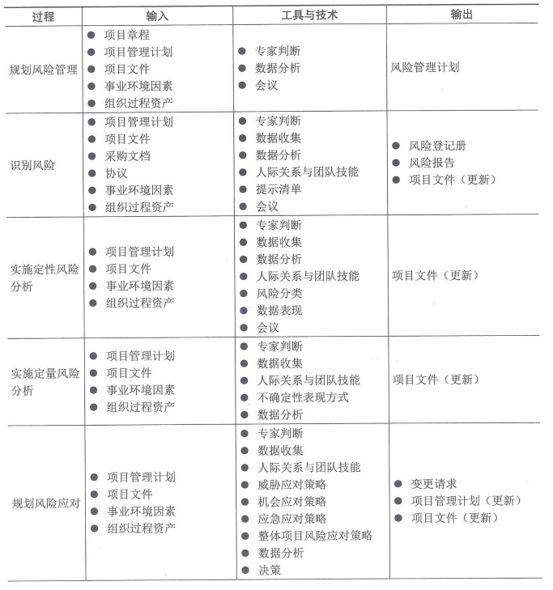

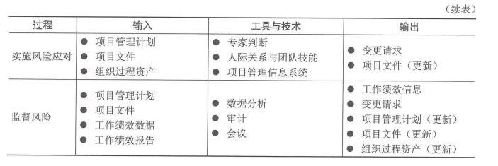

### 2.3敏捷与适应方法

从本质上讲，越是变化的环境就存在越多的不确定性和风险。要应对快速变化，就需要采用敏捷或适应型方法管理项目，如果常审查增量的工作产品，加快知识的分享，来确保对风险的认知和管理。在选择每个迭代期的工作内容都要考虑风险；在每个迭代期间应该识别、分析和管理风险。

此外，应根据对当前风险忍受度的深入理解，定期更新需求文件，并随项目进展重新排列工作优先级。

## 3.规划风险管理

规划风险管理是定义如何实施项目风险管理活动的过程。本过程的主要作用是，确保风险管理的水平、方法和可见度与项目风险程度相匹配，与对组织和其他干系人的重要程度相匹配。规划风险管理过程的数据流向如图：

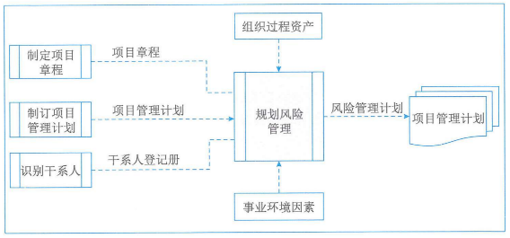

### 3.1输入

#### 1、项目章程

项目章程记录了项目的总体描述和边界、总体的需求和风险。

#### 2、项目管理计划

应考虑所有已批准的项目管理子计划，使风险管理计划与各计划相协调；各子计划中所列出的方法论可能也会影响规划风险管理过程。

#### 3、项目文件

可作为本过程输入的项目文件是**干系人登记册**。其中概述了干系人在项目中的角色和其对项目风险的态度，可用于确定项目风险管理的角色和职责，以及为项目设定风险临界值。

#### 4、事业环境因素

#### 5、组织过程资产

### 3.2工具与技术

#### 1、专家判断

#### 2、数据分析

可用于规划风险管理过程的数据分析技术是**干系人分析法**，通过干系人分析确定项目干系人的风险偏好。

#### 3、会议

### 3.3输出

#### 风险管理计划

风险管理计划是项目管理计划的组成部分，描述如何安排与实施风险管理活动。风险管理计划内容主要包括：

**（1）风险管理策略**：描述用于管理本项目风险的一般方法。

**（2）方法论**：确定用于开展本项目风险管理的具体方法、工具及数据来源。

**（3）角色与职责**：确定每项风险管理活动的领导者、支持者和团队成员，并明确职责。

**（4）资金**：确定开展项目风险管理活动所需资金，制定应急储备和管理储备使用方案。

**（5）时间安排**：确定在项目生命周期中实施项目风险管理过程的时间和频率，确定风险管理活动并将其纳入项目进度计划。

**（6）风险类别**：确定对项目风险进行分类的方式。通常借助风险分解结构（RBS）来构建风险类别。风险分解结构是潜在风险来源的层级展现，如图。风险分解结构有助于项目团队考虑单个项目风险的全部可能来源，对识别风险或归类已识别风险特别有用。

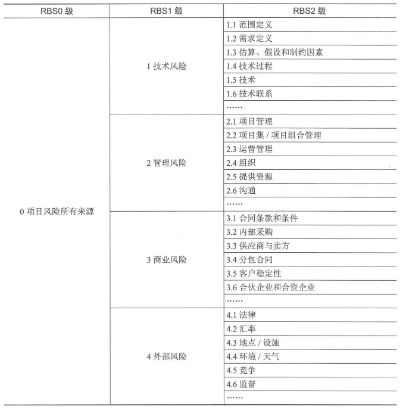

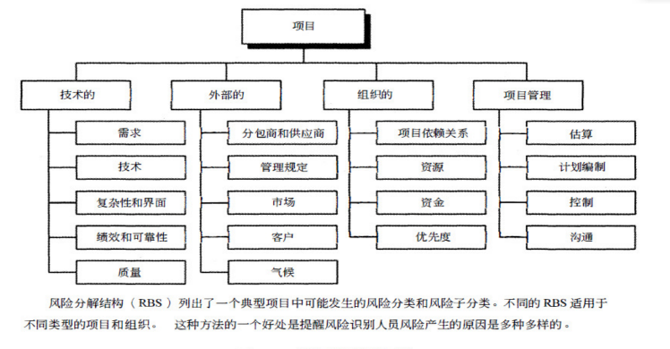

**（7）干系人偏好**：应在风险管理计划中记录项目关键干系人的风险偏好。他们的风险偏好会影响规划风险管理过程的细节。特别是，应该针对每个项目目标，把干系人的风险偏好表述成可预测的风险临界值。这些临界值不仅将联合决定可接受的整体项目风险忍受水平，而且也用于制定概率和影响定义。以后将根据概率和影响定义，对单个项目风险进行评估和排序。

**（8）风险概率和影响**：根据具体的项目环境、组织和关键干系人的风险偏好和临界值，来制定风险概率和影响。

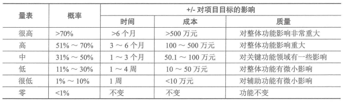

**（9）概率和影响矩阵**

**概率和影响可以用描述性术语（如很高、高、中、低和很低）或数值来表达。**如果使用数值，就可以把两个数值相乘，得出每个风险的概率-影响分值，以便据此在每个优先级组别之内排列单个风险相对优先级。下图是概率和影响矩阵的示例，其中也有数值风险评分的方法。

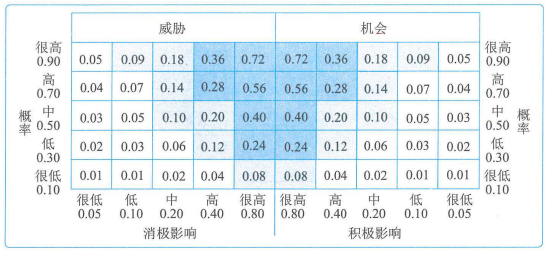

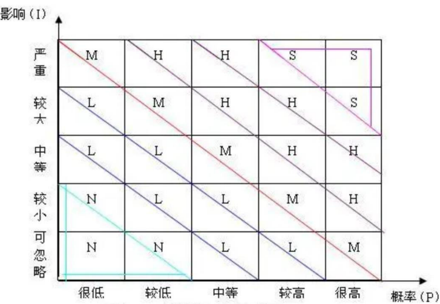

**（10）报告格式**：确定将如何记录、分析和沟通项目风险管理过程的结果。在这一部分，描述风险登记册、风险报告以及项目风险管理过程的其他输出的内容和格式。

**（11）跟踪**：确定将如何记录风险活动，以及如何审计风险的管理过程。

## 4.识别风险

识别风险是识别单个项目风险以及整体项目风险的来源，并记录风险特征的过程。本过程的主要作用：

1. 记录现有的单个项目风险，以及整体项目风险的来源；
2. 汇总相关信息，以便项目团队能够恰当的应对已识别的风险，

本过程应在整个项目期间开展。识别风险过程的数据流向如图：

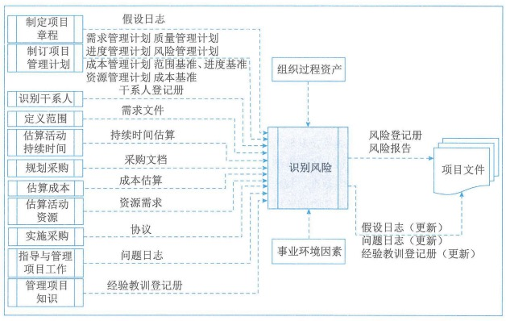

识别风险时，要同时考虑单个项目风险以及整体项目风险的来源。风险识别活动的参与者可能包括：项目经理、项目团队成员、项目风险专家（若已指定）、客户、项目团队外部的主题专家、最终用户、其他项目经理、运营经理、干系人和组织内的风险管理专家。**应鼓励所有项目干系人参与项目风险的识别工作。**

**应采用统一的风险描述格式来描述和记录项目风险**，以确保每一项风险都被清楚、明确的理解，从而为有效的分析和风险应对措施制定提供支持。

在整个项目生命周期中，单个项目风险可能随项目进展而不断变化，整体项目风险的级别也会发生变化。因此，**识别风险是一个迭代的过程**。迭代的频率和每次迭代所需的参与程度因情况而异，应在风险管理计划中做出相应规定。

### 4.1输入

#### 1、项目管理计划

可用于识别风险的项目管理计划组件主要包括：

1. **需求管理计划**：可能指出了特别有风险的项目目标。
2. **进度管理计划**：可能列出了受不确定性或模糊性影响的一些进度领域。
3. **成本管理计划**：可能列出了受不确定性或模糊性影响的一些成本领域。
4. **质量管理计划**：可能列出了受不确定性或模糊性影响的一些质量领域，或者关键假设可能引发风险的一些领域。
5. **资源管理计划**：可能列出了受不确定性或模糊性影响的一些资源领域，或者关键假设可能引发风险的一些资源领域。
6. **风险管理计划**：规定了风险管理的角色和职责，说明了如何将风险管理活动纳入预算和进度计划，并描述了风险类别。
7. **范围基准**：包括可交付成果及其验收标准，其中有些可能引发风险；还包括分解结构，可用作安排风险识别工作的框架。
8. **进度基准**：可以查看进度基准，找出不存在不确定性或模糊性的里程碑日期和可交付日期，或者可能引发风险的关键假设条件。
9. **成本基准**：可以查看成本基准，找出存在不确定性或模糊性的成本估算或资金需求，或者关键假设可能引发风险的方面。

#### 2、项目文件

作为识别风险过程输入的项目文件主要包括：

1. **假设条件**：所记录的假设条件和制约因素可能引发单个项目风险，还可能影响整体项目风险的级别。
2. **干系人登记册**：规定了哪些个人或小组可能参与项目的风险识别工作，还会详细说明哪些个人适合扮演风险责任人角色。
3. **需求文件**：列明了项目需求，使团队能够确定哪些需求存在风险。
4. **持续时间估算**：对项目持续时间的定量评估，理想情况下用区间表示，区间的大小预示着风险程度。对持续时间估算文件进行结构化审查，可能会显示当前估算不足，从而引发项目风险。
5. **成本估算**：对项目成本的定量评估，理想情况下用区间表示，区间的大小预示着风险程度。对成本估算文件进行结构化审查，可能显示当前估算不足，从而引发项目风险。
6. **资源需求**：对项目所需资源的定量评估，理想情况下用区间表示，区间的大小预示着风险程度。对资源需求文件进行结构化审查，可能显示当前估算不足，从而引发项目风险。
7. **问题日志**：所记录的问题可能引发单个项目风险，还可能影响整体项目风险的基级别。
8. 经验教训登记册：可以查看与项目早期所识别的风险相关的经验教训，以确定类似风险是否可能在项目的剩余时间再次出现。

#### 3、采购文档

如果需要从外部采购项目资源，就应该审查初始采购文档，因为从组织外部采购商品和服务可能提高或降低整体项目风险，并可能引发更多的项目风险。随着采购文档在项目期间的不断更新，还应该审查最新的文档，例如，卖方绩效报告、核准的变更请求和与检查相关的信息。

#### 4、协议

如果需要从外部采购项目资源，协议所规定的里程碑日期、合同类型、验收标准和奖罚条款等，都可能造成威胁或创造机会。

#### 5、事业环境因素

#### 6、组织过程资产

### 4.2工具与技术

#### 1、专家判断

#### 2、数据收集

适用于识别风险过程的数据收集技术主要包括：

1. **头脑风暴**：目标是获取一份全面的项目风险来源的清单。
2. **核查单**：基于从类似项目和其他信息来源积累的历史信息和知识来编制核查单。编制核查单时，可列出过去曾出现且可能与前期项目相关的具体项目风险，这是吸取已完成的类似项目的经验教训的有效方式。**虽然核查单简单易用，但它不可能穷尽所有风险**。
3. **访谈**：可通过对资深项目参与者、干系人和主体专家的访谈，来识别项目风险的来源。

#### 3、数据分析

适用于识别风险过程的数据分析技术主要包括：

**（1）根本原因分析**：常用于发现导致问题的深层原因并制定预防措施。

**（2）假设条件和制约因素分析**：每个项目及其项目管理计划的构思和开发都基于一系列的假设条件，并受一系列制约因素的限制。这些假设条件和制约因素往往都已纳入范围基准和项目估算。开展假设条件和制约因素分析来探索假设条件和制约因素的有效性，确定其中哪些会引发项目风险。从假设条件的不确定性、不稳定、不一致或不完整，可以识别出危险；通过清除或放松会影响项目或过程执行的制约因素，可以创造出机会。

**（3）SWOT分析**：对项目的优势、劣势、机会和威胁（简称SWOT）进行逐个检查。在识别风险时，它会将内部产生的风险包含在内，从而拓宽识别风险的范围。首先，关注项目、组织或一般业务领域，识别出组织的优势和劣势；然后找出组织优势可能为项目带来的机会和组织劣势可能造成的风险。还可以分析组织优势能在多大程度上克服威胁，组织劣势是否妨碍机会的产生。

**（4）文件分析**：通过对项目文件的结构化审查，可以识别出一些风险。可供审查的文件主要包括计划、假设条件、制约因素、以往项目档案、合同、协议和技术文件。项目文件中的不确定性或模糊性，以及同一文件内部或不同文件之间的不一致，都可能是项目风险的提示信号。

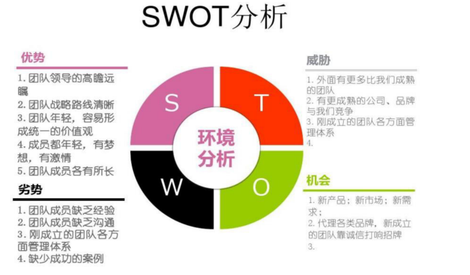

#### 4、人际关系与团队技能

帮助参会者专注于风险识别任务、准确遵循与技术相关的方法，确保风险描述清晰、找到并克服偏见，以及解决任何可能出现的分歧。

#### 5、提示清单

提示清单是关于可能引发项目风险来源的风险类别的预设清单。在采用风险识别技术时，提示清单可作为框架用于协助项目团队形成想法。可以用风险分解结构底层的风险类别作为提示清单，来识别单个项目风险。某些常见的战略框架更适用于识别整体项目风险的来源，如外部影响（政策、经济、社会、技术、法律、环境）、内部影响（技术、环境、商业、运营、政治）和性质（易变性、不确定性、复杂性、模糊性）。

#### 6、会议

### 4.3输出

#### 1、风险登记册

风险登记册记录已识别项目风险的详细信息。当完成识别风险过程时，风险登记册的内容主要包括：

**（1）已识别风险的清单**：在风险登记册中，每个项目风险都被赋予一个独特的标识符。需要按照所需的详细程度对已识别风险进行描述，确保明确理解。

**（2）潜在风险责任人**：如果已在识别风险过程中识别出潜在的风险责任人，就要把该责任人记录到风险登记册中。

**（3）潜在风险应对措施清单**：如果已在识别风险过程中识别出某种潜在的风险应对措施，就要把它记录到风险登记册中。随后将由规划风险应对过程进行确认。

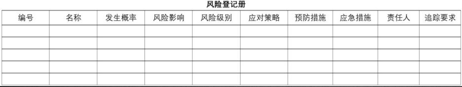

#### 2、风险报告

风险报告提供关于整体项目风险的信息，以及关于已识别的单个项目风险的概述信息。在项目风险管理过程中，风险报告的编制是一项渐进式的工作。随着实施定性风险分析、实施定量风险分析、规划风险应对、实施风险应对和监督风险过程的完成，这些过程的结果也需要记录在风险登记册中。完成识别风险过程时，风险报告内容主要包括：

**（1）整体项目风险的来源**：说明哪些是整体项目风险的最重要因素。

**（2）关于已识别单个项目风险的概述信息**：例如，已识别的威胁与机会的数量、风险在风险类别中的分布情况、测量指标和发展趋势。根据风险管理计划中规定的报告要求，风险报告中可能还包含其他信息。

#### 3、项目文件（更新）

可在识别过程更新的项目文件主要包括：

1. 假设日志：识别风险过程中，可能做出新假设，识别出新的制约因素，或者现有的假设条件或制约因素可能被重新审查和修改。更新假设日志，记录这些新信息。
2. 问题日志：记录发现的新问题或当前问题的变化。
3. 经验教训登记册：为了改善后期阶段或其他的项目绩效而更新经验教训登记册，记录关于行之有效的风险识别技术的信息。

## 5.实施定性风险分析

实施定性风险分析是通过评估单个项目风险发生的概率和影响及其他特征，对风险进行优先级排序，从而为后续分析或行动提供基础的过程。本过程的主要作用是重点关注高优先级的风险。本过程需要在整个项目期间开展。实施定性风险分析过程的数据流向如图：

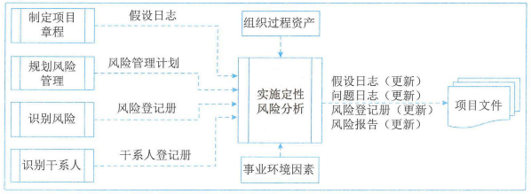

实施定性风险分析能为规划风险应对过程确定单个项目风险的相对优先级。本过程会为每个风险识别出责任人，以便由他们负责规划风险应对措施，并确保应对措施的实施。如果需要开展实施定量分析过程，那么实施定性风险分析也能为其奠定基础。

根据风险管理计划的规定，在整个项目生命周期中要定期开展实施定性风险分析过程。在敏捷型或适应型开发环境中，实施定性风险分析过程通常要在每次迭代开始前进行。

### 5.1输入

#### 1、项目管理计划

可用于实施定性风险分析的项目管理计划的子计划是风险管理计划。

#### 2、项目文件

可作为实施定性风险分析过程的项目文件主要包括：

1. **假设日志**：用于识别、管理和监督可能影响项目的关键假设条件和制约因素，它们可能影响对项目风险的优先级的评估。
2. 风险登记册：包括将在本过程评估的、已识别的项目风险的详细信息。
3. **干系人登记册**：包括可能被指定为风险责任人的项目干系人的详细信息。

#### 3、事业环境因素

#### 4、组织过程资产

### 5.2工具与技术

#### 1、专家判断

#### 2、数据收集

适用于实施定性风险分析过程的数据收集技术是**访谈**。结构化或结构化的访谈可用于评估单个项目风险的概率和影响，以及其他因素。访谈者应该营造信任和保密的访谈环境，以鼓励被访者提出诚实和无偏见的意见。

#### 3、数据分析

适用于实施定性风险分析过程的数据分析技术主要包括：

**（1）风险数据质量评估：**风险数据质量评估旨在评价关于单个项目风险的数据的准确性和可靠性。

**（2）风险概率和影响评估**：风险概率评估考虑的是特定风险发生的可能性，而风险影响评估考虑的是风险对一项或多项项目目标的潜在影响。低概率和影响的风险将被列入风险登记册中的观察清单，以供未来监测。

（3）其他风险参数评估。在对单个项目风险进行优先级排序时，项目团队可能考虑（除概率和影响以外的）如下其他风险特征：

- **紧迫性**：为有效应对风险而必须采取应对措施的时间段。时间短就说明紧迫性高。
- **领近性**：风险在多长时间后会影响一项或多项项目目标。时间短就说明领近性高。
- **潜伏期**：从风险发生到影响显现之间可能的时间段。时间短就说明潜伏期短。
- **可管理性**：风险责任人（或责任组织）管理风险发生或影响的容易程度。如果容易管理，可管理性就高。
- **可控性**：风险责任人（或责任组织）能够控制风险后果的程度。如果后果很容易控制，可控性就高。
- **可监测性**：对风险发生或即将发生进行监测的容易程度。如果风险发生很容易监测，可监测性就高。
- **连通性**：风险与其他单个项目风险存在关联的程度大小。如果风险与多个其他风险存在关联，连通性就高。
- **战略影响力**：风险对组织战略目标潜在的正面或负面影响。如果风险对战略目标有重大影响，战略影响力就大。
- **密切度**：风险被一名或多名干系人认为要紧的程度。被认为很要紧的风险，密切度就高。

#### 4、人际关系与团队技能

适用于实施定性风险分析过程的人际管理与团队技能是**引导**。开展引导能够提高对单个项目风险的定性分析的有效性。熟练的引导者可以帮助参会者专注与风险分析任务、准确遵循与技术相关的方法、就概率和影响评估达成共识、找到并克服偏见，以及解决任何可能出现的分歧。

#### 5、风险分类

对风险进行分类，有助于把注意力和精力集中到风险可能发生的最大的领域，或针对一组相关的风险制定通用的风险应对措施，从而有利于更有效的开展风险应对。

#### 6、数据表现

适用于实施定性风险分析过程的数据表现技术主要包括：

（1）概率和影响矩阵：把每个风险发生的概率和该风险一旦发生对项目目标的影响映射起来的表格。

（2）**层级图：如果使用了两个以上的参数对风险进行分类，那就不能使用概率和影响矩阵，而需要使用其他图形。**例如，气泡图能显示三维数据。在气泡图中，把每个风险都绘制成一个气泡，并用X（横）轴值、Y（纵）轴值和气泡大小来表示风险的3个参数。气泡图的示例如图，其中X轴表示可监测性，Y轴代表领近性，影响值则以气泡大小表示。

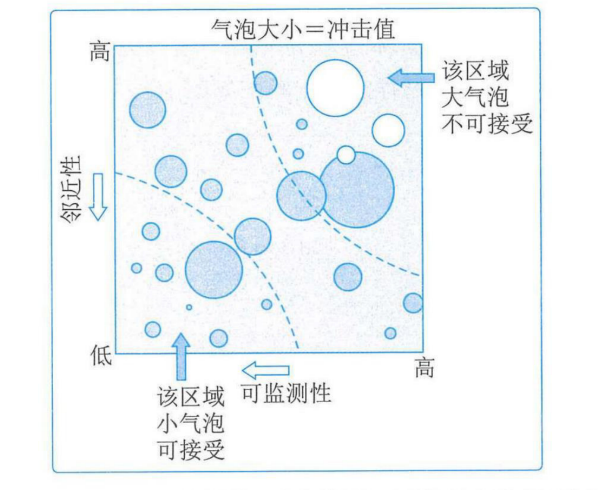

#### 7、会议

### 5.3输出

#### 项目文件（更新）

可在实施定性风险分析过程更新的项目文件主要包括：

1. 假设日志：可能做出新的假设、识别出新的制约因素，或者现有的假设条件或制约因素可能被重新审查和修改。
2. 问题日志：记录发现的新问题或当前问题的变化。
3. 风险登记册：更新内容可能包括：每项单个项目风险的概率和影响评估、优先级别或风险分值、指定风险责任人、风险紧迫性信息或风险类别，以及低优先级风险的观察抢单和需要进一步分析的风险。
4. 风险报告：更新风险报告，以记录最重要的单个项目风险（通常为概率和影响最高的风险）、所有已识别风险的优先级列表以及简要的结论。

## 6.实施定量风险分析

实施定量风险分析是就已识别的单个项目风险和不确定性的其他来源对整体目标的影响进行定量分析的过程。本过程的主要作用：

- 量化整体项目风险最大可能性；
- 提供额外的定量风险信息，以支持风险应对规划。

本过程并非每个项目必须，但如果采用，它会在整个项目期间持续开展。实施定量分析过程的数据流向如图：

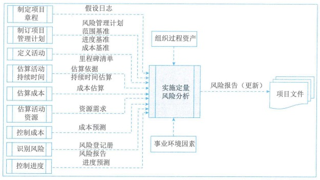

**并非所有的项目都需要实施定量风险分析。项目风险管理计划会规定是否需要使用定量风险分析。**定量分析适用于大型或复杂的项目，具有战略重要性的项目，合同要求进行定量分析的项目和主要干系人要求进行定量分析的项目。能否开展稳健的定量分析取决于是否有单个项目风险和其他不确定性来源的高质量数据，以及与范围、进度和成本相关的扎实的项目实践。

### 6.1输入

#### 1、项目管理计划

可用于实施定量风险分析的项目管理计划的组件主要包括：

1. 风险管理计划：确定项目是否需要定量风险分析，还会详细可用于分析的资源，以及预期的分析频率。
2. **范围基准**：提供了对单个项目风险和其他不确定性来源的影响开展评估的起点。
3. **进度基准**：提供了对单个项目风险和其他不确定性来源的影响开展评估的起点。
4. **成本基准**：提供了对单个项目风险和其他不确定性来源的影响开展评估的起点。

#### 2、项目文件

可作为实施定量风险分析过程输入的项目文件主要包括：

1. 假设日志：如果认为假设条件会引发项目风险，那么就应该把它们列作定量分析的输入。在定量风险分析期间，也可以建立模型来分析制约因素的影响。
2. **里程碑清单**：项目的重要阶段决定着进度目标，把这些进度目标与定量进度风险分析的结果进行比较，以确定与实现这些目标相关的置信水平。
3. 估算依据：开展定量风险分析时，可以把用于项目规划的估算依据反映在所建立的变量分析模型中。可能包括估算目的、分类、准确性、方法论和资料来源。
4. **持续时间估算**：提供了对进度变化性进行评估的起点。
5. **成本估算**：提供了对成本变化性进行评估的起点。
6. **资源需求**：提供了对变化性进行评估的起点。
7. **成本预测**：把这些预测指标与定量成本风险分析的结果进行比较，以确定与实现这些指标相关的置信高水平。
8. **风险登记册**：包含了用作定量风险分析输入的单个风险的详细信息。
9. **风险报告**：描述了整体项目风险的来源，以及当前的整体项目风险状态。
10. **进度预测**：可以将预测与定量进度风险分析的结果进行比较，以确定与实现预测目标相关的置信高水平。

#### 3、事业环境因素

#### 4、组织过程资产

### 6.2工具与技术

#### 1、专家判断

#### 2、数据收集

**访谈**可用于针对单个项目风险和其他不确定性来源，生成定量风险分析的输入。当需要向专家征求信息时，访谈尤其适用。

#### 3、人际关系与团队技能

适用于实施定量风险分析过程的人际关系与团队技能是**引导**。在由项目团队成员和其他干系人参加的专门风险研讨中，配备一名熟练的引导者，有助于更好的收集数据。

#### 4、不确定性表现方式

需要建立能反映单个项目风险和其他不确定性来源的定量风险分析模型，并为之提供输入。**三角分布、正态分布、对数正态分布、贝塔分布、均匀分布或离散分布。**

#### 5、数据分析

适用于实施定量风险分析过程的数据分析技术主要包括：

**（1）模拟**：在定量风险分析中，使用模型来模拟单个项目风险和其他不确定性来源的综合影响，以评估它们对项目目标的潜在影响。**模拟通常采用蒙特卡洛分析**。

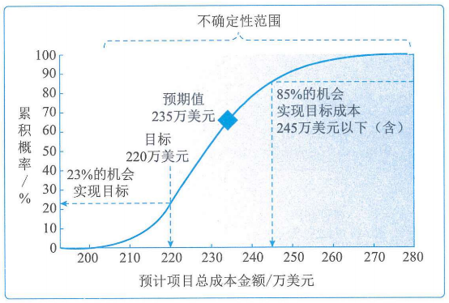

**（2）敏感性分析**：有助于确定哪些单个项目风险或不确定性来源对项目结果具有最大的潜在影响。敏感性分析的结果通常用龙卷风图来表示，图中标出定量风险分析模型中的每项要素与其能影响的项目结果之间的关联系数，这些要素可包括单个项目风险、易变的项目活动和具体的不明确性来源；每个要素按关联强度降序排列，形成典型的龙卷风形状。如图：

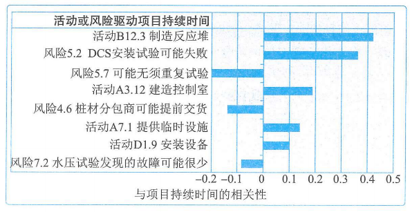

**（3）决策树分析**：预期货币价值

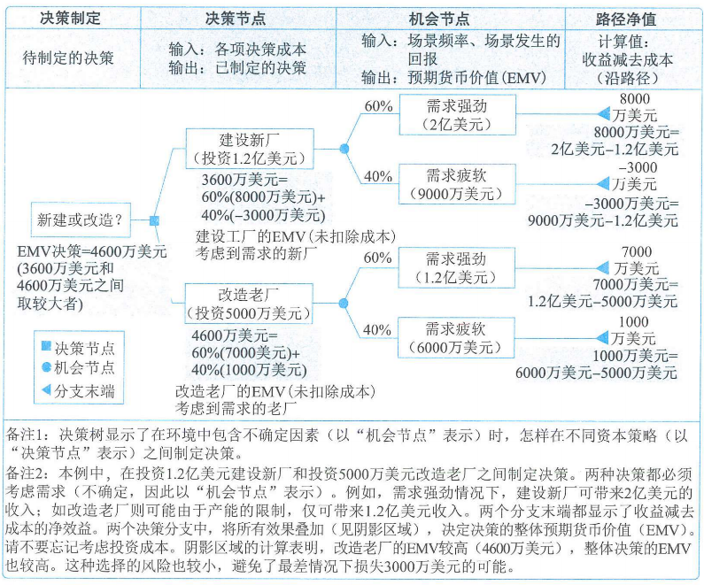

**（4）影像图：**不确定条件下进行决策的图形辅助工具。它将一个项目或项目重点一种情境表现为一系列实体、结果和影响，以及它们之间的关系和相互影响。如果因为存在单个项目风险或不确定性来源而影响图中的某些要素的不确定性，就在影响图中以区间或概率分布的形式表示这些要素；然后，借助模拟技术（如蒙罗卡洛析）来分析哪些要素对重要结果具有最大的影响。影像图分析可以得出类似于其他定量风险分析的结果，如S曲线图和龙卷风图。

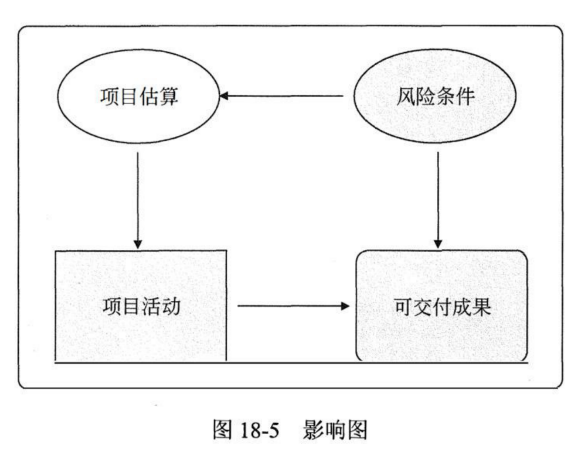

### 6.3输出

#### 项目文件（更新）

可作为实施定量风险分析过程输出的项目文件是风险报告。更新风险报告可以反映定量风险分析的结果。

1. 对整体项目风险最大可能性的评估结果。
2. 项目详细概率分析的结果。
3. 单个项目风险优先级清单。根据敏感性分析的结果，列出对项目造成最大威胁或产生最大机会的单个项目风险。
4. 定量风险分析结果的趋势。随着在项目生命周期的不同时间重复开展定量风险分析，风险的发展趋势可能逐渐清晰。
5. 风险应对建议。风险报告可能根据定量风险分析结果，针对整体风险的最大可能性或关键单个风险提出应对建议。

## 7.规划风险应对

规划风险的应对措施是为了应对项目风险，而制定可选方案、选择应对策略并商定应对行动的过程。本过程的主要作用：

1. 制定应对整体项目风险和单个项目风险的适当方法。
2. 分配资源，并根据需要将相关活动添加进项目文件和项目管理计划中。

本过程需要在整个项目期间开展。规划风险应对过程的数据流向如图：

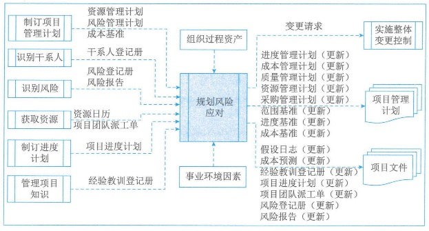

**风险应对方案应该与风险的重要性相匹配**，并且能够经济有效的应对挑战，同时在当前项目背景下实现可行，获得全体干系人的同意，并由一名责任人具体负责。

### 7.1输入

#### 1、项目管理计划

可用于规划风险应对的项目管理计划组件主要包括：

1. **资源管理计划**：有助于协调用于风险应对的资源和其他项目资源。
2. 风险管理计划：风险角色和职责、风险临界值。
3. **成本基准**：包含了拟用与风险应对的应急资金的信息。

#### 2、项目文件

可作为规划风险应对过程输入的项目文件主要包括：

1. **干系人登记册**：列出了风险应对的潜在责任人。
2. 风险登记册：包含了已识别并排序的、需要应对的单个项目风险的详细信息。
3. 风险报告：项目整体风险最大可能风险的当前级别，会影响风险应对策略的选择。风险报告也可能按优先级顺序列出了单个项目风险，并对单个项目风险的分布情况进行了更多分析；这些信息都会影响风险应对策略的选择。
4. **资源日历**：确定了潜在可用于风险应对的人力资源。
5. **项目团队派工单**：列明了可用于风险应对的人力资源。
6. **项目进度计划**：用于确定如何同时规划风险应对活动和其他项目活动。
7. 经验教训登记册：查看关于项目早期的风险应对的经验教训，确定类似的应对是否适用于项目后期。

#### 3、事业环境因素

#### 4、组织过程资产

### 7.2工具与技术

#### 1、专家判断

#### 2、数据收集

适用于规划风险应对过程的数据收集技术是**访谈**。项目风险的应对措施可以在与风险责任人的结构化或半结构化的访谈中制定。

#### 3、人际关系与团队技能

适用于规划风险应对过程的人际关系与团队技能是**引导**。开展引导能够提高项目风险应对策略制定的有效性。熟练的引导者可以帮助风险责任人理解风险、识别并比较备选的风险应对策略、选择适当的应对策略，并克服偏见。

#### 4、威胁应对策略

针对威胁，可以考虑如下5中备选的应对策略：

**（1）上报**。如果项目团队或项目发起人认为威胁不在项目范围内，或提议的应对措施超出了项目经理的权限，就应该采用上报策略。被上报的风险将在项目集层面、项目组合层面或组织的其他相关部门加以管理，而非项目层面。项目经理确定应就威胁通知哪些人员，并向该人员或组织部门传达关于该威胁的详细信息。**对于被上报的威胁，组织中的相关人员必须愿意承担应对责任，这一点非常重要。**威胁通常要上报给其目标会受该威胁影响的层级。威胁一旦上报，就不再由项目团队做进一步监督，虽然仍可出现在风险登记册中供参考。

**（2）规避。**风险规避是指项目团队采取行动来消除威胁，或保护项目免受威胁的影响。**它可能适用于发生概率较高、且具有严重负面影响的高优先级的威胁。**规避策略可能涉及变更项目管理计划的某些方面，或改变会受负面影响的目标，以便彻底消除威胁，将它发生概率降低到零。风险责任人也可以采取措施，来分离项目目标与风险万一发生的影响。**规避措施可能包括消除威胁的原因、延长进度计划、改变项目策略，或缩小范围。有些风险可通过澄清需求、获取信息、改善沟通或取得专有技能来加以规避。**

**（3）转移**。转移涉及将应对威胁的责任转移给第三方，让第三方管理风险并承担威胁发生的影响。采用转移策略通常需要向承担威胁的一方支付风险转移费用。**风险转移可能需要通过一系列行动才得以实现，主要包括购买保险、使用履约保函、使用担保书和使用保证书等；也可以通过签订协议，把具体风险的归属和责任转移给第三方。**

**（4）减轻。**风险减轻是指采取措施来降低威胁发生的概率和影响。提前采取减轻措施通常比威胁出现后尝试进行弥补更加有效。**减轻措施包括采用较简单的流程、进行更多次测试和选用更可靠的卖方。还可能涉及原型开发，以降低从实验台模型放大到实际工艺或产品中的风险。**如果无法降低概率，也许可以从决定风险严重性的因素入手，来减轻风险发生的影响。**例如，在一个系统中加入冗余部件，可减轻原始部件故障所造成的影响。**

**（5）接受。**风险接受是指承认威胁的存在。**此策略可用于低优先级威胁，也可用于无法以任何其他方式经济有效的应对的威胁。**接受策略又分为主动或被动方式。**最常见的主动接受策略是建立应急储备，包括预留时间、资金或资源以应对出现的威胁；被动接受策略则不会主动采取行动，而只是定期对威胁进行审查，确保其并未发生重大改变。**

#### 5、机会应对策略

针对机会，可以考虑以下5中备选策略：

**（1）上报**。如果项目团队或项目发起人认为某机会不在项目范围内，或提议的应对措施超出了项目经理的权限，就应该采取上报策略。被上报的机会将在项目集成面、项目组合层面或组织的其他相关部门加以管理，而非项目层面。项目经理确定应就机会通知哪些人员，并向该人员或组织部门传达关于该机会的详细信息。对于被上报的机会，组织中的相关人员必须愿意承担应对责任，这一点非常重要。机会通常要上报给其目标会受该机会影响的那个层面。机会一旦上报，就不再由项目团队做进一步监督，虽然仍可出现在风险登记层中供参考。

**（2）开拓。**如果组织向确保把握住高优先级的机会，就可以选择开拓策略。此策略将特定机会的出现概率提高到100确保其肯定出现，从而获得与其相关的收益。**开拓措施可能包括：报组织中最有能力的资源分配给项目来缩短完工时间，或采用权全新技术或技术升级来节约项目成本并缩短项目持续时间。**

**（3）分享。**分享涉及将应对机会的责任转移给第三方，使其享有机会所带来的部分收益。必须仔细为已分享的机会安排新的风险责任人，让那些最有能力为项目抓住机会的人担任新的风险责任人。采用机会应对策略，通常需要向承担机会应对责任的一方支付风险费用。**分享措施包括建立合伙关系、合作团队、特殊公司和合资企业分享机会。**

**（4）提高。**提高策略用于提供机会出现的概率和影响。提前采取提高措施通常比机会出现后尝试改善收益更加有效。通过关注其原因，可以提高机会出现的概率；如果无法提高概率，也许可以针对决定其潜在收益规模的因素来提高机会发生的影响。**机会提高措施包括为早日完成活动而增加资源。**

**（5）接受。**接受机会是承认机会的存在。**此策略可用于低优先级机会，也可用于无法以任何其他方式经济有效的应对的机会。接受策略又分为主动接受策略和被动接受策略。最常见的主动接受策略是建立应急储备，包括预留时间、资金或资源，以便在机会出现时加以利用；被动接受策略则不会主动采取行动，而知只是定期对机会进行审查，确保其并未发生重大改变。**

#### 6、应急应对策略

可以设计一些仅在特定事件发生时才采用的应对措施。对弈某些风险，如果项目团队相信其发生会有充分的预警信号，那么就应该制定仅在某些预定条件出现时才执行的应对计划。应该定义并跟踪应急应对策略的触发条件，例如，未实现中间的里程碑，或获得卖方更高程度的重视。采用此技术制定的风险应对计划通常称为应急计划，其中包括已识别的，用于启动计划的触发时事件。

#### 7、整体项目风险应对策略

风险应对措施的规划和实施不应只针对单个项目风险，还应针对整体的项目风险。用于应对单个项目风险的策略也适用于整体项目风险：

**（1）规避**。如果整体项目风险有严重的负面影响，并已超出商定的项目风险临界值，可以采用规避策略。此策略涉及采取集中行动，弱化不确定性对项目整体的负面影响，并将项目拉回到临界值以内。例如，取消项目范围中的高风险工作，就是一种整个项目层面的规避措施。如果无法将项目拉回到临界值以内，则可能取消项目。这是最极端的风险规避措施，仅适用于威胁的整体级别在当前和未来都不可接受的情况。

**（2）开拓**。如果整体项目风险有显著的正面影响，并已超出商定的项目风险临界值，就可以采取开拓策略。此策略涉及采取集中行动，获得不确定性对整体项目的正面影响。例如，在项目范围中增加高收益的工作，以提高项目对干系人的价值或效益；或者，也可以与关键干系人协商修改项目的风险临界值，以便将机会包含在内。

**（3）转移或分享**。如果整体项目风险的级别很高，组织无法有效加以应对，就可能需要让第三方代表组织对风险进行管理。若整体项目风险是负面的，就需要采取转移策略，这可能涉及支付风险费用：如果整体项目风险高度证明，则由多方分析，以获得相关收益。整体项目风险的转移和分享策略主要包括：建立买方和卖方分享整体项目风险的协作式业务结构、成了合资企业或特殊目的公司，或对项目的关键工作进行分包。

**（4）减轻或提高**。本策略设涉及变更整体项目风险的级别，以优化实现项目目标的可能性。减轻策略适用于负面的整体项目风险，而提高策略则适用于正面的整体项目风险。减轻或提高策略包括重新规划项目、改变项目范围和边界、调整项目优先级、改变资源配置、调整交付时间等。

**（5）接受**。即使整体项目风险已超商定的临界值，如果无法针对整体项目风险采取主动的应对策略，组织可能选择继续按当前的定义推动项目进展。接受策略又分为主动接受策略和被动接受策略。最常见的主动接受策略是为项目建立整体应急储备，包括预留时间、资金和资源，以便在项目风险超出临界值时使用；被动接受策略则不会主动采取行动，而只是定期对整体项目风险的级别进行审查，确保其未发生重大改变。

#### 8、数据分析

可用于选择首选风险应对策略的数据分析技术主要包括：

1. **备选方案分析：**对备选风险应对方案的特征和要求进行简单比较，进而确定哪个应对方案最为适用。
2. **成本收益分析：**把应对策略将导致的风险影响级别变更除以策略的实施成本所得到的比率，就代表应对策略的成本有效性。比率越高，有效性就越高。

#### 9、决策

适用于规划风险应对的决策技术是**多标准决策分析**，列入考虑范围的风险应对策略可能是一种或多种。决策技术有助于对多种风险应对策略进行优先级排序。

### 7.3输出

#### 1、变更请求

#### 2、项目管理计划（更新）

可能需要变更的项目管理计划组件主要包括：

1. 进度管理计划
2. 成本管理计划
3. 质量管理计划
4. 资源管理计划
5. 采购管理计划
6. 范围基准
7. 成本基准
8. 进度基准

#### 3、项目文件（更新）

可在规划风险应对过程更新的项目文件主要包括：

1. 假设日志：在规划风险应对过程中，可能做出新的假设、识别出新的制约因素，或者现有的假设条件或制约因素可能被重新审查和修改。
2. 成本预测：可能因规划的风险应对策略而发生变更。
3. 经验教训登记册：更新以记录适用于项目的未来阶段或未来项目的风险应对信息。
4. 项目进度计划：可以把用于执行已商定的风险应对策略的活动添加到项目进度计划中。
5. 项目团队派工单：一旦确定应对策略，应为每项与风险应对计划相关的措施分配必要的资源，包括用于执行商定的措施的具有适当资质和经验的人员（通常在项目团队中）、合理的资金和时间，以及必要的技术手段。
6. 风险登记册：需要更新以记录选择和商定的风险应对措施。
7. 风险报告：更新以记录针对当前整体项目风险敞口和高优先级风险的经商定的应对措施，以及实施这些措施之后的预期变化。

## 8.实施风险应对

实施风险应对是执行商定的风险应对计划的过程。本过程的主要作用：

- 确保按计划执行商定的风险应对措施；
- 管理整体项目风险入口、最小化单个项目威胁，以及最大化单个项目机会。

本过程需要在整个项目期间开展。实施风险应对过程的数据流向如图：

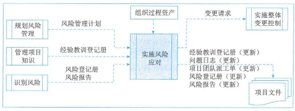

### 8.1输入

#### 1、项目管理计划

可用于实施风险应对的项目管理计划组件是风险管理计划。

#### 2、项目文件

可作为实施风险应对过程输入的项目文件主要包括：

1. 经验教训登记册：项目早期获得的与实施风险应对有关的经验教训，可用于项目后期提高本过程的有效性。
2. **风险登记册**：记录了每个风险的应对计划，并制定责任人。
3. **风险报告**：包括了对当前整体项目风险入口的评估，以及商定的风险应对策略，还会描述重要的单个项目风险及其应对计划。

#### 3、组织过程资产

### 8.2工具与技术

#### 1、专家判断

#### 2、人际关系与团队技能

适用于本过程的人际关系与团队技能是**影响力**。有些风险应对措施可能由项目团队以外的人员执行，或由存在其他竞争性需求的人员执行。这种情况下，负责引导风险管理过程的项目经理或人员就需要施展影响力，去鼓励指定的风险责任人采取所需的行动。

#### 3、项目管理信息系统

### 8.3输出

#### 1、变更请求

#### 2、项目文件（更新）

可在实施风险应对过程更新的项目文件主要包括：

1. 经验教训登记册
2. 问题日志：已识别问题会被记录到问题日志中。
3. 项目团队派工单：应为每项与风险应对计划相关的措施分配必要的资源，包括用于执行商定的措施的，具有适当资质和经验的人员、合理的资金和时间，以及必要的技术手段。
4. 风险登记册：可能需要更新风险登记册，以反映开展本过程所导致的对单个项目风险的已商定应对措施的任何变更。
5. 风险报告：可能需要更新风险报告，以反映开展本过程所导致的对整体项目风险入口的已商定应对措施的任何变更。

## 9.监督风险

监督风险是在整个项目期间，监督风险应对计划的实施，并跟踪已识别的风险、识别和分析新风险，以及评估风险管理有效性的过程。本过程的主要作用是，保证项目决策是在整体项目风险和单个项目风险当前信息的基础上进行。本过程需要在整个项目期间开展。监督风险过程的数据流向如图：

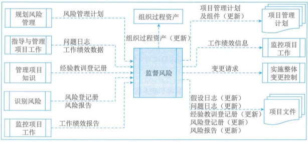

为了确保项目团队和关键干系人了解当前的风险级别，应该通过监督风险过程对项目工作进行持续监督，并持续关注新出现、正变化和已过时的单个项目风险。

监督风险过程采用项目执行期间生成的绩效信息，以确定：

- 实施的风险应对是否有效；
- 整体项目风险级别是否已改变；
- 已识别单个项目风险的状态是否已改变；
- 是否出现新的单个项目风险；
- 风险管理方法是否依然适用；
- 项目假设条件是否仍然成立；
- 风险管理政策和程序是否已得到遵守；
- 成本或进度应急储备是否需要修改；
- 项目策略是否仍然有效等。

### 9.1输入

#### 1、项目管理计划

可用于监督风险的项目管理计划的组件是风险管理计划。

#### 2、项目文件

应作为监督风险过程输入的项目文件主要包括：

1. **问题日志**：用于检查未决问题是否更新，并对风险登记册进行必要更新。
2. 经验教训登记册
3. **风险登记册**
4. 风险报告：包括对当前整体项目风险入口的评估，以及商定的风险应对策略，还会描述重要的单个项目风险及其应对计划和风险责任人。

#### 3、工作绩效数据

工作绩效数据包含关于项目状态的信息，例如，已实施的风险应对措施、已发生的风险仍活跃及已关闭的风险。

#### 4、工作绩效报告

工作绩效报告通过分析绩效测量结果得出，能够提供关于项目工作绩效的信息，包括偏差分析结果、挣值数据和预测数据。监督与绩效相关的风险时，需要使用这些信息。

### 9.2工具与技术

#### 1、数据分析

适用于监督风险过程的数据分析技术主要包括：

1. **技术绩效分析：**开展技术绩效分析，把项目执行期间所取得的技术成果与取得相关技术成果的计划进行比较。
2. **储备分析：**储备分析是指在项目的任一时点比较剩余应急储备与剩余风险量，从而确定剩余储备是否仍然合理。可以用各种图形（如燃尽图）来显示应急储备的消耗情况。

#### 2、审计

风险审计是一种审计模型，可用于评估风险管理过程的有效性。项目经理负责确保按项目风险管理计划所规定的频率开展风险审计。

#### 3、会议

适用于监督风险过程的会议是风险审查会。应该定期安排风险审查，来检查和记录风险应对在处理整体项目风险和已识别单个项目风险方面的有效性。

### 9.3输出

#### 1、工作绩效信息

工作绩效信息是经过比较单个风险的实际发生情况和预计发生情况，所得到的关于项目风险管理执行绩效的信息。它可以说明风险应对规划和应对实施过程的有效性。

#### 2、变更请求

#### 3、项目管理计划（更新）

项目管理计划的任何组件都可能受本过程的影响。

#### 4、项目文件（更新）

可在监督风险过程更新的项目文件主要包括：

1. 假设日志：监督风险过程中，可能做出新假设、识别出新的制约因素，或者现有假设条件或制约因素可能被重新审查和修改。
2. 问题日志：作为监督风险过程的一部分，已识别的问题会记录到问题日志中。
3. 经验教训登记册：更新经验教训登记表，记录风险审查期间得到的任何与风险相关的经验教训。
4. 风险登记册：更新风险登记册，以记录在监督风险中产生的单个项目风险的信息。
5. 风险报告：应随着监督风险过程生成的新信息更新风险报告

#### 5、组织过程资产（更新）

## 10.风险管理示例

一个主要的风险管理工具是主要风险清单。它指明了项目面临的风险列表，风险清单可以使项目经理的头脑保持着风险管理的意识。项目组应当在开始需求分析之前就初步的列一张风险清单，并且直到项目结束钱不断更新这张清单。重要的是它应当定期"维护"，项目经理、风险管理负责人和项目经理的上司应该定期（比如每隔一周）回顾一次清单。这种回顾应包含在计划进度表中，否则就可能被遗忘。

更新风险清单，给这些风险排优先顺序，并更新风险应对情况，可以帮助对这些风险的严重程度和变化情况保持警惕。

## 论文举例

项目风险管理旨在识别和管理未被项目计划及其他过程所管理的风险。如果不妥善管理，这些风险可能导致项目偏离计划，无法达成既定的项目目标。

请以"论信息系统项目的风险管理"为题进行论述：

1、概要叙述你参与管理的信息系统项目（项目的背景、项目规模、发起单位、目的、项目内容、组织结构、项目周期、交付的成果等），并说明你在其中承担的工作（项目背景要求本人真实经理，不得抄袭及杜撰）

2、请结合你所叙述的信息系统项目，围绕以下要点论述你对信息系统项目管理风险管理的认识：

（1）请根据你所描述的项目，详细阐述你是如何进行风险识别和风险应对的。

（2）请根据你所描述的项目，写出该项目的风险登记册，并描述风险登记册的具体内容在项目风险管理整个过程中是如何逐步完善的。