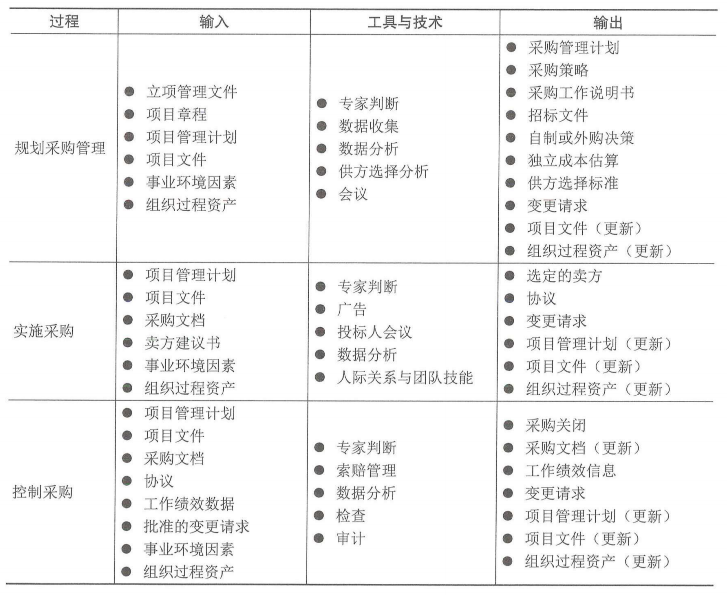
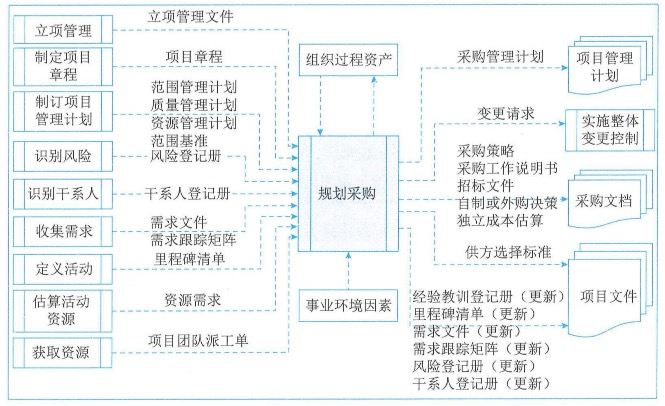
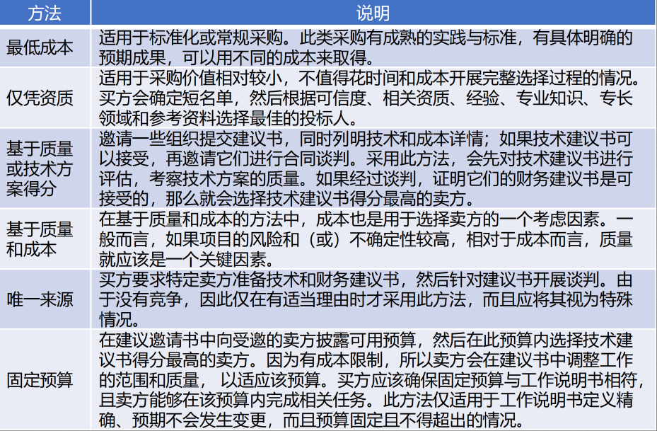
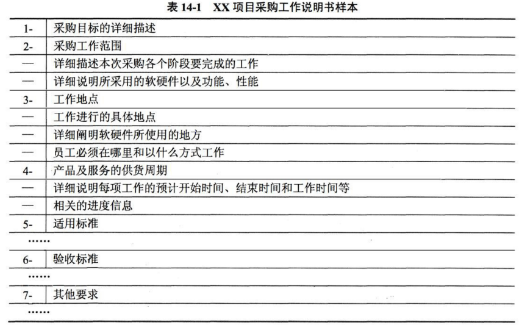
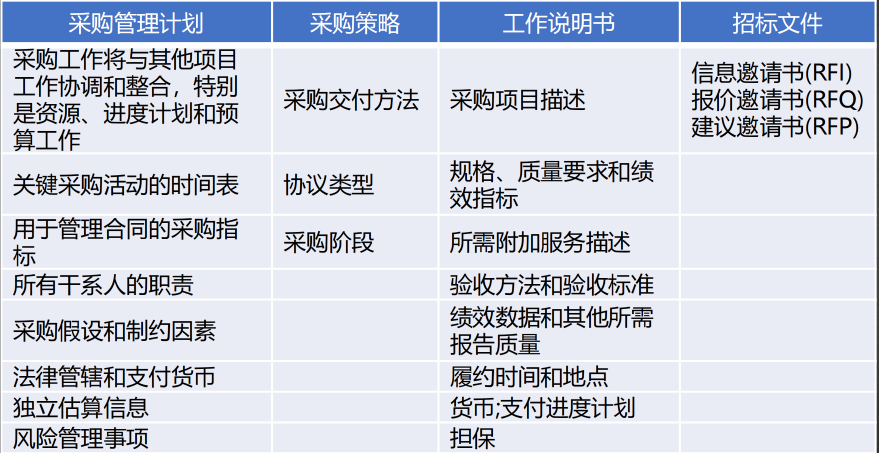
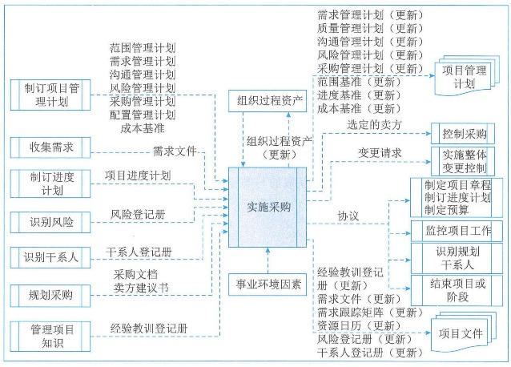
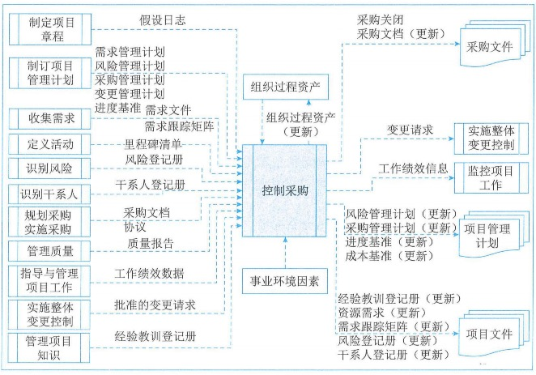

# 项目采购管理

项目采购管理包括从项目团队外部采购或获取所需产品、服务或成果的各个过程。项目采购管理包括编制和管理协议所需的管理和控制过程。

## 1.管理基础

### 1.1协议/采购合同

### 1.2管理新实践

## 2.项目采购管理过程

### 2.1过程概述

项目采购管理过程包括：

1. **规划采购管理**：记录项目采购决策、明确采购方法及识别潜在卖方。
2. **实施采购**：获取卖方应答、选择卖方并授予合同。
3. **控制采购**：管理采购关系、监督合同绩效、实施必要变更和纠偏，以及关闭合同。

### 2.2裁剪考虑因素

### 2.3敏捷与适应方法

在敏捷或适应型环境中，可能需要与特定卖方进行协作来扩充团队。

这种协作关系能够营造风险共担式采购模型，让买方和卖方共担项目风险和共享项目收益。

在大型项目上，可能针对某些可交付成果采用敏捷或适应型方法，而对其他部分则采用更稳定的方法。在这种情况下，可以通过主体协议，如主要服务协议（MSA）来管理整体协作关系，而将敏捷或适应型工作写入附录或补充文件。这样一来，变更只针对敏捷或适应型工作，而不会对主体协议造成影响。

## 3.规划采购管理

规划采购管理是记录项目采购决策、明确采购方法，及识别潜在卖方的过程。本过程的主要作用是确定是否从项目外部获取货物和服务，如果是，则还要确定将在什么时间、以什么方式获取什么货物和服务。货物和服务可从执行组织的其他部门采购，或者从外部渠道采购。本过程仅开展一次或仅在项目的预定义点开展。规划采购管理过程的数据流向如图：

### 3.1输入

#### 1、立项管理文件

 立项管理阶段经批准的结果或相关的文件可用于规划采购管理的依据。

#### 2、项目章程

项目章程包括目标、项目描述、总体里程碑，以及预先批准的财务资源。

#### 3、项目管理计划

可用于规划采购管理的项目管理计划的组件主要包括：

1. **范围管理计划**
2. **质量管理计划**
3. **资源管理计划**
4. **范围基准**

#### 4、项目文件

可作为规划采购管理过程输入的项目文件主要包括：

1. **风险登记册**：列明风险清单，以及风险分析和风险应对规划的结果。有些风险应通过采购协议转移给第三方。
2. **干系人登记册**：干系人登记册提供有关项目参与者及其项目利益的详细信息，包括监管机构、合同签署人员和法务人员。
3. **需求文件**：一是卖方需要满足的技术要求；二是具有合同和法律意义的需求。
4. **需求跟踪矩阵**：将产品需求从来源连接到满足需求的可交付成果。
5. **里程碑清单**：重要里程碑清单说明卖方需要在何时交付成果。
6. **资源需求**：包含关于某些特定需求的信息，例如，可能需要采购的团队及实物资源。
7. **项目团队派工单**：包含关于项目团队技能和能力的信息，以及他们可用于支持采购活动的时间。如果项目团队不具备开展采购活动的能力，则需要外聘人员或对现有人员进行培训，或者二者同时进行。

#### 5、事业环境因素

#### 6、组织过程资产

### 3.2工具与技术

#### 1、专家判断

#### 2、数据收集

适用于规划采购管理过程的数据收集技术是**市场调研**。市场调研包括考察行业情况和具体卖方的能力。

#### 3、数据分析

适用于规划采购管理过程的数据分析技术是**自制或外购分析**。自制或外购分析用于确定某项工作或可交付成果最好是由项目团队自行完成，还是应该从外部采购。

#### 4、供方选择分析

在确定选择方法前，有必要审查项目竞争性需求的优先级。由于竞争性选择方法可能要求卖方在事前投入大量时间和资源，因此，应该在采购文件中写明评估方法，让投标人了解将会被如何评估。**常用的选择方法包括：**

#### 5、会议

### 3.3输出

#### 1、采购管理计划

采购管理计划包含要在采购过程中开展的各种活动。

#### 2、采购策略

一旦完成自制或外购分析，并决定从项目外部渠道采购，就应该制定一套采购策略。应该在采购策略中规定项目交付方法、具有法律约束力的协议类型，以及如何在采购阶段推动采购进展。

#### 3、采购工作说明书

**依据项目范围基准，为每次采购编制工作说明书（SOW）**，仅对将要包含在相关合同中的那一部分项目范围进行定义。**工作说明书会充分详细的描述拟采购的产品、服务或成果，以便潜在卖方确定是否有能力提供此类产品、服务或成果。**根据采购品的性质、买方的需求或拟采用的合同形式，工作说明书的详细成本会有较大不同。工作说明书的内容包括：规格、所需数量、质量水平、绩效数据、履约期间、工作地点和其他要求。

采购工作说明书应力求清晰、完整和简练。它需要说明所需的附加服务，例如，报告绩效，或对采购品的后续运营支持。**在采购过程中，应根据需要对工作说明书进行修订，直到它成为所签协议的一部分。**

#### 4、招标文件

招标文件用于向潜在卖方征求建议书。招标文件可以是信息邀请书、报价邀请书、建议邀请书，或其他适当的采购文件。使用不同文件的条件如下：

1. **信息邀请书（RFI）**：如果需要卖方提供关于拟采购货物和服务的更多信息，就使用信息邀请书。随后一般还会使用报价邀请书或建议邀请书。
2. **报价邀请书（RFQ）**：如果需要供应商提供关于将如何满足需求和（或）将需要多少成本的更多信息，就使用报价邀请书。
3. **建议邀请书（RFP）**：如果项目中出现问题且解决办法难以确定，就使用建议邀请书。这是最正式的"邀请书"文件，需要遵守与内容、时间表，以及卖方应答有关的严格的采购规则。

#### 5、自制或外购策略

通过自制或外购分析，做出某项特定工作最好由项目团队自己完成，还是需要从外部渠道采购的决策。

#### 6、独立成本估算

对于大型的采购，采购组织可自行准备独立估算，或聘用外部专业估算师做出成本估算，并将其作为评价卖方报价的对照基准。**如果二者之间存在明显差异，则可能表明采购工作说明书存在缺陷或模糊，或者潜在卖方误解了或未能完全响应采购工作说明书。**

#### 7、供方选择标准

在确定评估标准时，买方要努力确保选出的建议书提供最佳质量的所需服务。

#### 8、变更请求

#### 9、项目文件（更新）

可在规划采购管理过程更新的项目文件主要包括：

1. 经验教训登记册
2. 里程碑清单：重要里程碑清单说明卖方需要在何时交付成果
3. 需求文件：可能包括卖方需要满足的技术要求；具有合同和法律意义的需求。
4. 需求跟踪矩阵
5. 风险登记册
6. 干系人登记册：更新以记录任何关于干系人的补充信息，尤其是监督机构、合同签署人员，以及法务人员的信息。

#### 10、组织过程资产（更新）

## 4.实施采购

实施采购是获取卖方应答、选择卖方并授予合同的过程。本过程的主要作用是，选定合格卖方并签署关于货物或服务交付的法律协议。本过程的最后成果是签订的协议，包括正式合同。本过程应根据需要在整个项目期间定期开展。实施采购过程的数据流向如图：

### 4.1输入

#### 1、项目管理计划

可用于实施采购的项目管理计划组件主要包括：

1. **范围管理计划**
2. **需求管理计划**
3. **沟通管理计划**：描述买方和卖方之间如何开展沟通。
4. **风险管理计划**
5. 采购管理计划：包含在实施采购过程中应该开展的活动。
6. 配置管理计划：包含卖方开展配置管理的形式和过程，以便与买方采取的方法保持一致。
7. **成本基准**：包括用于开展采购的预算，用于管理采购过程的成本，以及用于管理卖方的成本。

#### 2、项目文件

可作为实施采购过程输入的项目文件主要包括：

1. **需求文件**
2. **项目进度计划**：确定项目活动的开始和结束日期，包括采购活动。它还会规定承包商最终的交付日期。
3. **风险登记册**：取决于卖方的组织、合同的持续时间、外部环境、项目交付方法、所选合同类型，以及最终商定的价格。任何被选中的卖方都会带来特殊的风险。
4. **干系人登记册**：包含与识别干系人有关的所有详细信息。
5. 经验教训登记册：在项目早期获取的与实施采购有关的经验教训，可用于项目后期阶段，以提高本过程的效率。

#### 3、采购文档

采购文档适用于达成法律协议的各种书面文件，其中可能包括当前项目启动之前的较旧文件。采购文档可包括：

1. **招标文件**：包括发给卖方的信息邀请书、建议邀请书、报价邀请书，或其他文件，以便卖方编制应答文件。
2. **采购工作说明书**：向卖方清晰的说明目标、需求或成果，以便卖方据此做出量化应答。
3. **独立成本估算**：可由内部或外部人员编制，用于评价投标人提交的建议书的合理性。
4. **供方选择标准**：描述如何评估投标人的建议书，包括评估标准和权重。为了减轻风险，买方可能决定与多个卖方签署协议，以便在单个卖方出问题并影响整体项目时，降低由此导致的损失。

#### 4、卖方建议书

卖方为响应采购文件包而编制的建议书，其中包含的基本信息将被评估团队用于选定一个或多个投标人（卖方）。如果卖方将提交价格建议书，最好要求他们将价格建议书与技术建议书分开。评估团队会根据供方选择标准审查每一份建议书，然后选出最能满足采购组织需求的卖方。

#### 5、事业环境因素

#### 6、组织过程资产

### 4.2工具与技术

#### 1、专家判断

#### 2、广告

广告就是产品、服务或成果与用户或潜在用户进行的沟通。在大众出版物（如指定的报纸）或专门行业出版物上刊登广告，往往可以扩充现有的潜在卖方名单。**大多数政府机构都要求公开发布采购广告，或在网上公布拟签署的政府合同的信息。**

#### 3、投标人会议

投标人会议（又称承包商会议、供应商会议或投标前会议）是在卖方提交建议书之前，在买方和潜在卖方之间召开的会议，**其目的是确保所有潜在投标人对采购要求都有清楚且一致的理解，并确保没有任何投标人会得到特别优待。**

#### 4、数据分析

适用于实施采购过程的数据分析技术主要包括**建议书评估。**对建议书进行评估，确定它们是否对包含在招标文件包中的招标文件、采购文件说明书、供方选择标准和其他文件，都做出了完整且充分的响应。

#### 5、人际关系与团队技能

适用于实施采购过程的人际管理与团队技能是**谈判。**采购谈判是指在合同签署之前，对合同的结构、各方的权利和义务，以及其他条款加以澄清，以便双方达成共识。**最终的文件措辞应该反映双方达成的全部一致意见。谈判以签署买方和卖方均可执行的合同文件或其他正式协议而结束。谈判应由采购团队中拥有合同签署职权的成员主导。项目经理和项目管理团队的其他成员可以参加谈判并提供必要的协助。**

### 4.3输出

#### 1、选定的卖方

选定的卖方是在建议评估或投标评估中被判断为最有竞争力的投标人。**对于较复杂、高价值和高风险的采购，在授予合同前，要把选定卖方报给组织高级管理人员审批。**

#### 2、协议

合同是对双方都有约束力的协议。它强制卖方提供规定的产品、服务或成果，强制买方向卖方支付相应的报酬。

#### 3、变更请求

通过实施整体变更控制过程，来审查和处理对项目管理计划及其子计划和其他组件的变更请求。

#### 4、项目管理计划（更新）

可能需要变更的项目管理计划组件主要包括：

1. 需求管理计划：项目需求可能因卖方的要求而变更。
2. 质量管理计划：卖方可能提出备选质量标准或备选解决方案。
3. 沟通管理计划：选定卖方后，需要更新沟通管理计划。
4. 风险管理计划：每个协议和卖方都会带来独特的风险，从而需要更新风险管理计划。具体的风险应该记录到风险登记册中。
5. 采购管理计划：可能需要基于合同谈判和签署的结果更新采购管理计划。
6. 范围基准：在执行采购活动中，需明确考虑范围基准中的项目工作分解结构和可交付成果。本过程可能导致对任何一个或全部可交付成果的变更。
7. 进度基准：如果卖方交付成果方面的变更影响了项目的整体进度绩效，则可能需要更新并审批基准进度计划，以反映当前的期望。
8. 成本基准：在项目交付期间，承包商的材料价格和人力价格可能随外部经济环境而频繁变动。这种变动需要反映到成本基准中。

#### 5、项目文件（更新）

可在实施采购过程更新的项目文件主要包括：

1. 经验教训登记册
2. 需求文件
3. 需求跟踪矩阵
4. 资源日历：可能需要根据卖方的可用性更新与进度计划有关的资源日历
5. 风险登记册：每个被选中的卖方都会带来特俗的风险
6. 干系人登记册：包含与已识别干系人有关的所有详细信息。与具体卖方签订协议后，需要更新干系人登记册。

#### 6、组织过程资产（更新）

## 5.控制采购

控制采购是管理采购关系、监督合同绩效、实施必要的变更和纠偏，以及关闭合同的过程。本过程的主要作用是，确保买卖双方履行法律协议，满足项目需求。本过程应根据需要在整个项目期间开展。控制采购过程的数据流向如图：

**买方和卖方都出于类似的目的来管理采购合同，每方都必须确保双方履行合同义务，确保各自的合法权利得到保护。**

### 5.1输入

#### 1、项目管理计划

可用于控制采购的项目管理计划组件主要包括：

1. **需求管理计划**：描述将如何分析、记录和管理承包商需求。
2. **风险管理计划**：描述如何安排和实施由卖方引起的风险管理活动。
3. 采购管理计划：规定了在控制采购过程中需要开展的活动。
4. 变更管理计划：包含关于如何处理由卖方引发的变更的信息。
5. **进度基准**：如果卖方的进度拖后影响了项目的整体进度绩效，可能需要更新并审批进度计划，以反映当前的期望。

#### 2、项目文件

可作为控制采购过程输入的项目文件主要包括：

1. 假设日志：记录而采购过程中做出的假设。
2. **需求文件**：可能包括卖方需要满足的技术要求。
3. **需求跟踪矩阵**
4. **里程碑清单**：重要里程碑清单说明卖方需要在何时交付成果。
5. **风险登记册**：每个被选中的卖方都会带来特殊的风险。
6. **干系人登记册**：合同团队成员、选定的卖方、签署合同的专员，以及参与采购的其他干系人。
7. **质量报告**：用于识别不合规的卖方过程、程序或产品。
8. 经验教训登记册：在项目早期获取的经验教训可供项目未来使用，以改进承包商绩效和采购过程。

#### 3、采购文档

采购文档包含用于管理采购过程的完整支持性记录，包括工作说明书、支付信息、承包商工作绩效信息、计划、图纸和其他往来函件。

#### 4、协议

协议是双方达成的包括对各方义务的一致理解。

#### 5、工作绩效数据

工作绩效数据包含与项目状态有关的卖方数据，例如，技术绩效，已启动、进展中或已结束的活动，已产生或投入的成本。工作绩效数据还可能包括向卖方付款的情况。

#### 6、批准的变更请求

#### 7、事业环境因素

#### 8、组织过程资产

### 5.2工具与技术

#### 1、专家判断

#### 2、索赔管理

如果买卖双方不能就变更补偿达成一致意见，或对变更是否发生存在分歧，那么被请求的变更就成为有争议的变更或潜在的推定变更。此类有争议的变更称为索赔。

#### 3、数据分析

用于监督和控制采购的数据分析技术主要包括：

1. **绩效审查**：对照协议，对质量、资源、进度和成本绩效进行测量、比较和分析，以审查合同工作的绩效。其中包括确定工作包提前或落后进度计划、超出或低于预算，以及是否存在资源或质量问题。
2. **挣值分析（EVA）**：计算进度和成本偏差，以及进度和成本绩效指数，以确定偏离目标的程度。
3. **趋势分析**：可用于编制关于成本绩效的完工估算（EAC），以确定绩效是正在改善还是恶化。

#### 4、检查

检查是指对承包商正在执行的工作进行结构化审查，可能涉及对可交付成果的简单审查或对工作本身的实地审查。以确保双方对正在进行的工作由共同的认识。

#### 5、审计

涉及是对采购过程的结构化审查。应该在采购合同中明确规定与审计有关的权利和义务。买卖双方的项目经理都应该关注审计结果，以便对项目进行必要的调整。

### 5.3输出

#### 1、采购关闭

买方通常通过其授权的采购管理员，向卖方发出合同已经完成的正式书面通知。项目管理团队应该在关闭采购之前批准所有的可交付成果。

#### 2、采购文档（更新）

采购文档应更新，以包括用于支持合同的全部进度计划、已提出但未批准的合同变更，以及已批准的变更请求。采购文档还包括由卖方编制的技术文件，以及其他工作绩效信息。

#### 3、工作绩效信息

工作绩效信息是卖方正在履行的工作的绩效情况。

#### 4、变更请求

在控制采购过程中，可能提出对项目管理计划及其子计划和其他组件的变更请求。

#### 5、项目管理计划（更新）

可能需要变更的项目管理计划的组件主要包括：

1. 风险管理计划：每个协议和卖方都会带来独特的风险。
2. 采购管理计划：可能需要基于卖方执行工作的绩效情况对采购管理计划进行更新。
3. 进度基准：如果卖方的重大进度变更影响到了项目的整体进度绩效，则可能需要更新并审批基准进度计划，以反映当前的期望。
4. 成本基准：在项目交付期间，承包商的材料价格和人力价格可能随外部经济环境而频繁变动。这种变动需要反映到成本基准中。

#### 6、项目文件（更新）

可在控制采购过程更新的项目文件主要包括：

1. 经验教训登记册
2. 资源需求：随着承包商工作进展，工作执行不符合原定计划时需要变更资源需求。
3. 需求跟踪矩阵：更新需求跟踪矩阵，记录已实现的需求。
4. 风险登记册：随着早期风险的过时以及新风险的出现，项目执行期间会对风险登记册进行变更。
5. 干系人登记册：随着执行阶段的工作进展，承包商和供应商可能发生变更，应该把承包商和供应商的变更情况记录在干系人登记册中。

#### 7、组织过程资产（更新）

作为控制采购过程的结果，需要更新的组织过程资产主要包括：

1. 支付计划和请求：所有支付都应该按合同条款和条件进行。
2. **卖方绩效评估文件**：由买方准备，用于记录卖方继续执行当前合同工作的能力，说明是否允许卖方承接未来的项目，或对卖方现在的项目执行工作或过去的执行工作进行评级。
3. **预审合格卖方清单更新**：以前已经通过资格审查（获得批准）的潜在卖方的清单。因为卖方可能因绩效不佳而被取消资格并从清单中删除，所以根据控制采购过程的结果来更新这个清单。
4. 经验教训知识库
5. **采购档案**：应该准备好带索引规定全套合同文档，包括已关闭的合同，并将其纳入最终的项目档案。

## 6.项目合同管理

### 6.1合同的类型

#### 1、按项目范围划分

以项目的范围为标准划分，可以将合同分为项目总承包合同、项目单项承包合同和项目分包合同3类。

**（1）项目总承包合同。**买方将项目的全过程作为一个整体发包给同一个卖方的合同。总承包合同要求只与同一个卖方订立承包合同，但并不意味着只订立一个总合同。可以采用订立一个总合同的形式，也可以采用订立若干个合同的形式。**采用总承包合同的方式一般适用于经验丰富、技术实力雄厚且组织管理协调能力强的卖方，这样有利于发挥卖方的专业优势，保证项目的质量和进度，提高投资效益。采用这种方式，买方只需要与一个卖方沟通，容易管理与协调。**

**（2）项目单项承保合同。**一个卖方只承包项目中的某一项或某几项内容，买方分别与不同的卖方订立项目单项承包合同。**采用项目单项承包合同的方式有利于吸引更多的卖方参与投标竞争，使买方可以选择在某一项上实力强的卖方，同时也有利于卖方专注于自身经验丰富且技术实力雄厚的部分的建设，但这种方式对买方的组织管理协调能力提出了较高的要求。**

**（3）项目分包合同。**经合同约定和买方认可，卖方将其承包项目的某一部分或某几部分（非项目的主体结构）再分包给具有响应资质条件的分包方，与分包方订立的合同称为项目分包合同。需要说明的是，**订立项目分包合同必须同时满足5个条件：1.经过买方认可；2.分包的部分必须是项目非主体工作；3.只能分包部分项目，而不能转包整个项目；4.分包方必须具备相应的资质条件；5.分包方不能再次分包。**

分包合同涉及两种合同关系，即买方与卖方的承包合同关系，以及卖方与分包方的分包合同关系。卖方在原承包合同范围内向买方负责，而分包方与卖方在分包合同范围内向买方承担连带责任。如果分包的项目出现问题，买方既可以要求卖方承担责任，也可以直接要求分包方承担责任。

#### 2、按项目付款方式划分

以项目付款方式为标准进行划分，通常可以将合同分为两大类，即总价类和成本补偿类。还有第三种常用合同类型，即混合型的工料合同。

**（1）总价合同**总价合同为既定产品或服务的采购设定一个总价。总价合同也可以为达成或超过项目目标（例如，进度交付日期、成本和技术绩效，或其他可量化、可测量的目标）而规定财务奖励条款。**采用总价合同，买方必须准确定义要采购的产品或服务**。虽然允许范围变更，但范围变更通常会导致合同价格提高。从付款的类型上来划分，总价合同又可以分为：

1. **固定总价合同：**大多数买方都喜欢这种合同，因为采购的价格在一开始就被确定，并且**不允许改变（除非工作范围发生变更）**。因合同履行不好而导致的任何成本增加都由卖方承担。
2. **总价加激励费用合同：**总价加激励费用合同为买方和卖方都提供了一定的灵活性，**它允许有一定的绩效偏差，并对实现既定目标给予财务奖励。**奖励的计算方法可以有多种，但都与卖方的成本、进度或技术绩效有关，例如，规定目标工期以及提前完工的奖金绩效目标一开始就要制定好，而最终的合同价格要待全部工作结束后根据卖方绩效加以确定。在总价激励费用合同中，要设置一个价格上限（最高限价、天花板价），卖方必须完成工作并且要承担高于上限的全部成本，也就是说，买方付款的总数不能超过最高限价。
3. **总价加经济价格调整合同：**如果卖方履约要跨越相当长的周期（数年），就应该使用总价加经济价格调整合同。如果买方和卖方之间要维持多种长期关系，也可以采用这种合同类型。它是一种特殊的总价合同，**允许根据条件变化（例如，通货膨胀、某些特殊商品的成本增加或降低等），以事先确定的方式对合同价格进行最终调整。**总价加经济价格调整合同可以包含买方和卖方免受外界不可控情况的影响，总价加经济价格调整合同条款必须规定用于准确调整最终价格的、可靠的财务指数。
4. **订购单：**在实际工作中，还有另外一种形式的总价合同，那就是订购单。当非大量采购标准化产品时，通常可以由买方直接填写卖方提供的订购单，卖方照此供货。由于订购单通常不需要谈判，所以又称为单边合同。

**（2）成本补偿合同**成本补偿合同向卖方支付为完成工作而发生的全部合法实际成本（可报销成本），外加一笔费用作为卖方的利润。成本补偿合同也可为卖方超过或低于预定目标而规定财务奖励条款。成本补偿合同以卖方从事项目工作的实际成本作为付款的基础，即成本实报实销。**在这种合同下，买方的成本风险最大。这种合同适用于买方仅知道要一个什么产品但不知道具体工作范围的情况，也就是工作范围很不清楚的项目。当然，成本补偿合同也适用于买方特别信得过的卖方，想要与卖方全面合作的情况。**

1. **成本加固定费用合同：**成本加固定费用合同为卖方报销履行合同工作所发生的一切合法成本（即成本实报实销），并向卖方支付一笔固定费用作为利润，**该费用以项目初始估算成本（目标成本）的某一百分比计算。除非项目范围发生变更，费用金额维持不变。**
2. **成本加激励费用合同：**成本加激励费用合同为卖方报销履行合同工作所发生的一切合法成本（即成本实报实销），并在卖方达到合同规定的绩效目标时，向卖方支付预先确定的激励费用。在成本加激励费用合同下，如果卖方的实际成本低于目标成本，节余部分由双方按一定比例分享。如果卖方的实际成本高于目标成本，超过目标成本的部分由双方按比例分担。在成本加激励费用合同下：**如果实际成本大于目标成本，卖方可以得到的付款总数为"目标成本+目标费用+买方应负担的成本超支"；如果实际成本小于目标成本，则卖方可以得到的付款总数为"目标成本+目标费用-买方应享有的成本节约"。**
3. **成本加奖励费用合同：**成本加奖励费用合同为卖方报销履行合同工作所发生的一切合法成本（即成本实报实销），买方再凭自己的主观感觉给卖方支付一笔利润，**完全由买方根据自己对卖方绩效的主观判断来决定奖励费用，并且卖方通常无权申诉。**

**（3）工料合同**工料合同是指按项目工作所花费的实际工时数和材料数，按事先确定的单位工时费用标准和单位材料费用标准进行付款。**这类合同适用于工作性质清楚、工作范围比较明确，但具体的工作量无法确定的项目。工料合同在金额小、工期短、不复杂的项目上可以有效使用，但在金额大、工期长的复杂项目上不适用。工料合同是兼具成本补偿合同和总价合同的某些特点的混合型合同。再不能很快编写出准确工作说明书的情况下，经常使用工料合同来增加人员、聘请专家以及寻求其他外部支持。**这类合同与成本补偿合同的相似之处在于它们都是开口合同。

#### 3、合同类型的选择

要根据项目的实际情况和外界条件的约束来选择合同类型：

1. **如果工作范围很明确，且项目的涉及已具备详细的细节，则使用总结合同。**
2. **如果工作性质清楚，但范围不是很清楚，而且工作不复杂，又需要快速签订合同，则使用工料合同；**
3. **如果工作范围尚不明确，则使用成本补偿合同；**
4. **如果双方分担风险，则使用工料合同；如果买方承担成本风险，则使用成本补偿合同；如果卖方承担成本风险，则使用总价合同；**
5. **如果是购买标准产品，且数量不大，则使用单边合同等。**

### 6.2合同内容

### 6.3合同管理过程

**合同管理包括：合同的签订管理、合同的履约管理、合同的变更管理、合同的档案管理和合同的违约索赔管理。**

#### 1、合同的签订管理

在合同签订之前，应当做好以下3项工作：

1. 市场调查。主要了解产品的技术发展情况，市场供需情况和市场价格等。
2. 进行潜在合作伙伴或者竞争对手的资信调查，准确把握对方的真实意图，正确评判竞争的激烈程度。
3. 了解相关环境，做出正确的风险分析判断。

#### 2、合同的履约管理

合同的履约管理包括对合同的履行情况进行跟踪管理，主要指对合同当事人按合同规定履行应尽的义务和应尽规定职责进行检查，及时、合理的处理和解决合同履行过程中出现的问题，包括合同争议、合同违约和合同索赔等事宜。

**在解决合同争议的方法中，其优先顺序为谈判（协商）、调解、仲裁、诉讼。**

#### 3、合同的变更管理

项目的建设过程中难免出现一些不可预见的事项，包括要求修改或变更合同条款的情况。

当事人一方要求修改合同时，应当首先向另一方用**书面**的形式提出。另一方当事人在接到有关变更项目合同的申请后，应及时做出**书面**答复。

#### 4、合同的档案管理

合同档案管理（文本管理）是整个合同管理的基础。项目管理团队使用合同档案管理系统对合同文件和记录进行管理。该系统用于维持合同文件和通信往来的索引记录，并协助相关的检索和归档，合同文本是合同内容的载体。合同档案管理还包括正本和副本管理、合同文件格式等内容。在文本格式上，为了限制执行人员随意修改合同，一般要求采用计算机打印文本，手写的旁注和修改等不具备法律效力。

#### 5、合同的违约索赔管理

合同违约是指信息系统项目合同当事人一方或双方不履行或不适当履行合同义务，应承担因此给对方造成的经济损失的赔偿责任。

（1）索赔的概念与分类

- 合同索赔是指在项目合同履约过程中，由于当事人一方未能履行合同所规定的义务而导致另一方遭受损失时，受损失方向过失方提出赔偿的权利要求。在实际的工作中，即可能出现买方向卖方索赔的情况，也可能出现卖方向买方索赔的情况。
- 索赔可以从不同的角度、按不同的标准进行以下分类，创建的分类方式有按索赔的目的分类、按索赔的依据分类、按索赔的业务性质分类和按索赔的处理方式分类等。
- 按索赔的目的分类。按索赔的目的分类，可以分为**工期索赔和费用索赔**。工期索赔就是要求买方延长项目工期，使原规定的完工日期顺延，从而避免违约罚金的发生；费用索赔就是要求买方（或卖方）补偿费用损失，进而调整合同价款。

（2）索赔的起因和原则

合同索赔的重要前提条件是合同一方或双方存在违约行为和事实，并且由此造成了损失，责任应由对方承担。对提出的合同索赔，凡属于客观原因造成的延期、属于买方也无法预见到的情况，例如，**特殊反常天气达到合同中特殊反常天气的约定条件，卖方可能得到延长工期，但得不到费用补偿。对于属于买方的原因造成拖延工期，不仅应给卖方延长工期，还应给予费用补偿。**

索赔是合同管理的重要环境，应按以下原则进行索赔、

1. **索赔必须以合同为依据**：遇到索赔事件时，以合同为依据来公平处理合同双方的利益纠纷；
2. **必须注意资料的积累**：积累一切可能涉及索赔论证的资料，做到处理索赔时以事实和数据为依据；
3. **及时、合理的处理索赔**：索赔发生后，必须依据合同的相应条款及时的对索赔进行处理；
4. **加强索赔的前瞻性**：在项目执行过程中，应对可能引起的索赔进行预测，及时采取补救措施，避免过多索赔事件的发生。

（3）合同索赔流程

项目发生索赔事件后，一般先由监理工程师调解，若调解不成，由政府建设主管机构进行调解，若仍调解不成，由经济合同仲裁委员会进行调解或仲裁。在整个索赔过程中，遵循的原则是索赔的有理性、索赔依据的有效性和索赔计算的正确性。索赔具体流程如下。

1. **提出索赔要求。**当出现索赔事项时，索赔方以书面的索赔通知书形式，在索赔事项发生后的**28天**以内，向监理工程师正式提出索赔意向通知。
2. **报送索赔资料。**在索赔通知书发出后的**28天**内，向监理工程师提出延长工期和（或）补偿经济损失的索赔报告及有关资料。
3. **监理工程师答复。**监理工程师在收到送交的索赔报告有关资料后，于28天内给予答复，或要求索赔方进一步补充索赔理由和证据。
4. **监理工程师逾期答复后果。**监理工程师在收到承包人送交的索赔报告的有关资料后28天未予答复或未对承包人作出进一步要求，视为该项索赔已经认可。

（4）合同解释的原则

如果合同中的规定比较含糊或者不清楚时，则需要使用一般的合同解释原则来进行解释：

1. 主导语言原则
2. 适用法律原则
3. 整体解释原则
4. 公平诚信原则

## 论文

项目采购管理是从项目团队外部购买或获得未完成项目工作所需的产品、服务或成果的过程。

请以"论信息系统项目的采购管理"为题进行论述。

1、概要叙述你参与管理过的信息系统项目（项目的背景、项目规模、发起单位、目的、项目内容、组织结构、项目周期、交付的成果等）。并说明你在其中承担的工作（选择的背景要求本人真实经历，不得抄袭及杜撰）

2、请结合你所叙述的信息系统项目，围绕以下要点论述你对信息系统项目采购管理的认识，并总结你的心得体会。

（1）项目采购管理的过程

（2）如果需要进行招投标，请阐述招标投标程序。