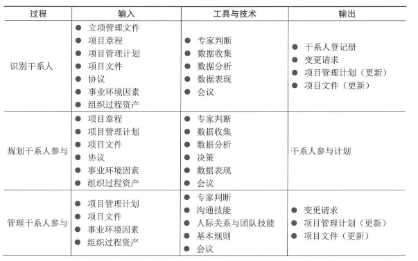
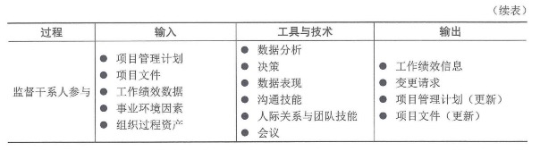
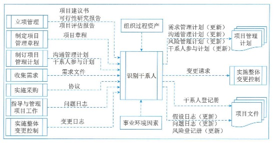
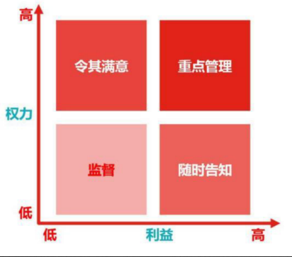
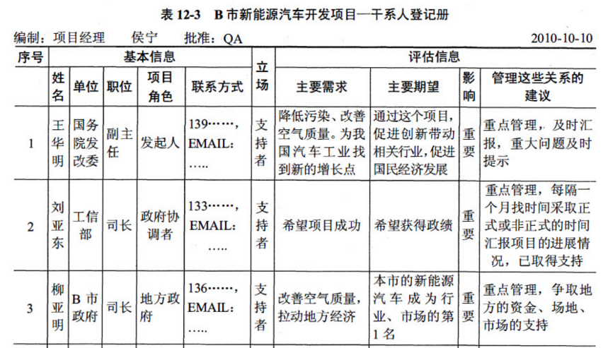
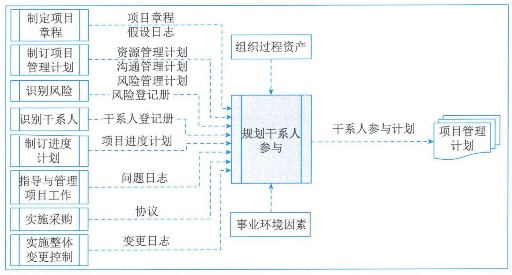
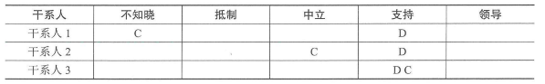
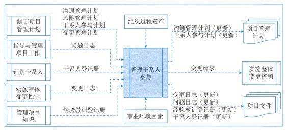
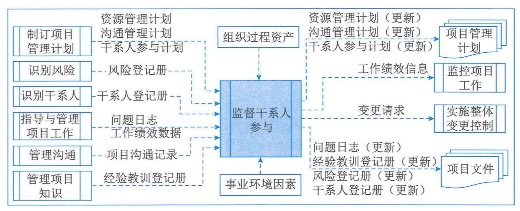

# 项目干系人管理

## 1.管理基础

### 1.1管理的重要性

### 1.2管理新实践

## 2.项目干系人管理过程

### 1.过程概述

项目干系人管理的过程包括：

1. **识别干系人**：定期识别干系人，分析和记录他们的利益、参与度、相互依赖度、影响力和对项目潜在的影响。
2. **规划干系人参与**：根据干系人的需求、期望、利益和对项目的潜在影响，制定项目干系人参与项目的方法。
3. **赶礼干系人参与**：与干系人进行沟通和协作，以满足其需求与期望，并处理问题，以促进干系人合理参与。
4. **监督干系人参与**：监督项目干系人关系，并通过修订参与策略和计划来引导干系人合理参与项目。

### 2.2裁剪考虑原因

### 2.3敏捷与适应方法

频繁变化的项目更需要项目干系人的有效互动和参与。为了开展及时且高效的讨论并制定策略，适应型团队会直接与干系人互动，而不是通过层层的管理级别。客户、用户和开发人员在动态的共创过程中交换信息，干系人参与和满意程度更高。在整个项目期间保持与干系人群体的互动，有利于降低风险、建立信任和及时做出项目调整，从而节约成本，提高项目成功的可能性。为加快组织内部和组织之间的信息分享，敏捷型方法提倡高度透明。

## 3.识别干系人

识别干系人是定期识别项目干系人，分析和记录他们的利益、参与度、相互依赖性、影响力和项目成功的潜在影响的过程。本过程的主要作用是，使项目团队能够建立对每个干系人或干系人群体的适当关注。本过程应根据需要在整个项目期间定期开展。识别干系人过程的数据流向如图：

识别干系人管理过程通常在编制和批准项目章程之前或同时首次开展，之后在项目生命周期过程中必要时重复开展。

### 3.1输入

#### 1、立项管理文件

立项管理阶段经批准的结果或相关的文件可用于识别干系人的依据。

#### 2、项目章程

项目章程会列出关键干系人清单，还可能包含与干系人责任有关的信息。

#### 3、项目管理计划

**在首次识别干系人时，项目管理计划并不存在；**不过，一旦编制完成，可作为识别干系人输入的项目管理计划组件主要包括：

- **沟通管理计划**：勾引与干系人参与之间存在密切联系。沟通管理计划中的信息是了解项目干系人的主要依据。
- **干系人参与计划**：确定有效引导干系人参与的管理策略和措施。

#### 4、项目文件

- **需求文件**：可以提供关于潜在干系人的信息。
- 问题日志：所记录的问题可能为项目带来新的干系人，或改变现有干系人的参与类型。
- 变更日志：可能引入新干系人，或改变干系人与项目的现有关系的性质。

#### 5、协议

协议的各方都是项目干系人，还可能涉及其他干系人。

#### 6、事业环境因素

#### 7、组织过程资产

### 3.2工具与技术

#### 1、专家判断

#### 2、数据收集

适用于识别干系人过程的数据收集技术主要包括：

1. **问卷和调查**：可以包括一对一调查、焦点小组讨论，或其他大规模信息收集技术。
2. **头脑风暴**：用于识别干系人的头脑风暴技术包括头脑风暴和头脑写作。头脑风暴是一种通用的数据收集和创意技术，用于向小组征求意见，如团队成员或主体专家；**头脑写作**是头脑风暴的改良形式，让个人参与者有时间在小组创意讨论开始前单独思考问题。信息可通过面对面小组会议收集，或在由技术支持的虚拟环境中收集。

#### 3、数据分析

适用于识别干系人过程的数据分析技术主要包括：

1. **干系人分析**：会产生干系人清单和关于干系人的各种信息
2. **文件分析**：评估现有项目文件及以往项目的经验教训，以识别干系人和其他支持性信息。

#### 4、数据表现

适用于识别干系人过程的数据表现技术是**干系人映射分析和表现**。干系人映射分析和表现是一种利用不同方法对干系人进行分类的方法。对干系人进行分类有助于团队与已识别的项目干系人建立关系。常见的分类方法包括：

**（1）权利利益方格、权利影响方格，或作用影响方格**：基于干系人的职级级别（权利）、对项目成果的关心程度（利益）、对项目成果的影响能力（影响），或改变项目计划或执行的能力，每一种方格都可用于对干系人进行分类。

**（2）干系人立方体：**上述方格模型的改良形式。立方体把上述方格中的要素组合成三维模型，项目经理和团队可据此分析干系人并引导干系人参与项目。作为一个多维模型，它将干系人视为一个多维实体，便于分析，从而有助于沟通策略的制定。

**（3）凸显模型：**通过评估干系人的**权利**（职权级别或对项目成果有重大利益诉求而导致需立即加以关注）和**合法性**（参与的适当性），对干系人进行分类。在凸显模型中，也可以用领近性取代合法性，以便考察干系人参与项目工作的程度。这种凸显模型适用于复杂的干系人大型群体，或在干系人群体内部存在复杂的关系网络。凸显模型可用于确定已识别干系人的相对重要性。

**（4）影响方向：**可以根据干系人对项目工作或项目团队本身的影响方向，对干系人进行分类。可以把干系人分类为：

1. **向上。**执行组织或客户组织、发起人和指导委员会的高级管理层。
2. **向下。**临时贡献知识或技能的团队或专家。
3. **向下。**项目团队外的干系人群体及其代表，如供应商、政府机构、公众、最终用户和监督部门。
4. **横向。**项目经理的同级人员，如其他项目经理或中层管理人员，他们与项目经理竞争稀缺项目资源或者合作共享资源或信息。

**（5）优先级排序**：如果项目有大量干系人、干系人群体的成员频繁变化、干系人和项目团队之间或干系人群体内部的关系复杂，则有必要对干系人进行优先级排序。

#### 5、会议

### 3.3输出

#### 1、干系人登记册

干系人登记册是识别干系人过程的主要输出，记录已识别干系人的信息，主要包括：

1. **身份信息：**姓名、组织职位、地点、联系方式，以及在项目中扮演的角色。
2. **评估信息：**主要需求、期望、影响项目成果的潜力，以及干系人最能影响或冲击的项目生命周期阶段。
3. **干系人分类：**用内部或外部，作用、影响、权利或利益，上级、下级、外围或横向，或者项目经理选择的其他分类模型进行分类的结果等。

#### 2、变更请求

#### 3、项目管理计划（更新）

可能需要变更的项目管理计划组件主要包括：

1. 需求管理计划：新识别的干系人可能会影响规划、跟踪和报告需求活动的方式。
2. 沟通管理计划：记录干系人的沟通要求和已商定的沟通策略。
3. 风险管理计划：如果干系人的沟通要求和已商定的沟通策略会影响管理项目风险的方法，就应在风险管理计划中加以反映。
4. 干系人参与计划：记录针对已识别干系人的商定的沟通策略。

#### 4、项目文件（更新）

在规划干系人过程更新的项目文件主要包括：

1. 假设日志：大量关于相对权利、利益和干系人参与度的信息，都是基于一定的假设条件的。应该在假设日志中记录这些假设条件。此外，还要在假设日志中记录会影响与具体干系人互动的各种制约因素。
2. 问题日志。
3. 风险登记册。

## 4.规划干系人参与

规划干系人参与是根据干系人的需求、期望、利益和对项目的潜在影响，制定项目干系人参与项目的方法的过程。本过程的主要作用是，提供与干系人进行有效互动的可行计划。本过程应根据需要在整个项目期间定期开展。规划干系人参与过程的数据流向如图。

为满足项目干系人的多样性信息需求，应在项目生命周期的早期制定一份有效的计划；然后，随着干系人群体的变化，定期审查和更新该计划。

### 4.1输入

#### 1、项目章程

#### 2、项目管理计划

可用于规划干系人参与的项目管理计划组件主要包括：

1. **资源管理计划：**包含团队成员及其他干系人角色和职责的信息。
2. **沟通管理计划：**用于干系人管理的沟通策略以及用于实施策略的计划，既是项目干系人管理中的各个过程的输入，又会收录来自这些过程的相关信息。
3. **风险管理计划：**可能包含风险临界值或风险态度，有助于选择最佳的干系人参与策略组合。

#### 3、项目文件

可用作规划干系人参与过程输入的项目文件（尤其是初始规划后），主要包括：

1. 假设日志
2. **风险登记册：**包含项目的已识别风险，它通常会把这些风险与具体干系人关联，即把特定干系人指定为风险责任人或受风险影响者。
3. **干系人登记册**
4. **项目进度计划**
5. 问题日志
6. 变更日志

#### 4、协议

在规划承包商及供应商参与时，通常需要与组织内的采购小组和合同签署小组进行合作，以确保对承包商和供应商进行有效管理。

#### 5、事业环境因素

#### 6、组织过程资产

### 4.2工具与技术

#### 1、专家判断

#### 2、数据收集

适用于规划干系人参与过程的数据收集技术是**标杆对照**。将干系人分析的结果与其他被视为具备引领级的组织或项目的信息进行比较。

#### 3、数据分析

适用于规划干系人参与过程的数据分析技术主要包括：

1. **假设条件和制约因素分析：**可能需要分析当前的假设条件和制约因素，以合理剪裁干系人参与策略
2. **根本原因分析：**开展根本原因分析，识别是什么根本原因导致了干系人对项目的某种支持水平，以便选择适当策略来改进其参与水平

#### 4、决策

适用于规划干系人参与过程的决策技术主要包括**优先级排序或分级**。应该对干系人需求以及干系人本身进行优先级排序或分级。**具有最大利益和最高影响的干系人，通常应该排在优先级清单的最前面。**

#### 5、数据表现

适用于规划干系人参与过程的数据表现技术主要包括：

**（1）思维导图：**用于对干系人信息、相互关系以及他们与组织的关系进行可视化整理。

**（2）干系人参与度评估矩阵：**用于将干系人当前参与水平与期望参与水平进行比较。干系人参与水平可分为如下：

- **不了解型：**不知道项目及其潜在影响。
- **抵制型：**知道项目及其潜在影响，但抵制项目工作或成果可能引发的任何变更。
- **中立型：**了解项目，但既不支持，也不反对。
- **支持型：**了解项目及其潜在影响，并且会支持项目工作及其成果。
- **领导型：**了解项目及其潜在影响，而且积极参与以确保项目取得成功。

#### 6、会议

### 4.3输出

#### 干系人参与计划

干系人参与计划是项目管理计划的组成部分。该计划制定了干系人有效参与和执行项目决策的决策和行动。干系人参与计划可以是正式的或非正式的，非常详细的或高度概括的，这基于项目的需要和干系人的期望。

干系人参与计划主要包括调动干系人个人或群体参与的特定策略或方法。

## 5.管理干系人参与

管理干系人参与是通过与干系人进行沟通协作，以满足其需求与期望、处理问题，并促进干系人合理参与的过程。本过程的主要作用是，尽可能提供干系人的支持度，并降低干系人的抵制程度。本过程需要在整个项目期间开展。管理干系人参与过程数据流向如图：

在管理干系人参与过程中，需要开展多项活动，包括：

- 在适当的项目阶段引导干系人参与，以便获取、确认或维持他们对项目成功的持续承诺；
- 通过谈判和沟通的方式管理干系人期望；
- 处理与干系人管理有关的任何风险或潜在关注点，预测干系人可能在未来引发的问题；
- 澄清和解决已识别的问题等。

管理干系人参与有助于干系人明确了解项目的目的、目标、收益和风险，以及他们会如何促进项目成功。

### 5.1输入

#### 1、项目管理计划

可用于管理干系人参与的项目管理计划组件主要包括：

1. **沟通管理计划：**描述与干系人沟通的方法、形式和技术
2. **风险管理计划：**描述了风险类别、风险偏好和报告格式
3. 干系人参与计划：为管理干系人期望提供指导和信息
4. 变更管理计划：描述了提交、评估和执行项目变更的过程

#### 2、项目文件

可作为管理干系人参与过程的项目文件主要包括：

1. **问题日志**：记录项目或干系人关注点，以及关于处理问题的行动方案。
2. 干系人登记册：提供项目干系人清单，以及执行干系人参与计划所需的任何信息。
3. 变更日志：记录变更请求及其状态，并将其传递给适当的干系人。
4. 经验教训登记册

#### 3、事业环境因素

#### 4、组织过程资产

### 5.2工具与技术

#### 1、专家判断

#### 2、沟通技能

在开展管理干系人参与过程时，应该根据沟通管理计划，针对每个干系人采取相应的沟通方法。项目管理团队应该使用反馈机制，来了解干系人对各种项目管理活动和关键决策的反应，包括正式与非正式对话、问题识别和讨论、会议、进展报告和调查。

#### 3、人际关系与团队技能

适用于管理干系人参与过程的人际关系与团队技能主要包括：

1. 冲突管理：项目经理应确保及时解决冲突。
2. 文化意识：有助于项目经理和团队通过考虑文化差异和干系人需求，来实现有效沟通。
3. 谈判：用于获得支持或达成关于支持项目工作或成果的协议，并解决团队内部或团队与其他干系人之间的冲突。
4. 观察和交谈：通过观察和交谈，及时了解项目团队成员和其他干系人的工作态度。
5. 政策意识：通过了解项目内外的权利关系，建立政策意识。

#### 4、基本规则

根据团队章程中定义的基本规则，明确项目团队成员和其他干系人引导干系人参与的行为。

#### 5、会议

### 5.3输出

#### 1、变更请求

#### 2、项目管理计划（更新）

可能需要变更的项目管理计划组件主要包括：

1. 沟通管理计划：更新沟通管理计划，用来反映新的或已变更的干系人需求。
2. 干系人参与计划：更新干系人参与计划，用来反映为干系人管理策略的变化。

#### 3、项目文件（更新）

可在管理干系人参与过程更新的项目文件主要包括：

1. 变更日志：根据变更请求变更日志。
2. 问题日志：可能需要更新以及反映问题日志条目的更新或添加。
3. 经验教训登记册：更新经验教训登记册，记录管理干系人参与的有效或无效方法，以供当前或未来项目借鉴。
4. 干系人登记册：可能需要基于提供给干系人的关于问题解决、变更审批和项目状态的新信息，来更新干系人的登记册。

## 6.监督干系人参与

监督干系人参与是监督项目干系人的关系，并通过修订参与策略和计划来引导干系人合理参与项目的过程。本过程的主要作用是，随着项目进展和环境变化，维持或提升干系人参与活动的效率和效果。本过程需要在整个项目期间开展。监督干系人参与过程的数据流向如图：

### 6.1输入

#### 1、项目管理计划

可用于监督干系人参与的项目管理计划组件主要包括：

1. **资源管理计划**：确定了对团队成员的管理方法。
2. **沟通管理计划**：描述了适用于项目干系人的沟通计划和策略。
3. 干系人参与计划：定义了管理干系人需求和期望的计划。

#### 2、项目文件

可作为监督干系人参与过程输入的项目文件主要包括：

1. **风险登记册**：记录了与干系人参与及互动有关的风险，包括它们的分类，以及潜在的应对措施。
2. 干系人登记册：记录了各种干系人信息，主要包括干系人名单、评估结果和分类情况。
3. 问题日志：记录了所有与项目和干系人有关的已知问题。
4. **项目沟通记录**：根据沟通管理计划和干系人参与计划与干系人开展的项目沟通记录。
5. 经验教训登记册：在项目早期获取的经验教训，可用于项目后期阶段，以提高引导干系人参与的效率和效果。

#### 3、工作绩效数据

工作绩效数据包含项目状态数据，如哪些干系人支持项目，他们的参与水平和类型。

#### 4、事业环境因素

#### 5、组织过程资产

### 6.2工具与技术

#### 1、数据分析

适用于监督干系人参与过程的数据分析技术主要包括：

1. **备选方案分析**：在干系人参与效果没有达到期望要求时，应该开展备选方案分析，评估应对偏差的各种备选方案。
2. **根本原因分析**：开展根本原因分析，确定干系人参与未达预期效果的根本原因。
3. **干系人分析**：确定干系人群体和个人在项目任何特定时间的状态。

#### 2、决策

适用于监督干系人参与过程的决策技术主要包括：

1. **多标准决策分析**：考察干系人成功参与项目的标准，并根据其优先级排序和加权，识别出最适当的选项。
2. **投票**：投稿投票选出应对干系人参与水平偏差的最佳方案。

#### 3、数据表现

适用于监督干系人参与过程的数据表现技术主要是**干系人参与度评估矩阵。**使用干系人参与度评估矩阵来跟踪每个干系人参与水平的变化，对干系人参与加以监督。

#### 4、沟通技能

适用于监督干系人参与过程的沟通技能主要包括：

1. 反馈：用于确保发送给干系人的信息被接收和理解。
2. 演示：为干系人提供清晰的信息。

#### 5、人际关系与团队技能

适用于监督干系人参与过程的人际关系与团队技能主要包括：

1. 积极倾听：通过积极倾听，减少理解错误和沟通错误。
2. 文化意识：文化意识和文化敏感性有助于项目经理分析干系人和团队成员的文化差异和文化需求，并对沟通进行规划。
3. 领导力：成功的干系人参与，需要强有力的领导技能，以传递愿景并激励干系人支持项目工作和成果。
4. 人际交往：通过人际交往了解关于干系人参与水平。
5. 政策意识：政策意识有助于理解组织战略，理解谁能行使权利和施加影响，以及培养与这些干系人沟通的能力。

#### 6、会议

### 6.3输出

#### 1、工作绩效信息

工作绩效信息包括与干系人参与状态有关的信息，例如，干系人对项目的当前支持水平，以及与干系人参与度评估矩阵、干系人立方体或其他工具所确定的期望参与水平相比较的结果。

#### 2、变更请求

变更请求可能包括用于改善当前干系人参与水平的纠正及预防措施。

#### 3、项目管理计划（更新）

可能需要变更的项目管理计划组件主要包括：

1. 资源管理计划：可能需要更新团队对引导干系人参与的职责。
2. 沟通管理计划：可能需要更新项目的沟通策略。
3. 干系人参与计划：可能需要更新关于项目干系人社区的信息。

#### 4、项目文件（更新）

可能在监督干系人参与过程更新的项目文件主要包括：

1. 问题日志：更新与干系人态度有关的信息。
2. 经验教训登记册：记录本过程遇到的挑战及应对方法和如何调动干系人参与的方法。
3. 风险登记册：记录和更新干系人风险应对措施。
4. 干系人登记册：记录和更新在监督干系人参与中得到的信息。

## 论文

项目干系人管理是对项目干系人需求、希望和期望的识别，并通过沟通上的管理来满足其需要、解决问题的过程。

请以"论信息系统项目的干系人管理"为题进行论述：

1、概要叙述你参与管理过的信息系统项目（项目的背景、项目规模、发起单位、目的、项目内容、组织结构、项目周期、交付的成果等），并说明你在其中承担的工作（项目背景要求本人真实经理，不得抄袭及杜撰）。

2、请结合你所叙述的信息系统项目，围绕以下要点论述你对信息系统项目干系人管理的认识：

（1）项目干系人管理的过程；

（2）请根据你所描述的项目，说明干系人管理和沟通管理、需求管理的联系与区别。

（3）请根据你所描述的项目，写出项目中所涉及的所有干系人，并按照权利/利益方格进行分析，给出具体干系人的管理策略。

3、请结合你所参与管理过的信息系统项目，论述你进行项目干系人管理的具体做法，并总结心得体会。