# 项目进度管理

项目进度管理是为了保证项目按时完成，对项目所需的各个过程进行管理，包括规划进度、定义活动、排列活动顺序、估算活动持续时间、制定项目进度计划和控制进度。

## 1.管理基础

### 1.1项目进度计划的定义和总要求

项目进度计划提供了项目的详尽计划，说明项目如何以及何时交付项目范围中定义的产品、服务和成果，是一种用于沟通和管理干系人期望的工具，为绩效报告提供依据。

## 2.项目进度管理过程

### 2.1过程概述

项目进度管理过程包括：

1. **规划进度管理**：为了规划、编制、管理、执行和控制项目进度，制定政策、程序和文档
2. **定义活动**：识别和记录为完成项目可交付成果而采取的具体活动。
3. **排列活动顺序**：识别和记录项目活动之间的关系
4. **估算活动持续时间**：根据资源估算的结果，估算完成单项活动所需工作时段数
5. **制定进度计划**：分析活动顺序、持续时间、资源需求和进度制约因素，创建项目进度模型，落实项目执行和监控情况
6. **控制进度**：监督项目状态，以更新项目进度和管理进度基准的变更

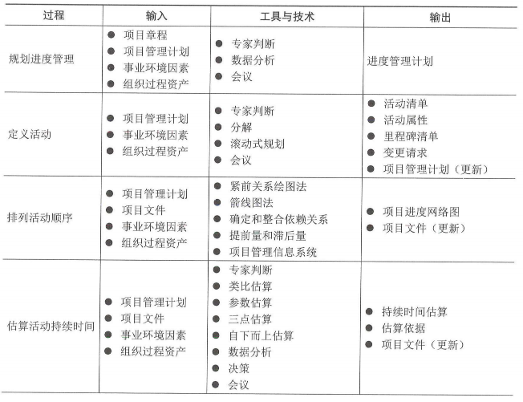

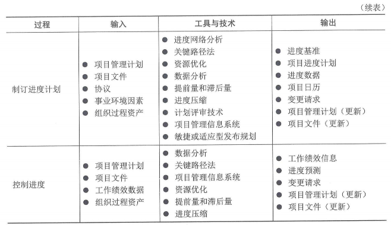

### 2.3敏捷与适应方法

在大型组织中，可能同时存在小规模项目和大规模项目的组合，需要制定长期路线图，通过规模参数（如团队规模、物理分布、法规合规性、组织复杂性和技术复杂性）来管理这些项目组合和项目集。

### 3.规划进度管理

规划进度管理是为规划、编制、管理、执行和控制项目进度而制定政策、程序和文档的过程。本过程的主要作用是为如何在整个项目期间管理项目进度提供指南和方向。规划进度管理过程的数据流向如图：

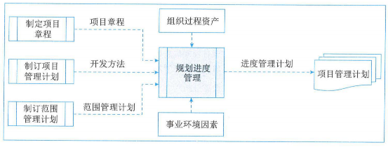

#### 3.1输入

##### 1、项目章程

项目章程中规定的总体里程碑进度计划会影响项目的进度管理。

##### 项目管理计划

规划进度管理中使用的项目管理计划组件主要包括：

（1）开发方法：有助于定义进度计划方法、估算技术、进度计划编制工具以及用来控制进度的技术

**（2）项目管理计划**：描述如何定义和制定范围，并提供有关如何制定进度计划的信息

##### 3、事业环境因素

##### 4、组织过程资产

#### 3.2工具与技术

##### 1、专家判断

##### 2、数据分析

适用于规划进度管理过程的数据分析方法是**备选方案分析**。备选方案分析可包括确定采用哪些进度计划方法，以及如何将不同方法整合到项目中；此外，它还可以包括确定进度计划的详细程度、滚动式规划的持续时间以及审查和更新频率。

##### 3、会议

#### 3.3输出

##### 进度管理计划

进度管理计划是项目管理计划的组成部分，为编制、监督和控制项目进度建立准则和明确活动要求。根据项目需要，进度管理计划可以是正式或非正式的，非常详细或高度概括的。

进度管理计划的内容一般包括：

1. 项目进度模型
2. 进度计划的发布和迭代长度
3. 准确度
4. 计量单位
5. 工作分解结构（WBS）
6. 项目进度模型维护
7. 控制临界值
8. 绩效测量贵州
9. 报告格式

### 4.定义活动

定义活动是识别和记录为完成项目可交付成果而须采取的具体行动的过程。本过程的主要作用是，将工作包分解为进度活动，作为对项目工作进行进度估算、规划、执行、监督和控制的基础。本过程需要在整个项目期间开展。定义活动过程的数据流向如图：

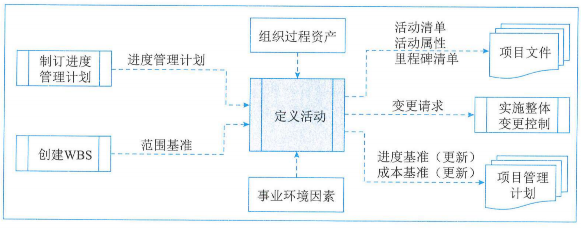

#### 4.1输入

##### 1、项目管理计划

定义活动中使用的项目管理计划组件主要包括：

（1）进度管理计划：定义进度计划方法、滚动式规划的持续时间，以及管理工作所需的详细程度

**（2）范围基准**：在定义活动时，需明确考虑范围基准中的项目WBS、可交付成果、制约因素和假设条件

##### 2、事业环境因素

##### 3、组织过程资产

#### 4.2工具与技术

##### 1、专家判断

##### 2、分解

##### 3、滚动式规划

滚动式规划是一种迭代式的规划技术，即详细规划近期要完成的工作，同时在较高层级上粗略规划远期工作。它是一种渐进明细的规划方法，适用于工作包、规划包。因此，在项目生命周期的不同阶段，工作的详细程度会有所不同。在早期的战略规划阶段，信息尚不明确，工作包只能分解到已知的详细水平；而后，随着了解到更多的信息，近期即将实施的工作包就可以分解到具体的活动。

##### 4、会议

#### 4.3输出

##### 1、活动清单

活动清单包含项目所需的进展活动。对于使用滚动式规划或敏捷技术的项目，活动清单会在项目进展过程中得到定期更新

##### 2、活动属性

活动属性是指每项活动所具有的多重属性，用来扩充对活动的描述，活动属性随着项目进展情况演进并更新。在活动属性编制完成时，活动属性可能包括活动描述、紧前活动、紧后活动、逻辑关系、提前量和滞后量、资源需求、强制日期、制约因素和假设条件。

##### 3、里程碑清单

里程碑是项目中的重要时点或事件，里程碑清单列出了项目所有的里程碑，并指明每个里程碑是强制性的（如合同要求的）还是选择性的（如根据历史信息确定的）。**里程碑的持续时间为零，因为它们代表的只是一个重要时间点或事件。**

##### 4、变更请求

##### 5、项目管理计划（更新）

定义活动过程中，可能需要变更请求的项目管理计划组成部分包括：

（1）进度基准：在整个项目期间，工作包逐渐细化为活动。在这个过程中可能会发现原本不属于项目基准的工作需要增加，因此需要修改交付日期或其他重要的进度里程碑。

（2）成本基准：在针对进度活动的变更获得批准后，需要对成本基准做出相应的变更。

### 5.排列活动顺序

1、排列活动顺序是识别和记录项目活动之间关系的过程，本过程的主要作用是定义工作之间的逻辑顺序，以便在既定的所有项目制约因素下获得最高的效率。本过程需要在整个项目期间开展。排列活动顺序过程的数据流向如图：

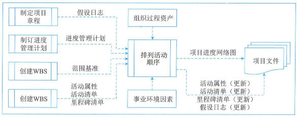

2、除了收尾两项，每项活动都至少有一项紧前活动和一项紧后活动，并且逻辑关系适当。通过设计逻辑关系可以支持创建一个切实的项目进度计划，**可能有必要在活动之间使用提前量或滞后量，使项目进度计划更为切实可行。**

#### 5.1输入

##### 1、项目管理计划

排列活动顺序中使用的项目管理计划组件主要包括：

（1）进度管理计划：规定了排列活动顺序的方法和精准度，以及所需的其他标准。

**（2）范围基准**：在排练活动顺序时，需明确考虑范围基准中的项目WBS、可交付成果、制约因素和假设条件。

##### 2、项目文件

可作为排列活动顺序过程输入的项目文件主要包括：

1. 假设日志
2. 活动属性
3. **活动清单**
4. **里程碑清单**

##### 3、事业环境因素

##### 4、组织过程资产

#### 5.2工具与技术

##### 1、紧前关系绘图法

紧前关系绘图法又称前导图法，使用方框或者长方形（被称作节点）代表活动，节点之间用箭头连接，以显示节点之间的逻辑关系。也被称作单代号网络图（只有节点需要编号）或活动节点图。

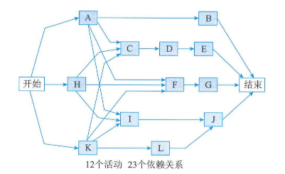

包括四种依赖关系或逻辑关系，如图。**紧前活动**是在进度计划的逻辑路径中，排在某个活动前面的活动。**紧后活动**是在进度计划的逻辑路径中，排在某个活动后面的活动。这些关系定义为：

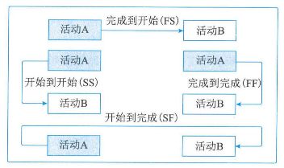

1. **完成到开始（FS**）:只有紧前活动完成，紧后活动才能开始的逻辑关系。例如，只有完成装配PC硬件（紧前活动），才能开始在PC上安装操作系统（紧后活动）。
2. **完成到完成（FF）**：只有紧前活动完成，紧后活动才能完成的逻辑关系。例如，只有完成文件的编写（紧前活动），才能完成文件的编辑（紧后活动）。
3. **开始到开始（SS）**：只有紧前活动开始，紧后活动才能开始的逻辑关系。例如，开始地基浇灌（紧前活动），才能开始混凝土的找平（紧后活动）。
4. **开始到完成（SF）**：只有紧前活动开始，紧后活动才能完成的逻辑关系。例如只有启动新应付账款系统（紧前活动），才能关闭旧的应付账款系统（紧后活动）。

在前导图法中，每项活动有唯一的活动好，每项活动都注明了预计工期（活动的持续时间）。通常，每个节点的活动会有如下几个时间：

1. **最早开始时间（ES）**：某项活动能够开始的最早时间。
2. **最早完成时间（EF）**：某项活动能够完成的最早时间。EF=ES+工期。
3. **最迟开始时间（LS）**：为了使项目按时完成，某项活动必须开始的最迟时间。
4. **最迟完成时间（LF）**：为了使项目按时完成，某项活动必须完成的最迟时间

LS=LF-工期。

##### 2、箭线图法

箭线图法使用箭线表示活动，节点表示事件的一种网络图绘制方法。这种网络图也被称作双代号网络图（节点和箭线都要编号）或活动箭线图。

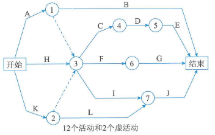

在箭线图法中，有如下三个基本原则：

1. **网络图中每一活动和每一事件都必须有唯一的一个代号，即网络图中不会有相同的代号；**
2. **任两项活动的紧前事件和紧后事件代号至少有一个不相同，节点代号沿箭线方向越来越大；**
3. **流入（流出）同一节点的活动，均有共同的紧后活动（或紧前活动）。**

为了绘图的方便，在箭线图中又人为引入了一种额外的、特殊的活动，叫做虚活动，在网络图中由一个虚箭线表示。虚活动不消耗时间，也不消耗资源，只是为了弥补箭线图在表达活动依赖关系方面的不足。借助虚活动，人们可以更好、更清楚地表达活动之间的关系，如图：

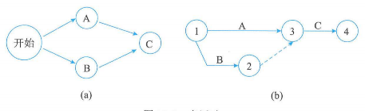

##### 3、确定和整合依赖关系

依赖关系可能是强制或选择的，内部或外部的。四种依赖关系包括：

1. **强制性依赖关系**：强制性依赖关系是法律或合同要求的或工作内在性质决定的依赖关系，又称硬逻辑关系或硬依赖关系。强制性依赖关系往往与客观限制有关。例如，只有在地基建成后，才能建立地面结构；在电子项目中，必须先把原型制造出来，才能对其进行测试。
2. **选择性依赖关系**：选择性依赖关系有时又称软逻辑关系。选择性依赖关系应基于应用领域的最佳实践或项目的特殊性质对活动顺序的要求来创建。例如，根据普遍公认的最佳实践，在建造期间，应先完成卫生管道工程，才能开始电气工程。这个顺序并不是强制性要求，两个工程可以同时（并行）开展工作，但如按先后顺序进行可以降低整体项目风险。
3. **外部依赖关系**：外部依赖关系是项目活动与非项目活动之间的依赖关系，这些依赖关系往往不在项目团队的控制范围内。例如，软件项目的测试活动取决于外部硬件的到货；建筑项目的现场准备可能要在政府的环境听证会之后才能开始。
4. **内部依赖关系**：内部依赖关系是项目活动之间的紧前关系，通常在项目团队的控制中。例如，只有机器组装完毕，团队才能对其测试，这是一个内部的强制性依赖关系。

##### 4、提前量和滞后量

提前量是相对于紧前活动，紧后活动可提前的时间量，**提前量一般用负值表示**。滞后量是相对于紧前活动，紧后活动需要推迟的时间量，**滞后量一般用正值表示**。例如新办公大楼建设项目中，景观建筑划分可以在尾工清单编制完成前2周开始；对于一个大型技术文档，编写小组可在编写工作开始后15天，开始编辑文档草案，如图所示。项目管理团队应该明确哪些依赖关系中需要加入提前量或滞后量，以便准确地表示活动之间的逻辑关系。

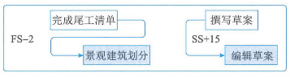

##### 5、项目管理信息系统

#### 5.3输出

##### 1、项目进度网络图

项目进度网络图是表示项目进度活动之间的逻辑关系（也叫依赖关系）的图形。

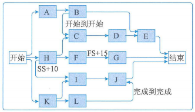

带有对个紧前活动的活动代表路径汇聚，而带有多个紧后活动的活动则代码路径分支。带汇聚和分支的活动受到多个活动的影响或能够影响多个活动，因此存在较大风险。

##### 2、项目文件（更新）

可在排列活动顺序过程更新的项目文件主要包括：

1. 活动属性：可能描述了事件之间的必然顺序或确定的紧前或紧后关系，以及定义的提前量与滞后量和活动之间的逻辑关系。
2. 活动清单：在排列活动顺序时，活动清单可能会受到项目活动关系变更的影响。
3. 假设日志：根据活动的排序、关系确定以及提前量和滞后量。可能需要更新假设日志中的假设条件和制约因素，并且有可能生成一个会影响项目进度的风险。
4. 里程碑清单：在排列活动顺序时，特定里程碑的计划实现日期可能会受到项目活动关系变更的影响。

### 6.估算活动持续时间

估算活动持续时间是根据资源估算的结果，估算完成单项活动所需工作时段数的过程。本过程的主要作用是确定完成每个活动所需花费的时间量。本过程需要在整个项目期间开展。估算活动持续时间过程的数据流向如图：

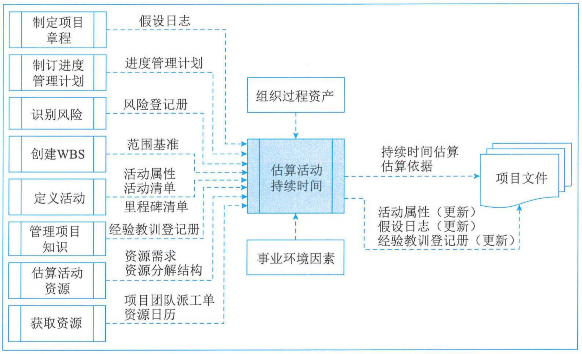

**在估算活动持续时间过程中，应该首先估算完成活动所需的工作量和计划投入该活动的资源数量，然后结合项目日历和资源日历，据此估算出完成活动所需的工作时段（及活动持续时间）**。应该由项目团队中最熟悉具体活动的个人或小组提供持续时间估算所需的各种输入，对持续时间的估算也应该根据输入数据的数量和质量进行渐进明细。

在许多情况下，预计可用的资源数量以及这些资源尤其是人力资源的技能熟练程度可能会决定活动的持续时间，更改分配到活动的主导性资源通常会影响持续时间，但这不是简单的"直线"或线性关系。有时候，因为工作的特性（即收到持续时间的约束、相关人力投入或资源数量），无论资源分配如何，都需要花预定的时间才能完成工作。估算持续时间时需要考虑的其他因素包括：

1. **收益递减归类**：在保持其他因素不变的情况下，增加一个用于确定单位产出所需投入的因素（如资源）会最终达到一个临界点，在该点之后的产出或输出会随着增加这个因素而递减。
2. **资源数量**：增加资源数量，比如两倍投入资源但完成工作的时间不一定能缩短一半，因为投入资源可能会增加额外的风险。
3. **技术进步**：在确定持续时间估算时，技术进步因素可能发挥重要作用。例如，通过采购最新技术，制造工厂可以提高产量，而这可能会影响持续时间和资源需求。
4. **员工激励**：项目经理还需要了解拖延症和帕金森定律。前者指出，人民只有在最后一刻，即快到期限时才会全力以赴；后者指出，只要还有时间，工作就会不断扩展，指导用完所有的时间。应该把活动持续时间估算所依据的全部数据与假设都记录在案。

#### 6.1输入

##### 1、项目管理计划

估算活动持续时间中使用的项目管理计划组件主要包括：

（1）进度管理计划：规定了用于估算活动持续时间的方法和准确度，以及所需的其他标准

**（2）范围基准**：包含WBS和WBS字典，后者包括可能影响人力投入和持续时间估算的技术细节

##### 2、项目文件

可作为估算活动持续时间过程输入的项目文件主要包括：

1. 假设日志：其所记录的假设条件和制约因素有可能生成一个会影响项目进度的风险
2. **风险登记册**：单个项目风险可能影响资源的选择和可用性
3. 活动属性：可能描述了确定的紧前或紧后关系、定义的提前量和滞后量以及可能影响持续时间估算的活动之间的逻辑关系
4. **活动清单**：列出了项目所需的、待估算的全部进度活动
5. **里程碑清单**：可能已经列出特定里程碑的计划实现日期
6. 经验教训登记册：以提高人力投入和持续时间估算的准确性
7. **资源需求**：估算的活动资源需求会对活动持续时间产生影响
8. **资源分解结构**：其按照资源类别和资源类型提供了已识别资源的层级结构
9. **资源日历**：其中的资源可用性、资源类型和资源性质都会影响进度活动的持续时间。资源日历规定了在项目期间特定的项目资源何时可用及可用多久
10. **项目团队派工单**：该派工单将适合的人员分派到团队，为项目配备人员

##### 3、事业环境因素

##### 4、组织过程资产

#### 6.2工具与技术

##### 1、专家判断

##### 2、类比估算

类比估算是一种使用相似活动或项目的历史数据来估算当前活动或项目的持续时间或成本的技术。类比估算以过去类似项目的参数值为基础，来估算当前和未来项目的同类参数或指标。这是一种粗略的估算方法，有时需要根据项目复杂性方面的已知差异进行调整，**在项目详细信息不足时，经常使用类比估算来估算项目持续时间。**

**类比估算通常成本较低、耗时较少，但准确性也较低。类比估算可以针对整个项目或项目中的某个部分进行，也可以与其他估算方法联合使用。如果以往活动是本质上而不是表面上类似，而且从事估算的项目团队成员具备必要的专业知识，那么类比估算可靠性会比较高。**

##### 3、参数估算

参数估算是一种基于历史数据和项目参数，使用某种算法来计算成本或持续时间的估算技术。它是指利用历史数据之间的统计关系和其他变量，来估算诸如成本、预算和持续时间等活动参数。把需要实施的工作量乘以完成单位工作量所需的工时，即可计算出持续时间。**参数估算的准确性取决于参数模型的成熟度和基础数据的可靠性。参数估算可以针对整个项目或项目中的某个部分，并可以与其他估算方法联合使用。**

##### 4、三点估算

**当历史数据不充分时，通过考虑估算中的不确定性和风险，可以提高活动持续时间估算的准确性。**使用三点估算有助于界定活动持续时间的近似区间。

##### 5、自下而上估算

自下而上估算是一种估算项目持续时间或成本的方法，通过从下到上逐层汇总WBS组成部分的估算而得到的项目估算。如果无法以合理的可信度对活动持续时间进行估算，则应将活动中的工作进一步细化，然后估算细化后的具体工作的持续时间，接着再汇总得到每个活动的持续时间。

##### 6、数据分析

可用作估算过的持续时间过程的数据分析技术主要包括：

（1）**备选方案分析**：备选方案分析用于比较不同的资源能力或技能水平、进度压缩技术、不同工具（手动和自动），以及关于资源的创建、租赁和购买决策。

（2）储备分析：储备分析用于确定项目所需的应急储备量和管理储备。

- **应急储备**：在进行持续时间估算时，须考虑应急储备应对进度方面的不确定性。应急储备是包含在进度基准中的一段持续时间，应急储备与"已知-未知"风险相关，用来应对已经接受的已识别风险，**应急储备可取活动持续时间估算值的某一百分比或某一固定的时间段**，亦可把应急储备从各个活动中剥离出来汇总。应该在项目进度文件中清楚地列出应急储备，**并随着项目信息越来越明确，可以动用、减少或取消应急储备。**
- **管理储备**：管理储备是为管控控制的目的而特别留出的项目预算，用来应对项目范围中不可遇见的工作。管理储备用来应对会影响项目目的"未知-未知"风险，**它不包括在进度基准中，但属于项目总持续时间的一部分。依据合同条款，使用管理储备可能需要变更进度基准。**

##### 7、决策

适用于估算活动持续时间过程的决策技术是**投票**。举手表决是从投票方式衍生出来的一种形式，经常用于敏捷项目中。

##### 8、会议

#### 6.3输出

##### 1、持续时间估算

持续时间估算是对完成某项活动、阶段或项目所需的工作时段数的定量评估。

##### 2、估算依据

持续时间估算所需的支持信息的数量和种类，支持性文件都应该清晰、完整地说明持续时间估算是如果得出的。

##### 3、项目文件（更新）

了再估算活动持续时间过程更新的项目文件主要包括：

1. 活动属性
2. 假设日志
3. 经验教训登记册

### 7.制定进度计划

制定进度计划是分析活动顺序、持续时间、资源需求和进度制约因素，创建进度模型，从而落实项目执行和监控的过程。本过程的主要作用是为完成活动而制定具有计划日期的进度模型。本过程需要在整个项目期间开展。制定进度加护过程的数据流向如图：

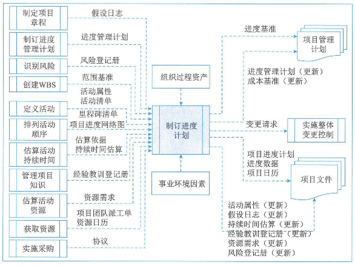

**制定可行的项目进度计划是一个反复进行的过程。经批准后作为基准用于跟踪项目进度。**

制定项目进度计划的关键步骤：

1. 定义项目里程碑，识别活动并排练活动顺序，估算持续时间，并确定活动的开始和完成日期。
2. 由分配至各个活动的项目人员审查其被分配的活动。
3. 项目人员确认开始和完成日期与资源日历和其他项目或任务没有冲突，从而确认计划日期的有效性。
4. 分析进度计划，确定是否存在逻辑关系冲突，以及在批准进度计划并将其作为基准之前是否需要资源平衡，并同步修订和维护项目进度模型，确保进度计划在整个项目期间一直切实可行。

#### 7.1输入

##### 1、项目管理计划

制定进度计划中使用的项目管理计划组件主要包括：

（1）进度管理计划：规定了用于制定进度计划的进度计划编制方法和工具，以及推算进度计划的方法。

**（2）范围基准**：范围说明书、WBS和WBS字典包含了项目可交付成果的详细信息，供创建进度模型时借鉴。

##### 2、项目文件

可作为制定进度计划过程输入的项目文件主要包括：

1. 假设日志
2. **风险登记册**
3. 活动属性
4. **活动清单**
5. **里程碑清单**
6. **项目进度网络图**：包含用于推算进度计划的紧前和紧后活动的逻辑关系。
7. 估算依据
8. **持续时间**
9. 经验教训
10. **资源需求**：活动资源需求明确了活动所需的资源类型和数量，用于创建进度模型。
11. **项目团队派工单**：明确了分配到每个活动的资源。
12. **资源日历**：规定了在项目期间的资源可用性。

##### 3、协议

在制定如何执行项目工作以履行合同承诺时，供应商为项目进度提供了输入。

##### 4、事业环境因素

##### 5、组织过程资产

#### 7.2工具与技术

##### 1、进度网络分析

进度网络分析是创建项目进度模型的一种综合技术。

##### 2、关键路径法

1. **总浮动时间**：在任一网络路径上，进度活动可以从最早开始日期推迟或拖延的时间，而不至于延误项目完成日期或违反进度制约因素，就是总浮动时间。总浮动时间的计算方法为：本活动的最迟完成时间减去本活动的最早完成时间，或本活动的最迟开始时间减去本活动的最早开始时间。
2. **自由浮动时间**：就是指在不延误任何紧后活动的最早开始日期或不违反进度制约因素的前提下，某进度活动可以推迟的时间量，其计算方法为：紧后活动最早开始时间的最小值减去本活动的最早完成时间。
3. **进度网络图可能有多条关键路径。**

##### 3、资源优化技术

资源优化技术是根据资源供需情况来调整进度模型的技术。包括：

1. **资源平衡。**资源平衡就是为了在资源需求与资源供给之间取得平衡，根据资源制约因素对开始日期和完成日期进行调整的一种技术。**资源平衡往往导致关键路径改变。**
2. **资源平滑。**对进度模型中的活动进行调整，从而使项目资源需求不超过预定的资源限制的一种技术。**相对于资源平衡而言，资源平滑不会改变项目的关键路径，完工日期也不会延迟。**

##### 4、数据分析

可用制定进度计划过程的数据分析技术主要包括：

1. **假设情景分析**：是对各种情景进行评估，预测它们对项目目标的影响（积极或消极的）。假设情景分析就是对"**如果情景X出现，情况会怎样？**"这样的问题进行分析，即基于已有的进度计划，考虑各种各样的情景。
2. **模拟**：是把单个项目风险和不确定性的其他来源模型化的方法，以评估它们对项目目标的潜在影响。最常见的模拟技术是**蒙特卡罗分析**。模拟包括基于多种不同的活动假设、制约条件、风险、问题或情景，使用概率分布和不确定性的其他表现形式，来计算出多种可能的工作包持续时间。

##### 5、提前量和滞后量

通过调整紧后活动的开始时间来编制一份切实可行的进度计划。提前量用于在条件许可情况下提早开始紧后活动；而滞后量是在某些限制条件下，在紧前和紧后活动之间增加一段不需要工作或资源的自然时间。

##### 6、进度压缩

进度压缩技术是指在不缩减项目范围的前提下，缩短或加快进度工期，以满足进度制约因素、强制日期或其他进度目标。进度压缩技术包括：

1. **赶工**：是通过增加资源，**以最小的成本代价**来压缩进度工期的一种技术。赶工的例子包括：批准加班、增加额外资源或支付加急费用来加快关键路径上的活动。赶工只适用于哪些通过增加资源就能缩短持续时间的且位于关键路径上的活动。但赶工并非总是切实可行的，因为它可能导致风险和或成本的增加。
2. **快速跟进**：是一种进度压缩技术，将正常情况下按顺序进行的活动或阶段改为至少是部分并行开展。例如，在大楼的建筑图纸尚未全部完成前就开始建地基。**快速跟进可能造成返工和风险增加**，所以它只适用于能够通过并行活动来缩短关键路径上的项目工期情况。若进度加快而使用提前量，通常会增加相关活动之间的协调工作，并增加质量风险。**快速跟进还有可能增加项目成本。**

##### 7、计划评审技术

计划评审技术（PERT），又称为三点估算技术，其理论基础是假设项目持续时间以及整个项目完成时间是随机的，且服从某种概率分布。

##### 8、项目管理信息系统

##### 9、敏捷或适应型发布规划

敏捷或适应型发布规划基于项目路线图和产品发展愿景，提供了高度概括的发布进度时间轴（通常是3-6个月）。同时还确定了发布的迭代或冲刺次数，使产品负责人和团队能够决定需要开发的内容，并基于业务目标、依赖关系和障碍因素确定达到产品放行所需的时间。对客户而言，产品功能就是价值，因此该时间轴定义了每次迭代结束时交付的功能，提供了更易于理解的项目进度计划，而这些就是客户真正需要的信息。

#### 7.3输出

##### 1、进度基准

进度基准是经过批准的进度模型，只有通过正式的变更控制程序才能进行变更，用作与实际结果进行比较的依据。

##### 2、项目进度计划

虽然项目进度计划可用列表形式，但图形方式更直观，可以采用的图形方式包括：

1. **横道图**：横道图也成为"**甘特图**"，是展示进度信息的一种图表方式。在横道图中，纵向列示活动，横向列示日期，用横条表示活动自开始日期至完成日期的持续时间。横道图相对易读，比较常用。
2. 里程碑图
3. 项目进度网络图：项目进度网络图通常用活动节点绘制，没有时间刻度，纯粹显示活动及其相互关系。项目进度网络图也可以是包含时间刻度的进度网络图，称为**"时标图"**。

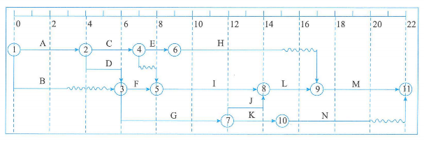

##### 3、进度数据

项目进度模型中的进度数据是用以描述和控制进度计划的信息集合。

##### 4、项目日历

在项目日历中规定可以开展进度活动的可用工作日和工作班次，它把可用于开展进度活动的时间段（按天或更小的时间单位）与不可用的时间段区分开来。

##### 5、变更请求

##### 6、项目管理计划（更新）

1. 进度管理计划
2. 成本基准

##### 7、项目文件（更新）

可在制定进度计划过程更新的项目文件主要包括：

1. 活动属性
2. 假设日志
3. 持续时间估算
4. 经验教训登记册
5. 资源需求
6. 风险登记册

### 8.控制进度

控制进度是监督项目状态，以更新项目进度和管理进度基准变更的过程。本过程的主要作用是在整个项目期间保持对进度基准的维护。本过程在整个项目期间开展。控制进度过程的数据流向如图：

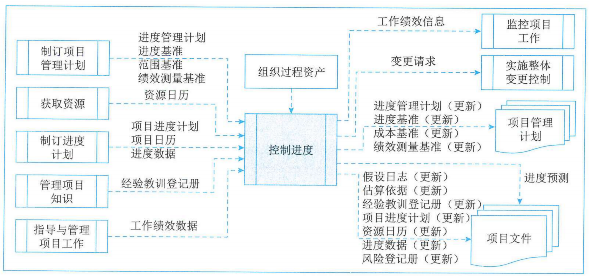

控制进度关注内容包括：

1. 判断项目进度的当前状态
2. 对引起进度变更的因素施加影响
3. 重新考虑必要的进度储备
4. 判断项目进度是否已经发生变更
5. 在变更实际发生时对其进行管理

**将工作外包时，定期向承包商和供应商了解里程碑的状态更新是确保工作按商定进度进行的一种途径，有助于确保进度受控。同时，应执行进度状态评审和巡检，确保承包商报告准确且完整。**

#### 8.1输入

##### 1、项目管理计划

控制进度中使用的项目管理计划组件主要包括：

1. 进度管理计划
2. 进度基准
3. **范围基准**：在控制进度基准时，需明确考虑范围基准中的项目WBS、可交付成果、制约因素和假设条件。
4. **绩效测量基准**：使用挣值分析时，将绩效测量基准与实际结果比较，以决定是否有必要进行变更，采取纠正措施或预防措施。

##### 2、项目文件

作为控制进度过程输入的项目文件主要包括：

1. **资源日历**：显示了团队和物质资源的可用性。
2. 项目进度计划
3. **项目日历**
4. 进度数据
5. 经验教训登记册

##### 3、工作绩效数据

工作绩效数据包含关于项目状态的数据，例如哪些活动已经开始，它们的进展如何（如实际持续时间、剩余持续时间和实际完成百分比），哪些活动已经完成。

##### 4、组织过程资产

#### 8.2工具与技术

##### 1、数据分析

可用作控制进度过程的数据分析技术主要包括：

**（1）挣值分析**：进度绩效测量指标（如进度偏差（SV）和进度绩效指数（SPI））用于评价偏离初始进度基准的程度。

**（2）迭代燃尽图**：这类图用于追踪迭代未完项中尚待完成的工作。它分析与理想燃尽图的偏差。可使用预测趋势来预测迭代结束时可能出现的偏差，以及在迭代期间应采取的合理行动。燃尽图中先用对角线表示理想的燃尽图情况，再每天画出实际剩余工作，最后基于剩余工作计算出趋势线以预测完成情况，如图：

**（3）绩效审查**：指根据进度基准测量、对比和分析进度绩效，如实际开始和完成日期、已完成百分比以及当前工作的剩余持续实际。

**（4）趋势分析**：检查项目绩效随时间的变化情况，以确定绩效是在改善还是在恶化。图形分析技术有助于理解截止目前的绩效，并与未来的绩效目标（表示为完工日期）进行对比。

**（5）偏差分析**：关注实际开始和完成日期与计划的偏离

**（6）假设情景分析**：基于项目风险管理过程的输出，对各种不同的情景进行评估，促使进度模型符合项目管理计划和批准的基准

##### 2、关键路径法

检查关键路径的进展情况有助于确定项目进度状态。关键路径上的偏差将对项目的结束日期产生直接影响。评估次关键路径上的活动的进展情况，有助于识别进度风险。

##### 3、项目管理信息系统

##### 4、资源优化

资源优化技术是在同时考虑资源可用性和项目时间的情况下，对活动和活动所需资源进行的进度规划。

##### 5、提前量和滞后量

在网络分析中调整提前量与滞后量，设法使进度滞后的项目活动赶上计划。

##### 6、进度压缩

#### 8.3输出

##### 1、工作绩效信息

工作绩效信息包括与进度基准相比较的项目工作执行情况。

##### 2、进度预测

进度预测根据已有的信息和知识，对项目未来的情况和事件进行的估算或预计。

##### 3、变更请求

可能会对进度基准、范围基准和或项目管理计划的其他组成部分提出变更请求。

##### 4、项目管理计划（更新）

可能需要变更的项目管理计划组成部分主要包括：

1. 进度管理计划
2. 进度基准
3. 成本基准
4. 绩效测量基准

##### 5、项目文件（更新）

可在控制进度过程更新的项目文件主要包括：

1. 假设日志
2. 估算依据
3. 经验教训登记册
4. 项目进度计划
5. 资源日历
6. 进度数据
7. 风险登记册

### 补充

缩短工期的方法：

1. 赶工，投入更多的资源或增加工作时间，以缩短关键活动的工期。
2. 快速跟进，并行施工，以缩短关键路径的长度。
3. 使用高素质的资源经验更丰富的人员。
4. 减少活动范围或降低活动要求。（**经过甲方同意**）
5. 改进方法或技术，以提高生产效率。
6. 加强质量管理，及时发现问题，减少返工，从而缩短工期。