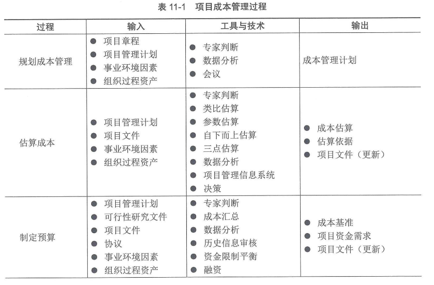
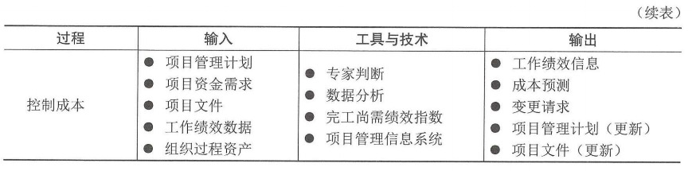
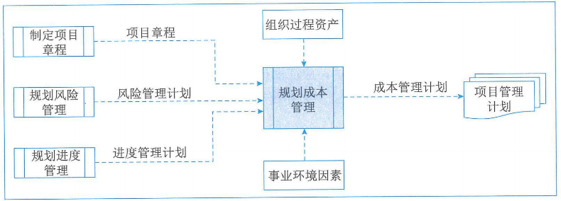
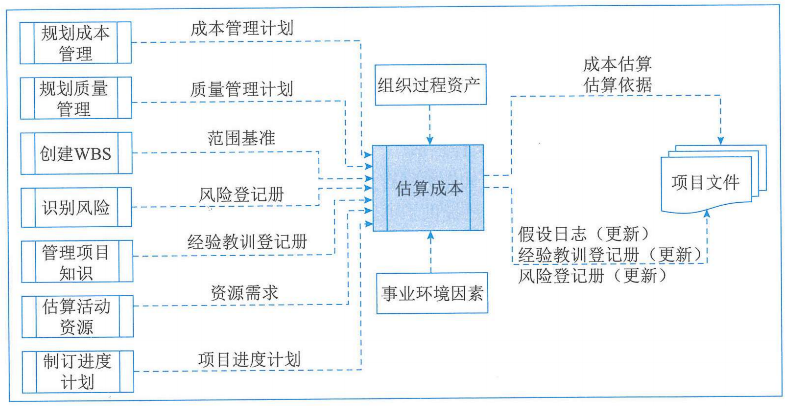
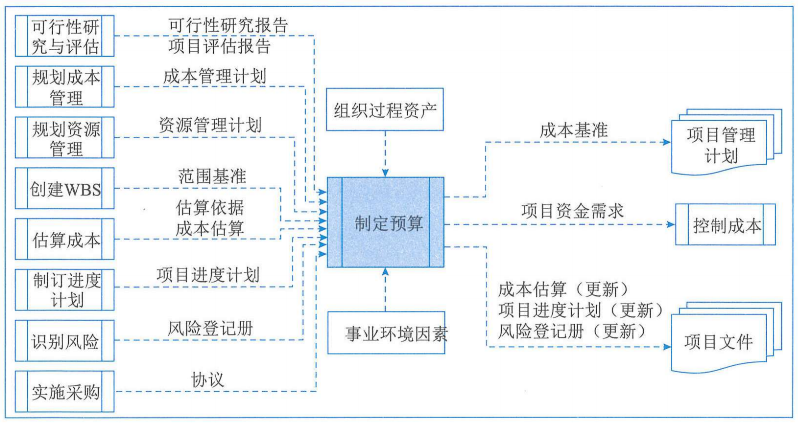
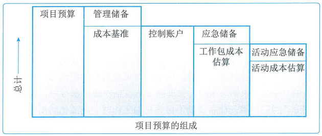
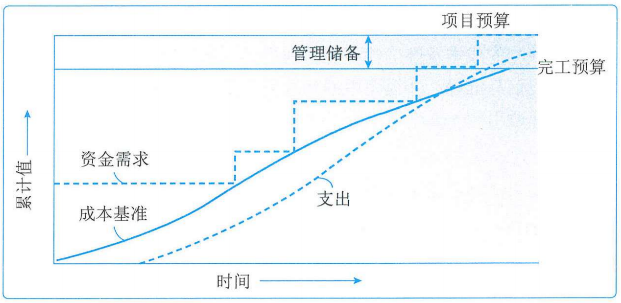
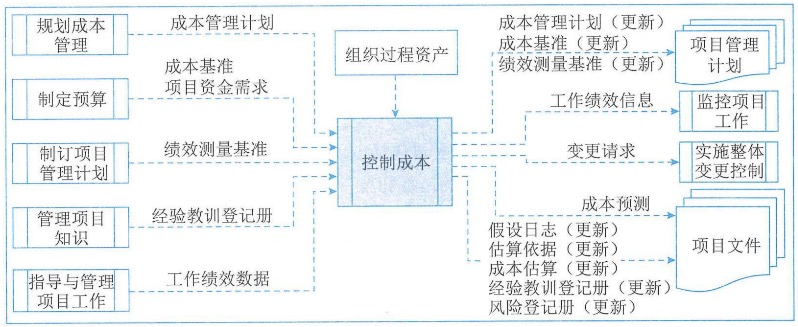
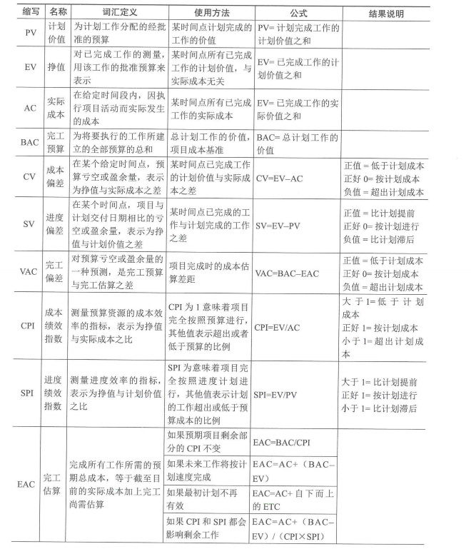

# 项目成本管理

## 1.管理基础

### 1.1重要性和意义

#### 1、项目成本管理的作用和意义

项目成本管理就是确保在批准的预算内完成项目。

#### 2、项目成本管理的重要性

#### 3、项目成本失控的原因

1. 对工程项目认识不足
2. 组织制度不健全
3. 方法问题
4. 技术的制约
5. 需求管理不当

### 1.2相关术语和定义

#### 1、项目成本概念及其构成

在项目中，成本是指项目活动或其组成部分的货币价值或价格，包括为实施、完成或创造该活动或其组成部分所需资源的货币价值。

#### 2、产品的全生命周期成本

产品的全生命周期成本就是在产品或系统的整个使用生命周期内，在获得阶段（设计、生产、安装和测试等活动）、运营与维护及生命周期结束时对产品的处置所发生的全部成本。

#### 3、成本类型

1. **可变成本**：随着生产量、工作量或时间而变的成本为可变成本。可变成本又称变动成本。
2. **固定成本**：不随生产量、工作量或时间的变化而变化的非重复成本为固定成本。
3. **直接成本**：直接可以归属于项目工作的成本为直接成本，如项目团队差旅费、工资、项目使用的物料及设备使用费等。
4. **间接成本**：来自一般管理费用科目或几个项目共同担负的项目成本所分摊给本项目的费用，形成了项目的间接成本，如税金、额外福利和保卫费用等。
5. **机会成本**：利用一定的时间或资源生产或交付一种产品或服务，而失去利用这些资源生产或交付其他最佳替代产品的机会就是机会成本，**泛指一切在做出某一选择后同时失去其他选择，其他选择中最大的损失**。
6. **沉默成本**：指由于过去的决策已经发生的，而不能由现在或将来的任何决策改变的成本。沉没成本是一种历史成本，对现有决策而言是不可控成本，会很大程度影响人们的行为方式与决策，**在投资决策时应该尽量排除沉没成本的干扰**。

#### 4、应急储备和管理储备

应急储备是包含在成本基准内的一部分预算，用来应对已经接受的已识别风险，以及已经制定应急或减轻措施的已识别风险。应急储备通常是预算的一部分，用来应对那些会影响项目的**"已知-未知"**风险。**可以为某个具体活动建立应急储备，也可以为整个项目建立应急储备，还可以同时建立。应急储备可取成本估算值的某一百分比、某个固定值或通过定量分析来确定**。

管理储备是为了管理控制的目的而特别留出的项目预算，用来应对项目范围中不可预见的工作。管理储备用来应对会影响项目的**"未知-未知"**风险。**管理储备不包括在成本基准中**，但属于项目总预算和资金需求的一部分，**使用前需要得到高层管理者审批。当动用管理储备资助不可预见的工作时，就要把动用的管理储备增加到成本基准中，此时会导致成本基准的变更。**

#### 5、成本基准

成本基准是经批准的按时间安排的成本支出计划，并随时反映了经批准的项目成本的变更（所增加或减少的资金数目），被用于度量和监督项目的实际执行成本。

### 1.3管理新实践

引入挣得进度（ES）这一概念。挣得进度理论用ES和实际时间（AT）替代了传统EVM所使用的进度偏差测量指标SV。使用这种替代方法计算进度偏差ES-AT，如果挣得进度大于0，则表示项目进度提前了，即在某个给定的时间点，项目的挣值大于计划价值。使用挣得进度测量指标的进度绩效指数（SPI）为ES与AT之比，表示完成项目的工作效率。此外，挣得进度理论通过挣得进度、实际时间和估算持续时间，提供了预测项目完成日期的计算公式。

## 2.项目成本管理

### 2.1过程概述

项目成本管理过程包括：

1. **规划成本管理**：确定如何估算、预算、管理、监督和控制项目成本。
2. **估算成本**：对完成项目活动所需货币资源进行近似估算。
3. **制定预算**：汇总所有单个活动或工作包的估算成本，建立一个经批准的成本基准。
4. **控制成本**：监督项目状态，以更新项目成本和管理成本基准的变更。

#### 2.2裁剪考虑因素

#### 2.3敏捷和适应方法

对易变性高、范围并未完成明确、经常发生变更的项目，项目的成本计算可能没有多大帮助。在这种情况下，可以采用轻量级估算方法快速生成对项目人力成本的高层级预测，这样在出现变更时容易调整预测；而详细的估算适用于采用准时制的短期规划。

如果易变的项目也遵循严格的预算，通常需要更频繁地更改范围和进度计划，确保始终保持在成本制约因素之内。

### 3.规划成本管理

规划成本管理是确定如何估算、预算、管理、监督和控制项目成本的过程，本过程的主要作用是，在整个项目期间为如何管理项目成本提供指南和方向。规划成本管理过程的数据流向如图：

#### 3.1输入

##### 1、项目章程

项目章程规定了预先批准的财务资源，可根据项目章程确定项目的项目成本，项目章程所规定的项目审批要求，也对成本管理有影响。

##### 2、项目管理计划

用于规划成本管理的项目管理计划组件主要包括：

1. **进度管理计划**：确定编制、监督和控制项目进度的准则和活动，同时也提供了影响成本估算和管理的过程及控制方法。
2. **风险管理计划**：提供识别、分析和监督风险的方法，同时也提供了影响成本估算和管理的过程及控制方法。

##### 3、事业环境因素

##### 4、组织过程资产

#### 3.2工具与技术

##### 1、专家判断

##### 2、数据分析

**备选方案分析**是适用于成本管理过程的数据分析技术，备选方案分析包括审查筹资的战略方法，如自筹资金、股权投资、借贷投资等，还可以包括对筹集项目资源的方法（如自制、采购、租用或租赁）的考量。

##### 3、会议

#### 3.3输出

##### 成本管理计划

成本管理计划是项目管理计划的组成部分，描述将如何规划、安排和控制项目成本。成本管理过程及所用工具与技术应记录在成本管理计划中。在成本管理计划中一般需要规定：

- 计量单位
- 精确度
- 准确度
- 组织程序链接
- 控制临界值
- 绩效测量规则
- 报告格式
- 其他细节

### 4.估算成本

估算成本是对完成项目工作所需资源成本进行近似估算的过程。本过程的主要作用是确定项目所需的资金。本过程应根据需要在整个项目期间定期开展。估算成本过程的数据流向如图：

成本估算是对完成活动所需资源的可能成本进行的量化评估，是在某特定时点根据已知信息所作出的成本预测。在估算成本时，需要识别和分析可用于启动与完成项目的备选成本方案；需要权衡备选成本方案并考虑风险，如比较自制成本与外购成本、购买成本与租赁成本及多种资源共享方案，以优化项目成本。

**通常用某种货币单位进行成本估算，但有时也可采用其他计量单位，如人时数或天人数，以消除通货膨胀的影响，便于成本比较。**

**进行成本估算，应该考虑针对项目收费的全部资源，一般包括人工、材料、设备、服务、设施，以及一些特殊的成本种类，如通货膨胀补贴、融资成本或应急成本。成本估算可在活动层级呈现，也可以通过汇总形式呈现。**

#### 4.1输入

##### 1、项目管理计划

用于估算成本的项目管理计划组件主要包括：

1. 成本管理计划
2. **质量管理计划**
3. **范围基准**

##### 2、项目文件

可作为估算成本过程输入的项目文件包括：

1. **风险登记册**
2. 经验教训登记册
3. **资源需求**
4. **项目进度计划**

##### 3、事业环境因素

##### 4、组织过程资产

#### 4.2工具与技术

##### 1、专家判断

##### 2、类比估算

成本类比估算使用以往类似项目的参数值或属性来估算，项目的参数值和属性包括范围、成本、预算、持续时间和规模指标（如尺寸、重量），类比估算以这些项目参数值或属性为基础来估算当前项目的同类参数或指标。

##### 3、参数估算

参数估算是指利用历史数据之间的统计关系和其他变量，来进行项目工作的成本估算，其准确性取决于参数模型的成熟度和基础数据的可靠性。参数估算可以针对整个项目或项目中的某个部分，并可与其他估算方法联合使用。

##### 4、自下而上估算

自下而上估算是对工作组成部分进行估算的一种方法，首先对单个工作包或活动的成本进行最具体、细致的估算，然后把这些细节性成本向上汇总或"滚动"到更高层次，用于后续报告和跟踪。

**自下而上估算的准确性及其本身所需的成本，通常取决于单个活动或工作包的规模或其他属性。**

##### 5、三点估算

通过考虑估算中的不确定性与风险，使用三种估算值来界定活动成本的近似区间，可以提高单点成本估算的准确性。

##### 6、数据分析

适用于估算成本过程的数据分析技术主要包括备选方案分析、储备分析和质量成本。

**（1）备选方案分析**

备选方案分析是一种对已识别的可选方案进行评估的技术，用来决定选择哪种方案或使用何种方法来执行项目工作。

**（2）储备分析**

为应对成本的不确定性，成本估算中可以包括应急储备。

而随着项目信息越来越明确，可以动用、减少或取消应急储备。

（3）质量成本

##### 7、项目管理信息系统

##### 8、决策

适用于估算成本过程的决策技术是**投票**。投票是为了达成某种期望结果而对多个未来行动方案进行评估的过程。这些技术可以调动团队成员的参与，提高估算的准确性，并提高对估算结果的责任感。

#### 4.3输出

##### 1、成本估算

成本估算包括对完成项目工作可能需要的成本、应对已识别风险的应急储备。

##### 2、估算依据

支持性文件都应该清晰、完整地说明成本估算是如何得出的。

##### 3、项目文件（更新）

可在成本估算过程更新的项目文件主要包括：

1. 假设日志：成本估算过程中可能会做出新假设、识别新的制约因素，或者重新审查和修改已有假设条件或制约因素。
2. 经验教训登记册
3. 风险登记册：可能需要更新风险登记册。

### 5.制定预算

制定预算是汇总所有单个活动或工作包的估算成本，建立一个经批准的成本基准的过程。本过程的主要作用是，确定可以依据其来进行监督和控制项目绩效的成本基准。项目预算包括经批准用于执行项目的全部资金，而成本基准是经过批准且按时间段分配的项目预算，**包括应急储备、但不包括管理储备**。制定预算过程的数据流向如图：

#### 5.1输入

##### 1、项目管理计划

用于制定预算的项目管理计划组件主要包括：

1. 成本管理计划：描述如何将项目成本纳入项目预算中。
2. **资源管理计划**：提供有关（人力和其他资源的）费率、差旅成本估算和其他可预见成本信息，这些信息是估算整个项目预算时必须考虑的因素。
3. **范围基准**：包括项目范围说明书、WBS和WBS字典的详细信息，可用于成本估算和管理。

##### 2、可行性研究文件

可作为制定预算过程输入的可行性研究文件包括：

1. 可行性研究报告：识别了项目成功的关键因素，包括财务成功因素。
2. 项目评估报告：概述了项目的目标效益，例如净现值的计算、实现效益的时限，以及与效益有关的测量指标。

##### 3、项目文件

可作为制定预算过程输入的项目文件主要包括：

1. 估算依据
2. 成本估算
3. **项目进度计划**
4. **风险登记册**

##### 4、协议

在制定预算时，需要考虑将要或已经采购的产品、服务或成果的成本，以及适用的协议信息。

##### 5、事业环境因素

##### 6、组织过程资产

#### 5.2工具与技术

##### 1、专家判断

##### 2、成本汇总

先把成本估算汇总到WBS中的工作包，再由工作包汇总至WBS的更高层次（如控制账户），最终得出整个项目的总成本。

##### 3、数据分析

可用于制定预算过程的数据分析技术之一是建立项目**管理储备**的储备分析。管理储备不包括在成本基准中，但属于项目总预算和资金需求的一部分。当动用管理储备资助不可遇见的工作时，就要把动用的管理储备增加到成本基准中，从而导致成本基准变更。

##### 4、历史信息审核

审核历史信息有助于进行参数估算或类比估算，历史信息包括各种项目特征（参数），它们用于建立数学模型预测项目总成本。这些数学模型可以是简单的，也可以是复杂的。

类比和参数模型预测的成本及准确性可能差别很大，**满足以下情况时，模型预测最为可靠：**

1. **用来建立模型的历史信息准确**；
2. **模型中参数易于量化**；
3. **模型可以调整，以便对大项目、小项目和各项目阶段都适用。**

##### 5、资金限制平衡

应该根据对项目资金的限制来平衡资金支出，如果发现资金限制与计划支出之间存在差异，则可能需要调整工作的进度计划，以平衡资金的支出水平，**例如可以通过在项目进度计划中添加强制日期来实现。**

##### 6、融资

融资是指为项目获取资金。长期的基础设施、工业和公共服务项目通常会寻求外部融资，如果项目使用外部资金，出资实体可能会对项目提出要求。

#### 5.3输出

##### 1、成本基线

成本基准是经过批准、按时间段分配的项目预算，不包括任何管理储备，只用通过正式的变更控制程序才能变更，用作与实际结果进行比较的依据，成本基准是不同进度活动批准的预算的综合。

项目预算和成本基准的各个组成部分，如图所示。先汇总各项目**活动**的成本估算及其应急储备，得到相关工作包的成本；然后汇总各**工作包**的成本估算及其应急储备，得到控制账户的成本；接着再汇总各**控制账户**的成本，得到成本基准；最后，在成本基准之上增加管理储备，得到项目预算。当初心有必要动用管理储备的变更时，则应该在获得变更控制过程的批准之后，把适量的管理储备移入成本基准中。

由于成本基准中的成本估算与进度活动之间关联，因此就可按时间段分配成本基准，得到一条S曲线，如图所示。对于使用挣值管理的项目，成本基准指的是绩效测量基准。

##### 2、项目资金需求

根据成本基准，确定总资金需求和阶段性（如季度或年度）资金需求。成本基准中**包括预计支出及预计债务。项目资金通常以增量的方式投入，并且可能是非均衡的，呈现出下图所示的阶梯状。**

如果有管理储备，则总资金需求等于成本基准加管理储备。在资金需求文件中，也可说明资金来源。

##### 3、项目文件（更新）

可在制定预算过程更新的项目文件，主要包括：

1. 成本估算：更新成本估算，以记录任何额外信息。
2. 项目进度计划：项目进度计划可能记录了各项活动的估算成本。
3. 风险登记册：记录了本过程中识别的新风险于风险登记册中，并通过风险管理过程进行管理。

### 6.控制成本

控制成本是监督项目状态，以更新项目成本和管理成本基准变更的过程。本过程的主要作用是在整个项目期间保持对成本基准的维护。本过程需要在整个项目期间开展。控制成本过程的数据流向如图：

项目成本控制的目标包括：

1. 对造成成本基准变更的因素施加影响。
2. 确保所有变更请求都得到及时处理；
3. 当变更实际发生时，管理这些变更
4. 确保成本支出不超过批准的资金限额，既不超出按时段、WBS组件和活动分配的限额，也不超出项目总限额；
5. 监督成本绩效，找出并分析与成本基准的偏差；
6. 对照资金支出，监督工作绩效；
7. 防止在成本或资源使用报告中出现未经批准的变更；
8. 向干系人报告所有经批准的变更及其相关成本；
9. 设法把预期的成本超支控制在可接受的范围内等。

#### 6.1输入

##### 1、项目管理计划

用于控制成本过程的项目管理计划组件主要包括：

1. 成本管理计划
2. 成本基准：将成本基准与实际结果相比，以判断是否需要进行变更或采取纠正或预防措施。
3. **绩效测量基准**：使用挣值分析，将绩效测量基准与实际结果比较，以决定是否有必要进行变更、采取纠正措施或预防措施。

##### 2、项目资金需求

##### 3、项目文件

可作为控制成本过程输入的项目文件是经验教训登记册。

##### 4、工作绩效数据

##### 5、组织过程资产

#### 6.2工具与技术

##### 1、专家判断

##### 2、数据分析

适用于控制成本过程的数据分析技术主要包括：

**（1）挣值分析**

**计划价值（PV）**：是为计划工作分配的经批准的预算，它是为完成某活动或WBS组成部分而准备的一份经批准的预算，不包括管理储备。**PV的总和有时被称为绩效测量基准（PMB），项目的总计划价值又被称为完工预算（BAC）。**

**挣值（EV）**：是对已完成工作的测量值，用该工作的批准预算来表示，是已完成工作的经批准的预算。

**实际成本（AC）**：是在给定时段内执行某活动而实际发生的成本，是为完成与EV相对应的工作而发生的总成本。

（2）偏差分析

（3）趋势分析

（4）储备分析

##### 3、完工尚需绩效指数

完工尚需绩效指数（TCPI）是一种为了实现特定的管理目标，剩余资源的使用必须达到的成本绩效指标，是完成剩余工作所需的成本与剩余预算之比。

##### 4、项目管理信息系统

#### 6.3输出

##### 1、工作绩效信息

##### 2、成本预测

##### 3、变更请求

##### 4、项目管理计划（更新）

需要变更请求的项目管理计划组成部分包括：

1. 成本管理计划
2. 成本基准
3. 绩效测量基准

##### 5、项目文件（更新）

可在控制成本过程更新的项目文件中主要包括：

1. 假设日志：成本绩效可能表明需要重新修订有关资源生产率和其他影响成本绩效因素的假设条件。
2. 估算依据：成本绩效可能表明需要重新审查初始估算依据。
3. 成本估算：可能需要更新成本估算，以反映项目的实际成本效率。
4. 经验教训登记册：有效维护预算、偏差分析、挣值分析、预测，以及应对成本偏差的纠正措施的相关技术，应当更新在经验教训登记册中。
5. 风险登记册：如果出现成本偏差，或成本可能达到临界值，则应更新风险登记册。