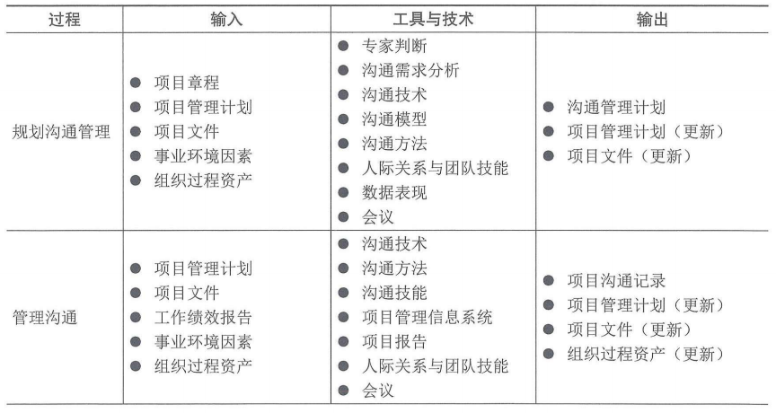
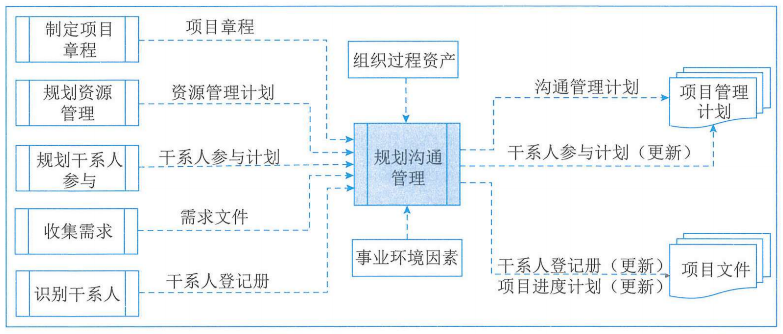
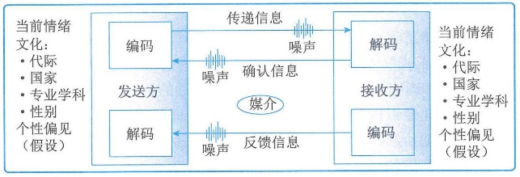
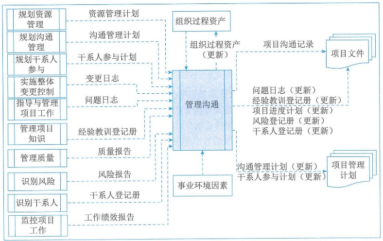
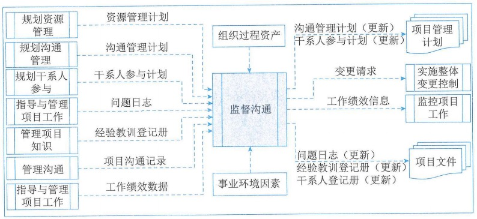

# 项目沟通管理

项目沟通管理是确保及时、正确的产生、收集、分发、存储和最终处理项目信息所需的过程。

## 1.管理基础

### 1.1沟通

沟通具体形式包括：

- 书面形式：实物或电子形式
- 口头形式：面对面或远程形式
- 正式或非正式形式：通过正式的纸质文件或社交媒体
- 手势动作：语调和面部表情
- 媒体形式：图片、行动或借助其他媒介
- 遣词造句：表达某种想法的词语往往不止一个，须留意各词语的含义会存在细微差异。

项目经理的大多数时间用于与团队成员和其他项目干系人沟通。

### 1.2沟通模型

沟通模型的关键要素包括：

1. **编码**：把思想或想法转化为他人能理解的语言
2. **信息和反馈信息**：编码过程所得到的结果
3. **媒介**：用来传递信息的方法
4. **噪声**：干扰信息传输和理解的一切因素
5. **解码**：把信息还原成有意义的思想或想法

沟通模型包含5中状态：已发送、已收到、已理解、已认可、已转化为积极的行动。

### 1.3沟通分类

沟通活动可按多种维度进行分类，主要包括：

1. **内部沟通**：针对项目内部或组织内部的干系人
2. **外部沟通**：针对外部干系人
3. **正式沟通**：报告、正式会议（定期或临时）、会议议程记录、干系人的一般沟通活动
4. **非正式沟通**：采用电子邮件、社交媒体、网站和非正式临时讨论的一般沟通活动
5. **层级沟通**：干系人或干系人群体会根据内部职权的不同，采取向上（针对高层）、向下（针对团队成员）和横向（针对同级项目经理或其他人员）等不同的沟通方式，保证有效沟通
6. **官方沟通**：年报、呈交监管机构或政府部门的报告
7. **非官方沟通**：采用灵活（往往为非正式）的手段，来建立和维护项目团队及其干系人对项目情况的了解和认可，并在他们之间建立强有力的关系
8. **书面与口头沟通**：包括口头（用词和音调变化）及非口头（肢体语言和行为）、社交媒体和网站、媒体发布

### 1.4沟通技巧

**有效的沟通活动和成果创建具有如下3个基本属性：**

1. **沟通目的明确；**
2. **尽量了解沟通接收方，满足其需求及偏好；**
3. **监督并衡量沟通的效果。**

#### 1、书面沟通的5C原则

在编制书面或口头信息的时候，应使用书面沟通的5C原则，以减轻理解错误：

**（1）正确的语法和拼写（Correctness）**：语法不当或拼写错误会分散注意力，甚至可能扭曲信息含义，降低可信度。

**（2）简洁的表述（Concise）**：简洁且精心组织的信息能降低误解信息意图的可能性。

**（3）清晰的目的和表述（Clarity）**：确保在信息中包含能满足受众需求与激发其兴趣的内容。

**（4）连贯的思维逻辑（Coherent）**：写作思路连贯，在整个书面文件中使用诸如"引言"和"小结"的小标题。

**（5）善用控制语句和承接（Controlling）**：可能需要使用图表或小结来控制语句和思路的承接。

#### 2、其他沟通技巧

1. **积极倾听。**与说话人保持互动，并总结对话内容，以确保有效的信息交换。
2. **理解文化和个人差异**。提升团队对文化及个人差异的认知，以减少误解并提升沟通能力。
3. **识别、设定并管理关系人期望。**与干系人磋商，减少干系人群体中自相矛盾的期望。
4. **强化技能。**所有团队成员应强化以下技能：说服个人团队或组织采取行动；激励和鼓励人们，或帮助人们重塑自信；指导人们改进绩效并取得期望结果；通过磋商达成共识以减少审批或决策延误；解决冲突，防止破环性影响等。

### 1.5管理新实践

## 2.项目沟通管理过程

### 2.1过程概述

项目沟通管理过程包括：

1. **规划沟通管理**：基于每个干系人或干系人群体的信息需求、可用的组织资产以及具体项目的需求，为项目沟通活动制定恰当的方法和计划。
2. **管理沟通**：确保项目信息及时且恰当的收集、生成、发布、存储、检索、管理、监督和最终处置。
3. **监督沟通**：确保满足项目及干系人的信息需求。

### 2.2裁剪考虑因素

### 2.3敏捷与适应方法

在模糊不定的项目环境中，必然需要对不断演变和出现的细节情况进行更频繁和快速的沟通。因此，应该尽量简化团队成员获取信息的通道，要经常进行团队检查，并让团队成员集中办公。此外，为了促进与高级管理层和关系人的沟通，还需要以透明的方式发布项目成果，并定期邀请干系人评审项目成果。

## 3.规划沟通管理

规划沟通管理是基于每个干系人或干系人群体的信息需求、可用的组织资产，以及具体项目的需求，为项目沟通活动制定恰当的方法和计划的过程。本过程的主要作用：

1. 及时向干系人提供相关信息
2. 引导干系人有效参与项目
3. 编制书面沟通计划

本过程应根据需要在整个项目期间定期开展。规划沟通管理过程的数据流向如图：

项目经理需要在项目生命周期的早期，针对项目干系人多样性的信息需求，制定有效的沟通管理计划。应该在整个项目期间，定期审查本过程的成果并做必要修改，以确保其持续适用。

### 3.1输入

#### 1、项目章程

项目章程会列出主要干系人清单，其中可能包含与干系人角色及职责有关的信息。

#### 2、项目管理计划

可用于规划沟通管理的项目管理计划组件主要包括：

1. **资源管理计划：**指导如何对项目资源进行分类、分配、管理和释放。团队成员和小组可能有沟通要求，应该在沟通管理计划中列出。
2. **干系人参与计划：**干系人参与计划确定了有效吸引干系人参与所需的管理策略，而这些策略通常通过沟通来落实。

#### 3、项目文件

可作为规划沟通管理过程输入的项目文件主要包括：

1. **需求文件：**可能包含项目干系人对沟通的需求。
2. **干系人登记册：**用于规划与干系人的沟通活动。

#### 4、事业环境因素

#### 5、组织过程资产

### 3.2工具与技术

#### 1、专家判断

#### 2、沟通需求分析

分析沟通需求，确定项目干系人的信息需求，包括所需信息的类型和格式，以及信息对干系人的价值。

#### 3、沟通技术

用于在项目干系人之间传递信息的方法很多，信息交换和协作的常见方法包括对话、会议、书面文件、数据库、社交媒体和网站。

**影响沟通技术的选择的因素包括：**

1. **信息需求的紧迫性**
2. **技术的可用性与可靠性**
3. **易用性**
4. **项目环境**
5. **信息的敏感性和保密性**

#### 4、沟通模型

以下图示的沟通模型展示了发送方的当前情绪、知识、背景、个性、文化和偏见会如何影响信息本身及其传递方式。类似的，接收方的当前情绪、知识、背景、个性、文化和偏见也会影响信息的接收和解读方式，导致沟通中的障碍或噪声。

#### 5、沟通方法

项目干系人之间用于分享信息的沟通方法主要包括：

1. **互动沟通。**在两方或多方之间进行的实时多向信息交换。它使用诸如会议、电话、即时信息、社交媒体和视频会议等沟通方式。
2. **推式沟通。**向需要接收信息的特定接收方发送或发布信息。这种方法可以确保信息的发送，但不能确保信息送达目标受众或被目标受众理解。在推式沟通中，可以用于沟通的有：邮件、备忘录、报告、电子邮件、传真、语音邮件、博客和新闻稿。
3. **拉式沟通。**适用于大量负责信息或大量信息受众的情况。它要求接收方在遵守有关安全规定的前提之下自行访问相关内容。这种方法包括门户网站、组织内网、电子在线课程、经验教训数据库或知识库。

#### 6、人际关系与团队技能

适用于规划沟通管理过程的人际关系与团队技能主要包括：

**（1）沟通风格评估。**用于评估沟通风格并识别偏好的沟通方法、形式和内容的一种技术。常用于不支持项目的干系人。可以先开展干系人参与度评估，再开展沟通风格评估。在干系人参与度评估中，找出干系人参与度的差距。为了弥补这种差距，就需要特别裁剪沟通活动和方法。

**（2）政策意识。**政策意识有助于项目经理根据项目环境和组织的政策环境来规划沟通。政策意识是指对正式和非正式权利关系的认知，以及在这些关系中工作的意愿。

**（3）文化意识。**文化意识指理解个人、群体和组织之间的差异，并据此调整项目的沟通策略。具有文化意识并采取后续行动，能够最小化因项目干系人社区内的文化差异而导致的理解错误和沟通错误。文化意识和文化敏感性有助于项目经理依据干系人和团队成员的文化差异与文化需求对沟通进行规划。

#### 7、数据表现

适用于规划沟通管理过程的数据表现是**干系人参与度评估矩阵**。干系人参与度评估矩阵显示了各干系人当前和期望参与度之间的差距。在本过程中，可进一步分析该评估矩阵，以便为填补参与度差距而识别额外的沟通需求（除常规报告以外）。

#### 8、会议

### 3.3输出

#### 1、沟通管理计划

沟通管理计划描述如何规划、结构化、执行与监督项目沟通，以提高沟通的有效性。沟通管理计划主要包括：

1. 干系人的沟通需求；
2. 需沟通的信息，包括语言、形式、内容和详细程序；
3. 上报步骤；
4. 发布信息的原因；
5. 发布所需信息、确认已收到或作出回应（若适用）的时限和频率；
6. 负责沟通相关信息的人员；
7. 负责授权保密信息发布的人员；
8. 接收信息的人员或群体，包括他们的需要、需求和期望；
9. 用于传递信息的方法或技术，如备忘录、电子邮件、新闻稿、或社交媒体；
10. 为沟通活动分配的资源，包括时间和预算；
11. 随着项目进展（如项目不同阶段干系人社区的变化）而更新与优化沟通管理计划的方法；
12. 通用术语表；
13. 项目信息流向图、工作流程（可能包含审批程序）、报告清单和会议计划等；
14. 来自法律、技术、组织政策等的制约因素等。

沟通管理计划中还包括关于项目状态会议、项目团队会议、网络会议和电子邮件等的指南和模板。如果项目要使用项目网站和项目管理软件，需要将其写入沟通管理计划。

#### 2、项目管理计划（更新）

可能需要变更的项目管理计划组件是干系人参与计划。

#### 3、项目文件（更新）

可在规划沟通管理过程更新的项目文件主要包括：

1. 干系人登记册：可能需要更新干系人登记册，以反映计划好的沟通。
2. 项目进度计划：可能需要更新项目进度计划，以反映沟通活动。

## 4.管理沟通

管理沟通是确保项目信息及时且恰当的收集、生成、发布、存储、检索、管理、监督和最终处置的过程。本工程的主要作用是，促成项目团队与干系人之间的有效信息流动。本过程需要在整个项目期间开展。管理沟通过程的数据流向如图。

本过程不局限于发布相关信息，它还设法确保信息以适当的格式正确生成和送达目标受众。本过程也为干系人提供机会，允许他们参与提供更多信息、澄清和讨论。有效的沟通管理需要借助的技术主要包括：

**（1）发送方-接收方模型**：运用反馈循环，为互动和参与提供机会，并清除妨碍有效沟通的障碍。

**（2）媒介选择**：为满足特定的项目需求而使用合理的沟通方法。例如，何时进行书面沟通或口头沟通，何时准备非正式备忘录或正式报告，何时使用推式或拉式沟通，以及该选择何种沟通技术。

**（3）写作风格**：选择适当的语态、句子结构，以及使用适当的词汇。

**（4）会议管理**：准备议程，邀请重要参会者并确保他们出席；处理会议现场发生的冲突，或因对会议纪要和后续行动跟进不力而导致的冲突，或因不当人员 与会而导致的冲突。

**（5）演示**：了解肢体语言和视觉辅助设计的作用。

**（6）引导**：达成共识、克服障碍（如小组缺乏活力），以及维持小组成员兴趣和热情。

**（7）积极倾听**：包括告知已收到、澄清与确认信息、理解，以及消除妨碍理解的障碍。

### 4.1输入

#### 1、项目管理计划

用于管理沟通的项目管理计划组件主要包括：

1. **资源管理计划：**描述为管理团队或物质资源所需开展的沟通。
2. 沟通管理计划：描述将如何对项目沟通进行规划、结构化和监控。
3. **干系人参与计划：**描述如何用适当的沟通策略引导干系人参与。

#### 2、项目文件

可作为管理沟通过程输入的项目文件主要包括：

1. 变更日志：用于向受影响的干系人传达变更，以及变更请求的批准、推迟和否决情况。
2. **问题日志：**：将与问题有关的信息传达给受影响的干系人。
3. 经验教训登记册：项目早期获取的与管理沟通有关的经验教训，可用于项目后期阶段改进沟通过程，提高沟通效率与效果。
4. **质量报告：**包括与质量问题、项目和产品改进，以及过程改进的相关信息。这些信息应交给能够采取纠正措施的人员，以便达成项目的质量期望。
5. **风险报告：**提供关于整体项目风险的来源的信息，以及关于已识别的单个项目风险的概述信息。这些信息应传达给风险责任人及其它受影响的干系人。
6. **干系人登记册：**确定了需要各类信息的人员、群体或组织。

#### 3、工作绩效报告

根据沟通管理计划的定义，工作绩效报告会通过本过程传递给项目干系人。

#### 4、事业环境因素

#### 5、组织过程资产

### 4.2工具与技术

#### 1、沟通技术

会影响技术选用的因素包括团队是否集中办公、需要分析的信息是否需要保密、团队成员的可用资源，以及组织文化会如何影响会议和讨论的政策开展。

#### 2、沟通方法

沟通方法的选择应该具有灵活性，以应对干系人成员变化，或成员的需求和期望的变化。

#### 3、沟通技能

适用于管理沟通过程的沟通技能主要包括：

1. **沟通胜任力**。经过裁剪的沟通技能的组合，有助于明确关键信息的目的、建立有效关系、实现信息共享和采取领导行为。
2. **反馈**。反馈是关于沟通、可交付成果或情况的反应信息。
3. **非口头技能**。例如，通过示意、语调和面部表情等适当的肢体语言来表达意思。镜像模仿和眼神交流也是重要的技能。
4. **演示**。演示是信息和文档的正式交付。向干系人明确、有效的演示项目的信息。

#### 4、项目管理信息系统

项目管理信息系统能够确保干系人及时便利的获取所需信息。

#### 5、项目报告

**项目报告发布是收集和发布项目信息的行为。项目信息应发布给众多干系人群体。应针对每种干系人来调整项目信息发布的适当层次、形式和细节。从简单的沟通到详尽的定制报告和演示，报告的形式各不相同。可以定期准备信息或基于例外情况准备。虽然工作绩效报告是监控项目工作过程的输出，但是本过程会编制临时报告、项目演示、博客，以及其他类型的信息。**

#### 6、人际关系与团队技能

适用于管理沟通过程的人际关系与团队技能主要包括：

- 积极倾听
- 冲突管理
- 文化意识
- 会议管理
- 人际交往
- 政策意识

#### 7、会议

### 4.3输出

#### 1、项目沟通记录

项目沟通记录主要包括：绩效报告、可交付成果的状态、进度进展、产生的成本、演示，以及干系人需要的其他信息。

#### 2、项目管理计划（更新）

可在管理沟通过程更新的项目管理计划主要包括：

1. 沟通管理计划：如果本过程引起了项目沟通方法发生变更，就要把这种变更反映在项目沟通计划中。
2. 干系人参与计划：本过程将会引起干系人的沟通需求以及商定的沟通策略更新。

#### 3、项目文件（更新）

可在管理沟通过程更新的项目文件主要包括：

1. 问题日志：更新以反映项目的沟通问题，以及如何通过沟通来解决实际问题。
2. 经验教训登记册：更新以记录在项目中遇到的调整、可采取的规避方法，以及适用和不适用于管理沟通的方法。
3. 项目进度计划：可能需要更新，以反映沟通活动的状态。
4. 风险登记册：更新以记录与管理沟通相关的风险。
5. 干系人登记册：更新以记录关于项目干系人沟通活动的信息。

#### 4、组织过程资产（更新）

## 5.监督沟通

监督沟通是确保满足项目及干系人的信息需求的过程。本过程的主要作用是，按沟通管理计划和干系人参与计划的要求优化信息传递流程。本过程需要在整个项目期间开展。监督沟通过程的数据流向如图：

监督沟通过程可能触发规划沟通管理、管理沟通过程的跌点，以便修改沟通计划并开展额外的沟通活动，来提升沟通的效果。这种迭代体现了项目沟通管理各过程的持续性。问题、关键绩效指标、风险或冲突，都可能立即触发重新迭代开展这些过程。

### 5.1输入

#### 1、项目管理计划

可用于监督沟通的项目管理计划组件主要包括：

1. **资源管理计划**：通过描述角色和职责，以及项目组织结构图，资源管理计划可用于理解实际的项目组织以及其任何变更。
2. **沟通管理计划**：是关于及时收集、生成和发布信息的现行计划，它确定了沟通过程中的团队成员、干系人和有关工作。
3. **干系人参与计划**：确定了计划用以引导干系人参与的沟通策略。

#### 2、项目文件

可作为监督沟通过程输入的项目文件主要包括：

1. **问题日志**：提供项目的历史信息、干系人参与问题的记录，以及它们如何得以解决。
2. 经验教训登记册：在项目早期的经验教训可用于项目后期阶段，以改进沟通效果。
3. **项目沟通记录**：提供已开展的沟通的信息。

#### 3、工作绩效数据

工作绩效数据包含关于已开展的沟通类型和数量的数据。

#### 4、事业环境因素

#### 5、组织过程资产

### 5.2工具与技术

#### 1、专家判断

#### 2、项目管理信息系统

#### 3、数据表现

监督沟通时，适用的数据表现技术是**干系人参与度评估矩阵**。他可以提供与沟通活动效果有关信息。应该检查干系人的期望与当前参与度的变化情况，并对沟通进行必要调整。

#### 4、人际关系与团队技能

适用于监督沟通过程的人际关系与团队技能主要包括**观察和交谈**。与项目团队展开讨论和对话，有助于确定最合适的方法，用于更新和沟通项目绩效，以及回应干系人的信息请求。通过观察和交谈，项目经理能够发现团队内的问题、人员间的冲突，或个人绩效问题。

#### 5、会议

### 5.3输出

#### 1、工作绩效信息

工作绩效信息包括：计划沟通的实际开展情况；对沟通的反馈，例如关于沟通效果的调查结果。

#### 2、变更请求

#### 3、项目管理计划（更新）

可能需要变更的项目管理计划组件主要包括：

1. 沟通管理计划：需要更新沟通管理计划，以记录能够让沟通更有效的新信息。
2. 干系人参与计划：需要更新干系人参与计划，以反映干系人的实际情况、沟通需求和重要性。

#### 4、项目文件（更新）

在监督沟通过程更新的项目文件主要包括：

1. 问题日志：可能需要更新问题日志，记录与出现的问题及其处理进展和解决办法相关的新信息。
2. 经验教训登记册：可能需要更新经验教训登记册，记录问题的原因、所选纠正措施的理由，以及其他与沟通有关的经验教训。
3. 干系人登记册：可能需要更新干系人登记册，加入修订的干系人沟通要求。